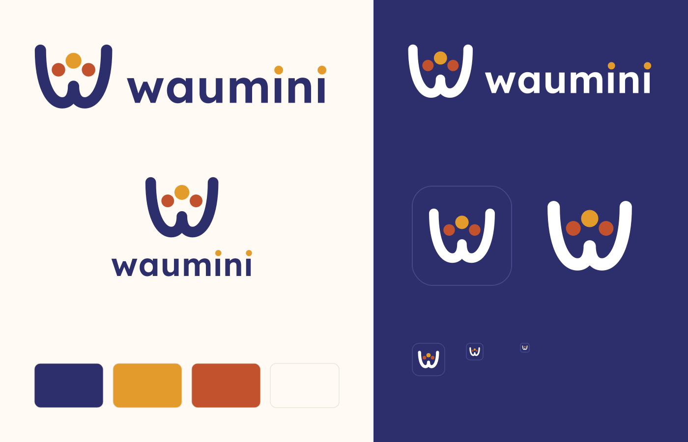

# Identité visuelle de Waumini

*Waumini* signifie « les fidèles » en swahili. Le logo représente **deux mains jointes en coupe** qui forment un W arrondi et portent trois graines, qui sont aussi trois personnes.

Ce geste est commun à toutes les communautés de foi : la **prière** (la louange, la *dua*), l'**offrande** (on donne) et l'**accueil** (on reçoit et on prend soin). Waumini prend soin de ce que la communauté lui confie : ses membres, ses finances et sa mémoire.

Le logo ne contient aucun symbole propre à une religion. Il convient aussi bien à une église qu'à une mosquée.



## Couleurs

| Nom | Code | Usage |
|---|---|---|
| Indigo | `#2C2F6B` | Couleur principale : textes, mains du symbole, fond du motif wax |
| Ocre | `#E39B2C` | Graine centrale, points des « i », action principale, élément actif |
| Terre cuite | `#C2522D` | Graines latérales, accents |
| Vert | `#2E7A5A` | Accents (réussite, validation) |
| Crème | `#FFFAF3` | Fond clair |

Style de l'application : **« Chaleureux, inspiré du wax »**, choisi parmi quatre directions (voir `docs/design/styles-waumini.html`). Le motif de pagne (pois ocre et terre cuite, anneaux clairs sur indigo) habille les en-têtes et la barre latérale.

## Typographie

**Lexend** (licence SIL Open Font License, voir `fonts/Lexend-OFL.txt`), conçue pour faciliter la lecture :
- *SemiBold* pour le nom et les titres ;
- *Regular* pour les textes.

Dans le nom « waumini », les points des deux « i » sont ocre. Ce sont deux fidèles de plus.

## Fichiers

| Dossier | Contenu |
|---|---|
| `logo/` | Symbole seul, logo horizontal, logo vertical (en couleur, en blanc pour les fonds sombres, en monochrome), icône d'application, en SVG |
| `logo/png/` | Aperçus PNG haute définition |
| `icons/` | Favicon (`.ico` et `.svg`), icônes PWA (192, 512, *maskable*), icône Apple |
| `icons/windows/` | Icône `waumini.ico` (16 à 256 px), tuiles du menu Démarrer et de l'écran d'accueil pour l'application Windows |

## Règles d'usage

- Laisser autour du logo un espace libre au moins égal à la hauteur d'une graine.
- Sur un fond sombre, utiliser les versions `-blanc`. Les graines gardent leurs couleurs.
- Ne pas déformer, ne pas faire pivoter, ne pas changer les couleurs des graines.
- Ne pas descendre sous 16 px pour le symbole, ni sous 80 px de large pour le logo horizontal.

## Régénérer les fichiers

Tous les fichiers sont produits par un script, à partir d'un dessin unique :

```bash
pip install fonttools cairosvg pillow
python3 branding/generate.py
```
