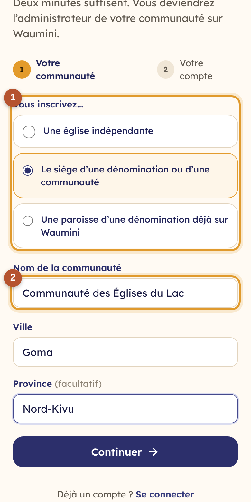
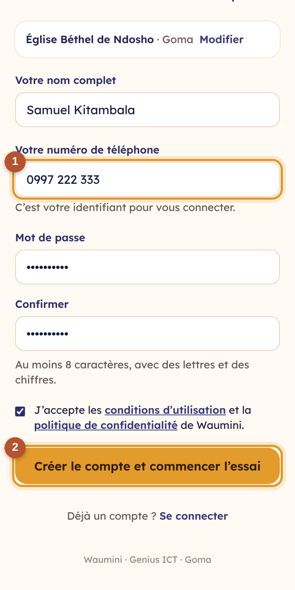

# 0. Créer le compte de son église

Toute communauté peut s'inscrire seule sur Waumini, depuis un téléphone ou un ordinateur. La personne qui s'inscrit devient l'**administrateur** de la communauté, et l'**essai gratuit de 30 jours** commence aussitôt, sans engagement.

Ouvrez la page d'accueil de Waumini et touchez **Essai gratuit** (ou **Essayer gratuitement 30 jours**).

## Étape 1 : votre communauté

<table><tr>
<td width="68%"></td>
<td width="32%"></td>
</tr></table>

1. Choisissez **ce que vous inscrivez** ① :
   - **une église indépendante** ;
   - **le siège d'une dénomination** ou d'une communauté : vous ajouterez ensuite vos régions, secteurs et paroisses (voir [Organiser la hiérarchie](04-hierarchie.md)) ;
   - **une paroisse d'une dénomination déjà sur Waumini** : après l'inscription, vous demanderez à rejoindre votre siège.
2. Saisissez le **nom de la communauté** ②, la **ville** et, si vous le souhaitez, la **province**.
3. Touchez **Continuer**.

## Étape 2 : votre compte

<table><tr>
<td width="68%"></td>
<td width="32%"></td>
</tr></table>

1. Saisissez **votre nom complet** et **votre numéro de téléphone** ① : ce sera votre identifiant pour vous connecter.
2. Choisissez un **mot de passe** d'au moins 8 caractères, avec des lettres et des chiffres, et saisissez-le une deuxième fois.
3. Lisez puis acceptez les **conditions d'utilisation** et la **politique de confidentialité**.
4. Touchez **Créer le compte et commencer l'essai** ②.

Vous arrivez sur le [tableau de bord](03-tableau-de-bord.md) de votre communauté. Suivez les **Premiers pas** pour bien démarrer.

> **Ce numéro a déjà un compte ?** Un numéro de téléphone ne peut servir qu'à un seul compte. Connectez-vous avec ce numéro, ou demandez à l'administrateur de votre communauté de vous ajouter.

> **Une paroisse ?** Après l'inscription, Waumini ouvre la page **Hiérarchie** : touchez **Rejoindre un siège** et saisissez le code de rattachement donné par votre siège (voir [Rejoindre un siège](04-hierarchie.md#rejoindre-un-siège-pour-une-église-inscrite-seule)).

## Demander plutôt une démonstration

Vous préférez qu'on vous présente Waumini d'abord ? En bas de la page d'accueil, remplissez **Demander une démonstration** : votre nom, votre téléphone ou WhatsApp, votre communauté. L'équipe Genius ICT vous recontacte pour convenir d'un rendez-vous, sur place avec vos propres registres.
