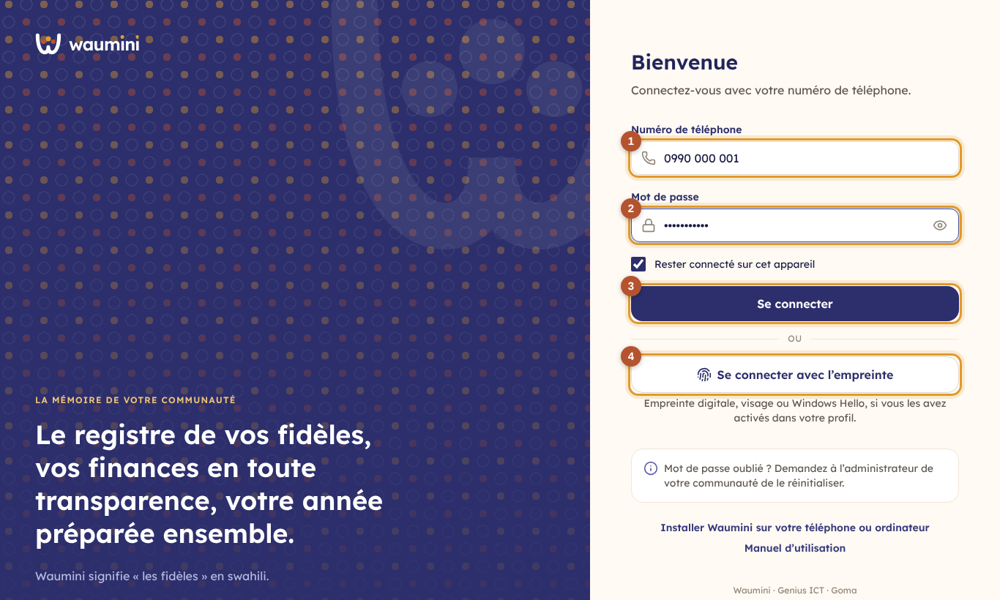
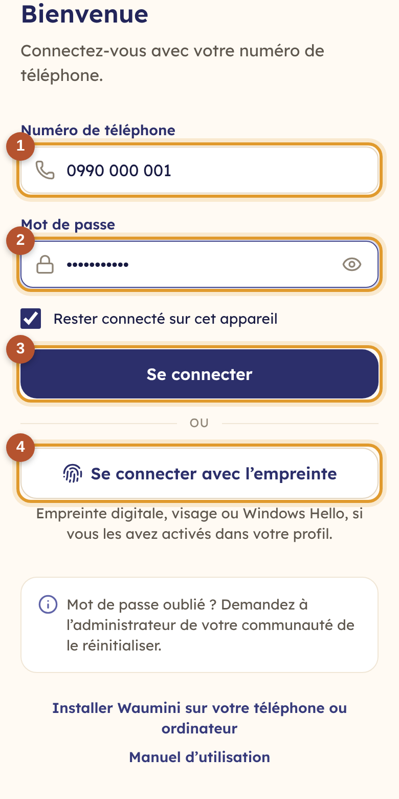
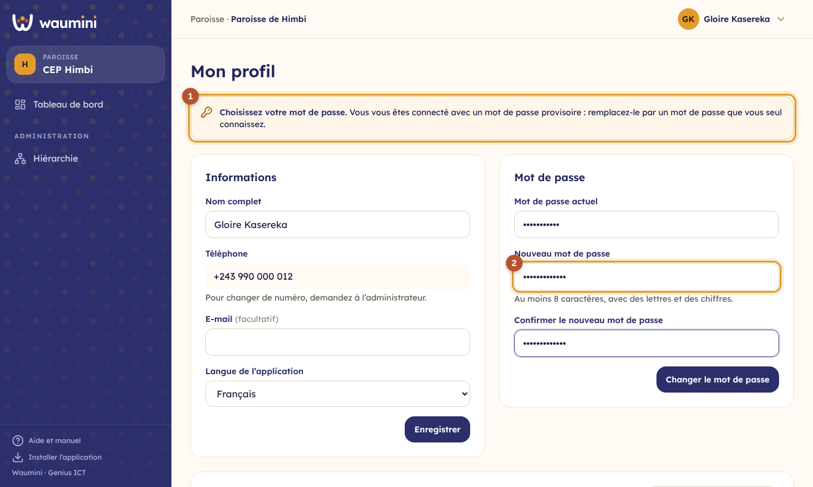
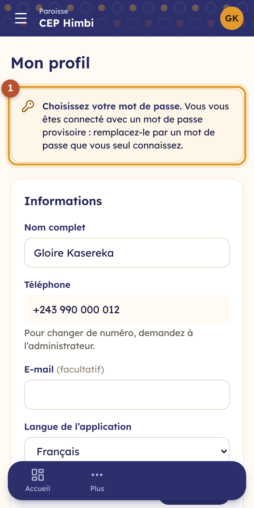
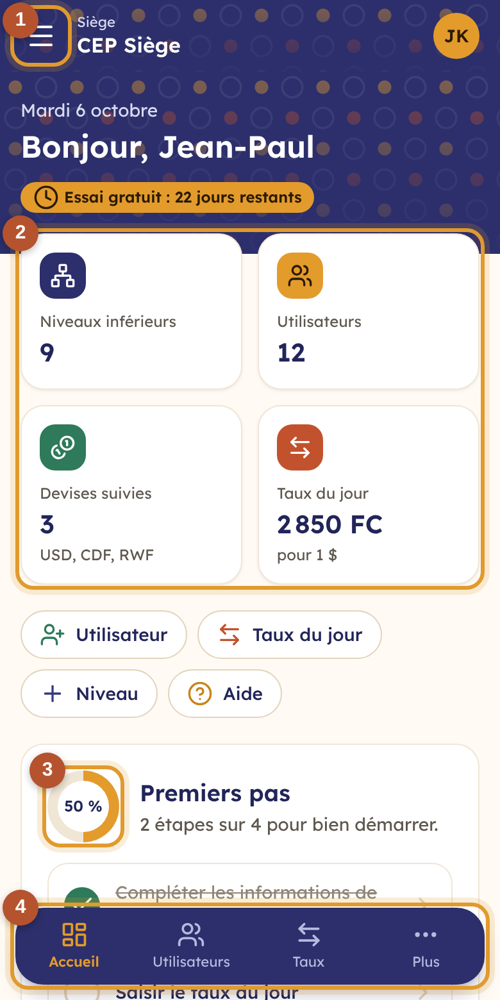
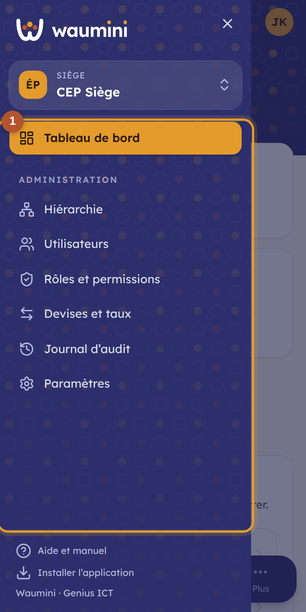
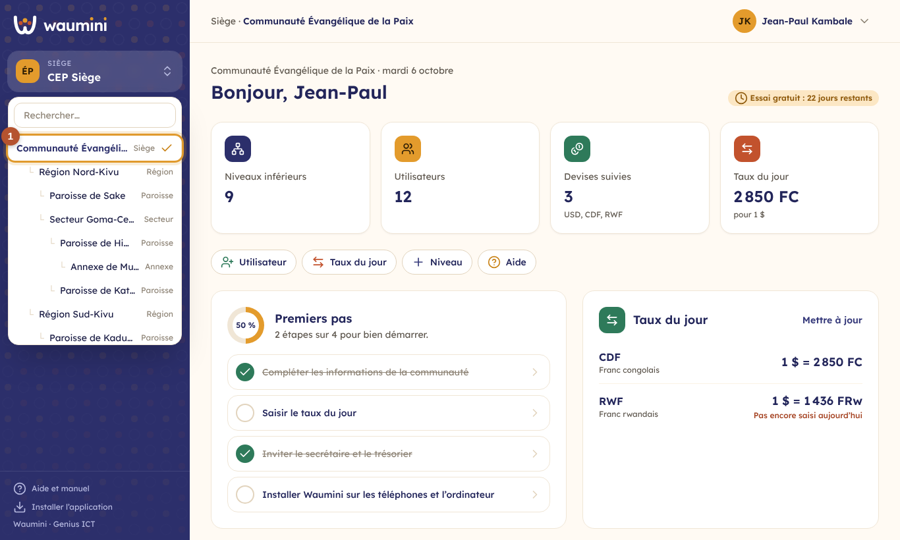
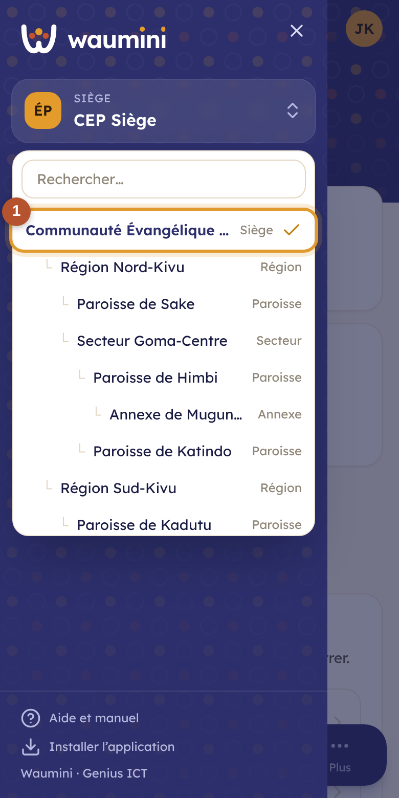

# 1. Premiers pas : se connecter et se repérer

## Se connecter

Waumini s'ouvre dans le navigateur de votre téléphone ou de votre ordinateur, ou depuis l'application installée (voir [Installer Waumini](02-installer.md)).

<table><tr>
<td width="68%"></td>
<td width="32%"></td>
</tr></table>

1. Saisissez votre **numéro de téléphone** ①. Vous pouvez l'écrire comme vous en avez l'habitude : `0812 345 678`, `+243 812 345 678` ou `243812345678`, Waumini le reconnaît.
2. Saisissez votre **mot de passe** ②. L'œil à droite du champ affiche ce que vous tapez, pour vérifier.
3. Touchez **Se connecter** ③.

Si vous avez activé l'**empreinte** sur cet appareil (voir [Mon profil](10-profil.md#se-connecter-avec-son-empreinte)), touchez simplement **Se connecter avec l'empreinte** ④ : plus besoin de taper le numéro ni le mot de passe.

Laissez **« Rester connecté sur cet appareil »** coché sur votre téléphone personnel. Décochez-le sur un ordinateur partagé, par exemple celui du secrétariat.

> **Mot de passe oublié ?** Demandez à l'administrateur de votre communauté de le réinitialiser. Il vous donnera un mot de passe provisoire (voir [Gérer les utilisateurs](05-utilisateurs.md#réinitialiser-un-mot-de-passe)).

> **Trop de tentatives ?** Après 5 essais incorrects, Waumini bloque la connexion pendant une minute, pour protéger votre compte.

## La première connexion : choisir son mot de passe

Quand l'administrateur crée votre compte, il vous communique un **mot de passe provisoire** (par exemple `KMB-4821`). À votre première connexion, Waumini vous demande de le remplacer.

<table><tr>
<td width="68%"></td>
<td width="32%"></td>
</tr></table>

1. Le bandeau ① vous rappelle que vous utilisez un mot de passe provisoire.
2. Dans **Mot de passe actuel**, saisissez le mot de passe provisoire.
3. Dans **Nouveau mot de passe** ②, choisissez un mot de passe d'**au moins 8 caractères**, avec des **lettres et des chiffres**. Saisissez-le une deuxième fois dans **Confirmer**.
4. Touchez **Changer le mot de passe**. Vous arrivez sur le tableau de bord.

Tant que ce n'est pas fait, les autres écrans restent inaccessibles.

## Se repérer dans Waumini

### Sur ordinateur

- À gauche, la **barre latérale** : le logo, le **sélecteur de communauté**, puis le **menu**. Vous n'y voyez que les écrans autorisés par votre rôle.
- En haut, le **niveau** et le **nom** de la communauté dans laquelle vous travaillez, et votre nom. Cliquez sur votre nom pour ouvrir votre profil, installer l'application ou vous déconnecter.

### Sur téléphone

<table><tr>
<td width="50%"></td>
<td width="50%"></td>
</tr></table>

- En haut, le **bandeau** au motif wax rappelle la communauté dans laquelle vous travaillez.
- En bas, la **barre d'onglets** donne accès aux écrans les plus utilisés. L'onglet ouvert est en ocre. **Plus** ouvre le menu complet.
- En haut à gauche, le bouton **☰** ouvre aussi le menu complet ①.
- En haut à droite, vos **initiales** ouvrent votre profil et la déconnexion.

## Changer de communauté

Si vous avez des rôles dans plusieurs communautés (par exemple le siège et une paroisse), ou si votre rôle couvre les niveaux inférieurs, vous passez de l'une à l'autre avec le **sélecteur de communauté**.

<table><tr>
<td width="68%"></td>
<td width="32%"></td>
</tr></table>

1. Touchez le nom de la communauté, en haut de la barre latérale ou du menu.
2. La liste montre la hiérarchie à laquelle vous avez accès. Un **✓** marque celle où vous travaillez ①.
3. Touchez une autre communauté : Waumini l'ouvre et l'affiche en haut de l'écran. S'il y en a beaucoup, tapez quelques lettres dans **Rechercher**.

Tout ce que vous faites ensuite (saisies, rapports, utilisateurs) concerne **la communauté affichée**. Vérifiez-la avant de saisir.

## Se déconnecter

Touchez votre nom ou vos initiales, en haut à droite, puis **Se déconnecter**. Faites-le toujours sur un appareil partagé.
