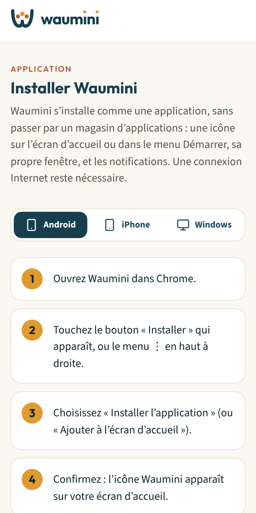
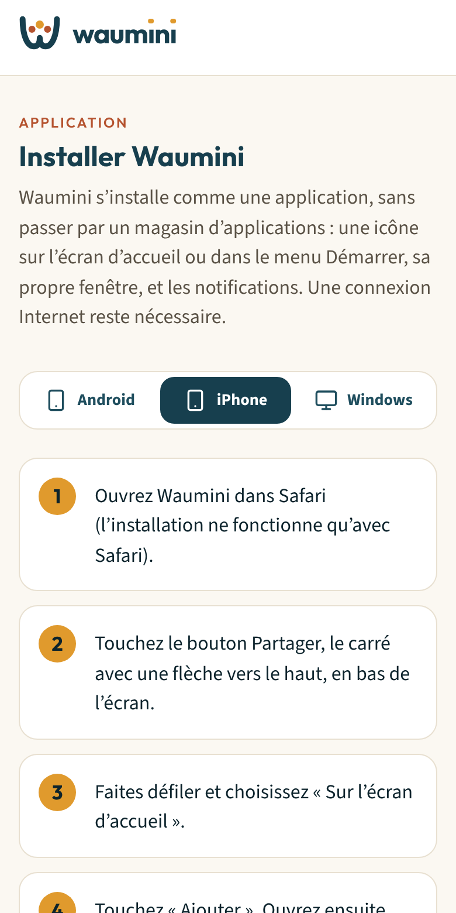
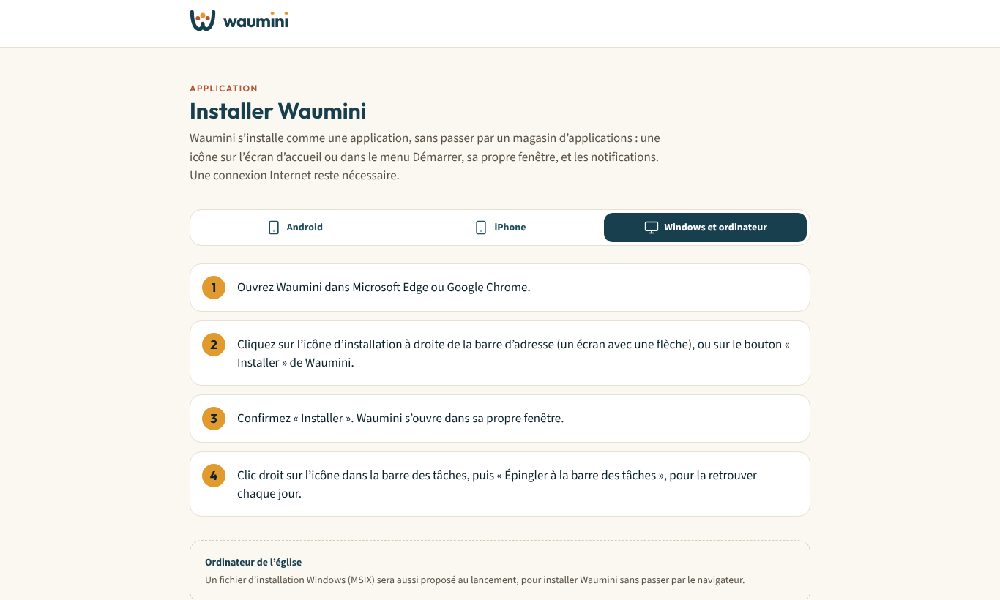

# 2. Installer Waumini sur son téléphone ou son ordinateur

Waumini s'installe **comme une application**, sans passer par le Play Store ni l'App Store :

- une **icône** sur l'écran d'accueil du téléphone, ou dans le menu Démarrer et la barre des tâches de Windows ;
- sa **propre fenêtre**, sans barre d'adresse ;
- les **notifications** de la communauté.

Une **connexion Internet** reste nécessaire pour utiliser Waumini.

La page **Installer Waumini** est accessible depuis la page de connexion, depuis le menu (**Installer l'application**) ou à l'adresse `/installer`. Elle affiche directement les instructions de votre appareil.

> Quand votre navigateur le permet, un bouton orange **Installer** apparaît en haut de l'écran : touchez-le, et l'installation se fait en une étape.

## Sur un téléphone Android

1. Ouvrez Waumini dans **Chrome**.
2. Touchez le bouton **Installer** qui apparaît, ou le menu **⋮** en haut à droite.
3. Choisissez **Installer l'application** (ou **Ajouter à l'écran d'accueil**).
4. Confirmez : l'icône Waumini apparaît sur votre écran d'accueil.

## Sur un iPhone

1. Ouvrez Waumini dans **Safari**. L'installation ne fonctionne qu'avec Safari.
2. Touchez le bouton **Partager** (le carré avec une flèche vers le haut), en bas de l'écran.
3. Faites défiler et choisissez **Sur l'écran d'accueil**.
4. Touchez **Ajouter**.

> Sur iPhone, les notifications ne fonctionnent que si vous ouvrez Waumini **depuis l'icône de l'écran d'accueil**.

## Sur l'ordinateur de l'église (Windows)

1. Ouvrez Waumini dans **Microsoft Edge** ou **Google Chrome**.
2. Cliquez sur l'**icône d'installation** à droite de la barre d'adresse (un écran avec une flèche), ou sur le bouton **Installer** de Waumini.
3. Confirmez **Installer**. Waumini s'ouvre dans sa propre fenêtre et apparaît dans le menu Démarrer.
4. Faites un clic droit sur l'icône Waumini dans la barre des tâches, puis **Épingler à la barre des tâches**, pour la retrouver chaque jour.

Un **fichier d'installation Windows** (MSIX) sera aussi proposé au lancement, pour installer Waumini sans passer par le navigateur.

## Désinstaller

- **Android** : appui long sur l'icône, puis **Désinstaller**.
- **iPhone** : appui long sur l'icône, puis **Supprimer l'app**.
- **Windows** : dans la fenêtre Waumini, menu **⋯** puis **Désinstaller**, ou depuis **Paramètres > Applications**.

Désinstaller l'application ne supprime aucune donnée : tout reste dans Waumini.
