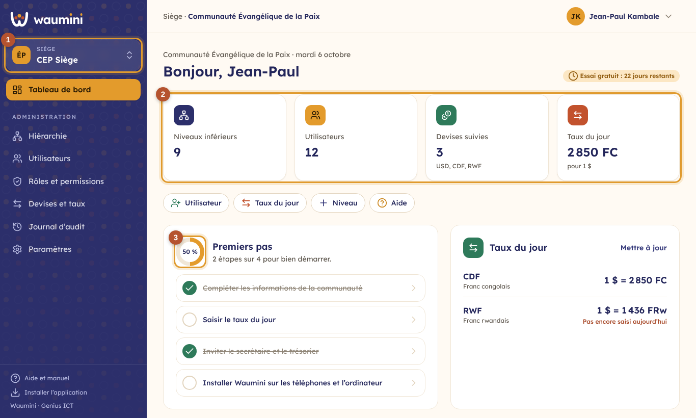

# 3. Le tableau de bord

C'est le premier écran après la connexion. Chacun y voit ce qui concerne **la communauté affichée** et **son rôle**.

<table><tr>
<td width="68%"></td>
<td width="32%"></td>
</tr></table>

① **La communauté** dans laquelle vous travaillez. Touchez-la pour en changer (voir [Changer de communauté](01-premiers-pas.md#changer-de-communauté)). Sur téléphone, le menu s'ouvre avec le bouton ☰, dans le bandeau en haut de l'écran.

② **Les chiffres clés**, chacun avec sa pastille de couleur : l'effectif des membres (avec les nouveaux de l'année), les niveaux inférieurs (régions, secteurs, paroisses…) ou, pour une église sans niveaux, les ménages, les utilisateurs et le taux du jour du franc congolais. Touchez un chiffre pour ouvrir l'écran correspondant.

Juste en dessous, les **actions rapides** ouvrent en un toucher ce que l'on fait le plus souvent : ajouter un membre, ajouter un utilisateur, saisir le taux du jour, ajouter un niveau, ouvrir l'aide. Chacun ne voit que les actions permises par son rôle.

③ **Premiers pas** : cinq étapes pour bien démarrer, avec un anneau qui montre où vous en êtes. Chaque étape se coche toute seule quand elle est faite :

- inscrire les membres ou importer l'ancien registre (voir [Importer depuis Excel](14-import-export.md)) ;
- compléter les informations de la communauté (voir [Paramètres](08-parametres.md)) ;
- saisir le taux du jour (voir [Devises et taux du jour](07-devises.md)) ;
- inviter le secrétaire et le trésorier (voir [Gérer les utilisateurs](05-utilisateurs.md)) ;
- installer Waumini sur les téléphones et l'ordinateur (voir [Installer Waumini](02-installer.md)).

Sur téléphone, la **barre d'onglets** ④ flotte toujours en bas de l'écran.

## Les autres blocs

- **Cette semaine** : les activités du [calendrier](27-calendrier-presences.md) des sept prochains jours. Toucher une activité ouvre sa date.
- **Annonces** : les trois dernières [annonces](28-annonces.md) en cours, les épinglées d'abord.
- **Taux du jour** : le taux de chaque devise par rapport au dollar. La mention **« Pas encore saisi aujourd'hui »** rappelle au trésorier de le mettre à jour. Le lien **Mettre à jour** ouvre l'écran des taux.
- **Activité récente** : les dernières actions dans la communauté (qui a fait quoi, et quand). Le lien **Tout le journal** ouvre le [journal d'audit](09-journal.md).
- **Essai gratuit** : pendant les 30 jours d'essai, un badge indique les jours restants.
- **Bientôt dans Waumini** : les modules qui arrivent étape par étape (consolidation, site vitrine…).
