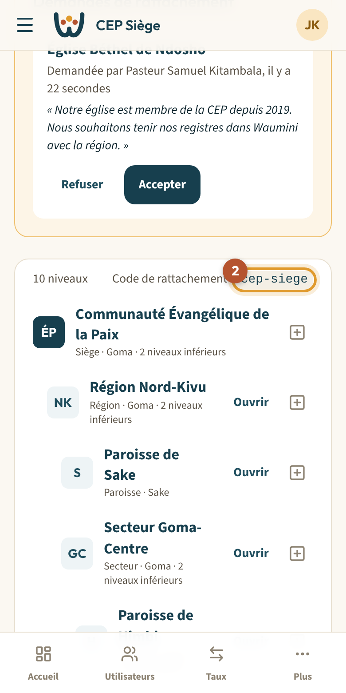
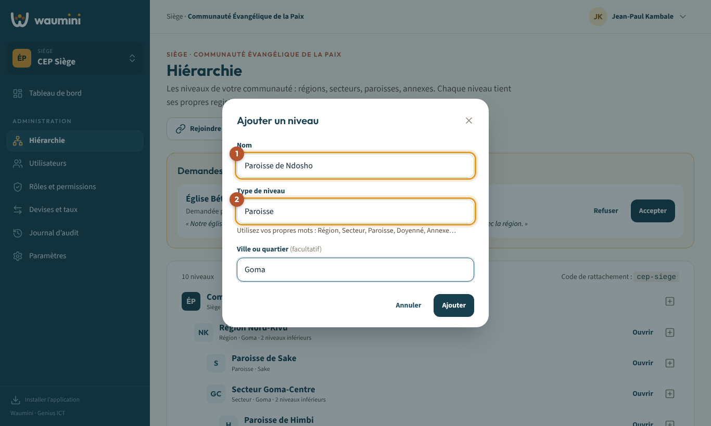
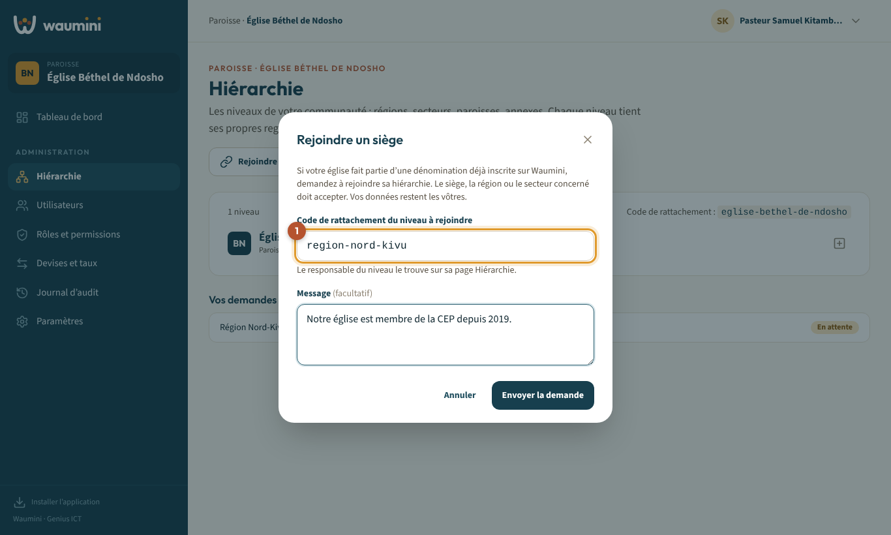
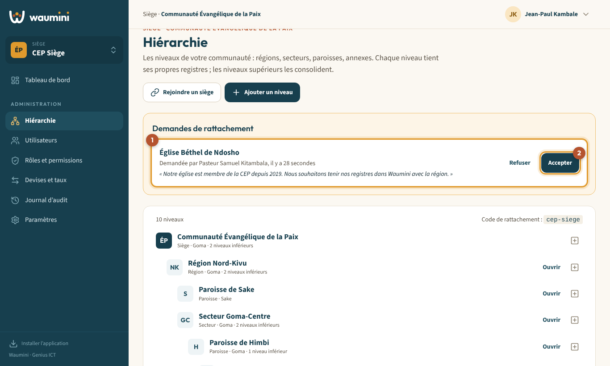
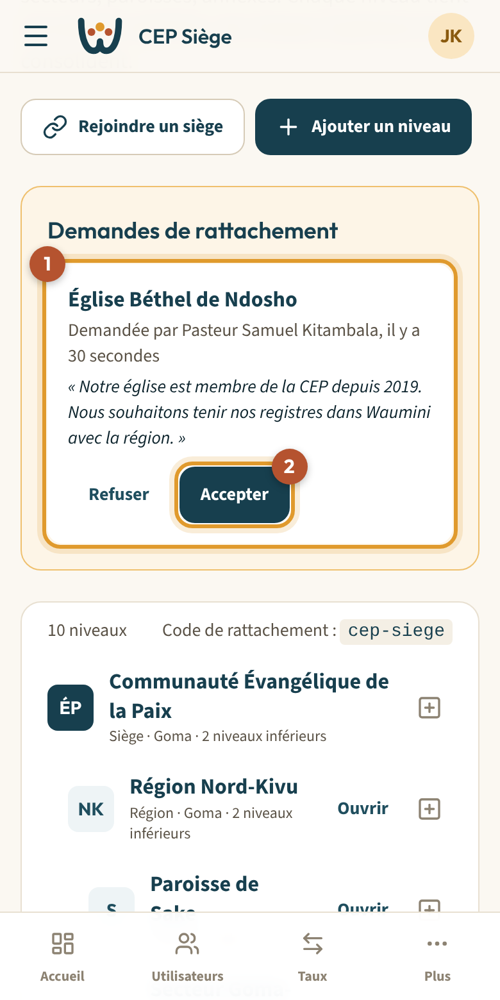

# 4. Organiser la hiérarchie

La hiérarchie décrit l'organisation de votre communauté : **siège**, **régions**, **secteurs**, **paroisses**, **annexes**… avec **vos propres mots** (Diocèse, Doyenné, District, Église mère…).

Chaque niveau tient **ses propres registres** : sa paroisse, son trésorier, ses taux. Les niveaux supérieurs **consolident** ceux d'en dessous sans rien ressaisir.

Une **église indépendante** n'a qu'un seul niveau : elle n'a rien à faire ici, sauf si elle ouvre des annexes.

> Permission nécessaire : **Gérer la hiérarchie** (rôle Administrateur par défaut).

<table><tr>
<td width="68%"></td>
<td width="32%"></td>
</tr></table>

L'écran montre l'arbre de votre communauté, à partir du niveau affiché. Pour chaque niveau : son type, sa ville et le nombre de niveaux en dessous.

- **Ajouter un niveau** ① crée un niveau sous celui qui est affiché.
- **Ouvrir** passe dans ce niveau, comme le sélecteur de communauté.
- **⊞** ajoute un niveau **sous** celui-ci.
- Le **code de rattachement** ② est l'identifiant à donner à une église qui veut rejoindre ce niveau.

## Ajouter un niveau

1. Touchez **Ajouter un niveau** (sous le niveau affiché), ou le bouton **⊞** d'un niveau précis.
2. Saisissez le **Nom** ①, par exemple *Paroisse de Ndosho*.
3. Indiquez le **Type de niveau** ② : Waumini propose celui des niveaux voisins, mais vous pouvez écrire le vôtre (Paroisse, Annexe, Doyenné…).
4. Ajoutez la **ville ou le quartier** si vous le souhaitez, puis touchez **Ajouter**.

<table><tr>
<td width="68%"></td>
<td width="32%"></td>
</tr></table>

Le nouveau niveau apparaît dans l'arbre. Donnez-lui ensuite ses responsables (voir [Gérer les utilisateurs](05-utilisateurs.md)).

## Rejoindre un siège (pour une église inscrite seule)

Une paroisse qui s'est inscrite seule sur Waumini peut rejoindre la hiérarchie de sa dénomination. **Ses données restent les siennes** : elle garde ses registres, ses utilisateurs et son historique.

<table><tr>
<td width="68%"></td>
<td width="32%"></td>
</tr></table>

1. Demandez au responsable du niveau à rejoindre (siège, région ou secteur) son **code de rattachement**. Il le trouve sur sa page Hiérarchie.
2. Sur votre page **Hiérarchie**, touchez **Rejoindre un siège**.
3. Saisissez le **code** ①, ajoutez un message si vous le souhaitez, puis touchez **Envoyer la demande**.
4. La demande apparaît dans **Vos demandes envoyées**, avec son état : *En attente*, *Acceptée* ou *Refusée*.

## Accepter une demande de rattachement

Quand une église demande à rejoindre votre niveau, un encadré **Demandes de rattachement** apparaît en haut de la page Hiérarchie.

<table><tr>
<td width="68%"></td>
<td width="32%"></td>
</tr></table>

1. Vérifiez le nom de l'église, qui a fait la demande, et son message ①.
2. Touchez **Accepter** ② : l'église et ses éventuelles annexes rejoignent votre hiérarchie. Ou touchez **Refuser**.

Chaque rattachement est inscrit au [journal d'audit](09-journal.md).
