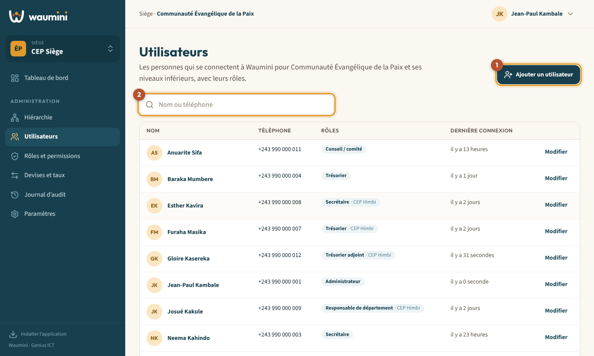
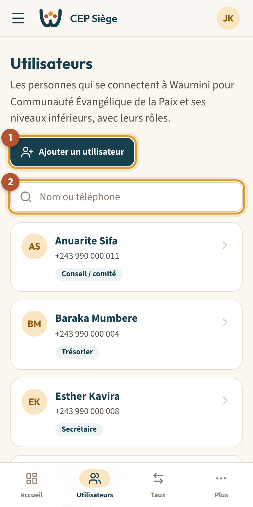
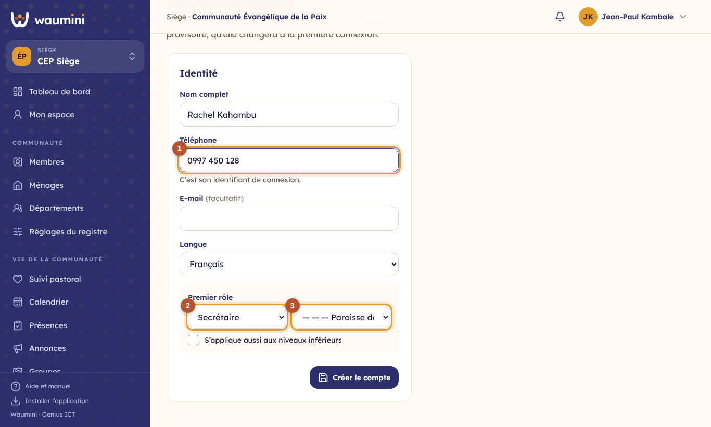
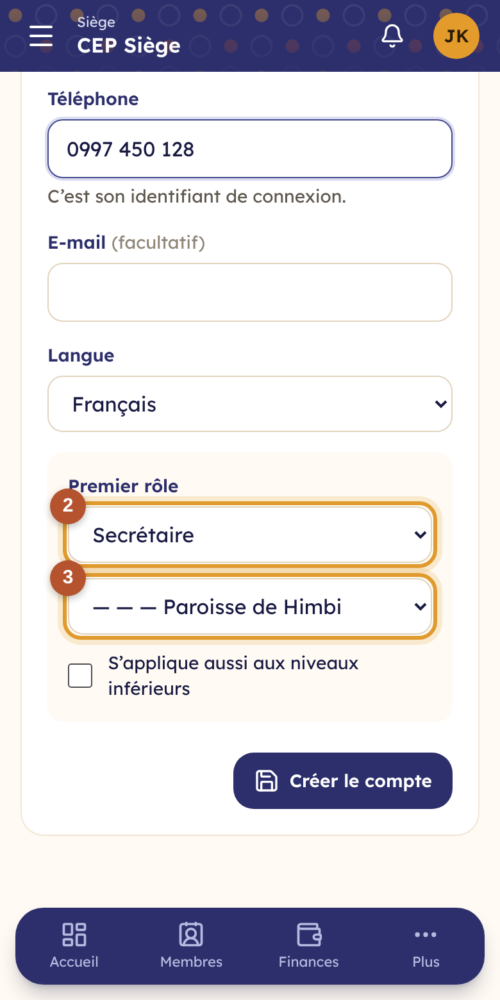
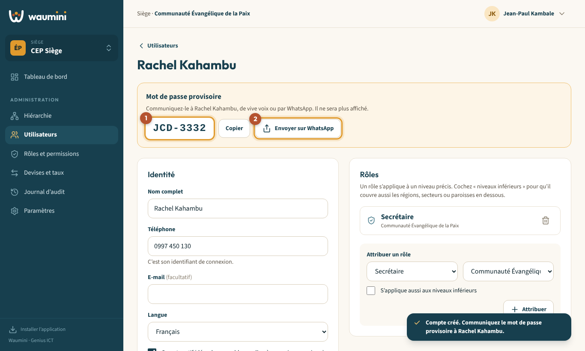
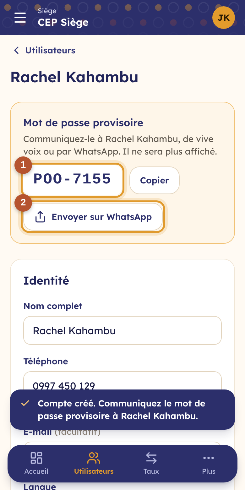
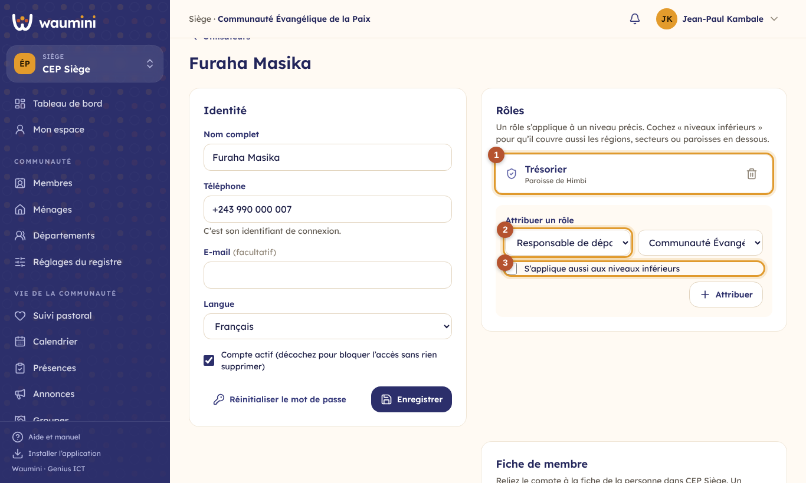
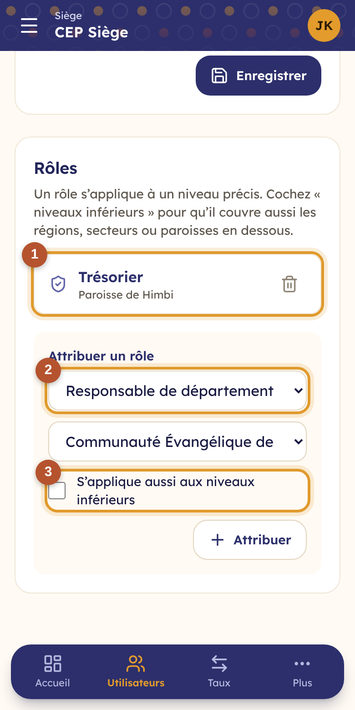

# 5. Gérer les utilisateurs

Un **utilisateur** est une personne qui se connecte à Waumini : pasteur, secrétaire, trésorier, responsable de département… Chacun reçoit un ou plusieurs **rôles**, qui décident de ce qu'il voit et peut faire.

> Les **membres** de la communauté (les fidèles) sont inscrits dans le [registre des membres](12-membres.md). Ils n'ont pas besoin d'être utilisateurs.

> Permissions nécessaires : **Voir les utilisateurs** pour la liste, **Créer les utilisateurs et leur attribuer des rôles** pour le reste.

## La liste des utilisateurs

<table><tr>
<td width="68%"></td>
<td width="32%"></td>
</tr></table>

La liste montre les utilisateurs de la communauté affichée **et de ses niveaux inférieurs**, avec leur téléphone, leurs rôles (et le niveau concerné) et leur dernière connexion.

- **Ajouter un utilisateur** ① ouvre le formulaire de création.
- La **recherche** ② trouve une personne par son nom ou son numéro de téléphone.

## Ajouter un utilisateur

<table><tr>
<td width="68%"></td>
<td width="32%"></td>
</tr></table>

1. Touchez **Ajouter un utilisateur**.
2. Saisissez le **nom complet** et le **téléphone** ①. Le téléphone est l'**identifiant de connexion** : un même numéro ne peut servir qu'à un seul compte.
3. L'e-mail est facultatif. Choisissez la **langue** de la personne.
4. Dans **Premier rôle**, choisissez le **rôle** ② et le **niveau** où il s'applique ③. Par exemple : *Secrétaire* de la *Paroisse de Himbi*.
5. Cochez **S'applique aussi aux niveaux inférieurs** si ce rôle doit couvrir les régions, secteurs ou paroisses en dessous. Par exemple, un responsable de région qui doit voir toutes ses paroisses.
6. Touchez **Créer le compte**.

### Communiquer le mot de passe provisoire

Waumini crée un **mot de passe provisoire**, facile à dicter (par exemple `KMB-4821`).

<table><tr>
<td width="68%"></td>
<td width="32%"></td>
</tr></table>

1. Notez le mot de passe ①. **Il ne sera plus affiché** une fois la page quittée.
2. Communiquez-le de vive voix, ou touchez **Envoyer sur WhatsApp** ② : WhatsApp s'ouvre avec un message prêt à envoyer à la personne (adresse de Waumini, numéro et mot de passe).
3. À sa première connexion, la personne choisira son propre mot de passe (voir [Premiers pas](01-premiers-pas.md#la-première-connexion--choisir-son-mot-de-passe)).

## Attribuer ou retirer un rôle

Ouvrez un utilisateur (bouton **Modifier** sur ordinateur, ou touchez sa carte sur téléphone).

<table><tr>
<td width="68%"></td>
<td width="32%"></td>
</tr></table>

- Le bloc **Rôles** liste ses rôles actuels et le niveau de chacun ①. La corbeille retire un rôle.
- Pour ajouter un rôle, choisissez-le ②, choisissez le niveau, cochez si besoin **S'applique aussi aux niveaux inférieurs** ③, puis touchez **Attribuer**.

Une même personne peut avoir **plusieurs rôles**, par exemple Pasteur et Trésorier dans une petite église.

Deux règles protègent la communauté :

- seul un **administrateur** peut nommer un autre administrateur ;
- il reste toujours **au moins un administrateur** : le dernier ne peut pas être retiré.

## Relier un compte à sa fiche de membre

En bas de l'écran d'un utilisateur, **Fiche de membre** relie son compte à sa fiche dans le registre de la communauté affichée. Waumini sait alors de quels départements il est responsable : un responsable de département ne prépare le budget et ne suit les actions que de ses départements. Voir [Le budget](21-budget.md#relier-le-compte-du-responsable-à-sa-fiche-de-membre).

## Bloquer un compte sans rien supprimer

Quand une personne quitte sa fonction, décochez **Compte actif** puis **Enregistrer**. Elle ne peut plus se connecter, mais tout ce qu'elle a saisi reste dans Waumini, avec son nom dans le journal. Vous pouvez réactiver le compte à tout moment.

## Réinitialiser un mot de passe

Si une personne a oublié son mot de passe : ouvrez son compte, touchez **Réinitialiser le mot de passe** et confirmez. Waumini affiche un nouveau mot de passe provisoire, à communiquer comme lors de la création.
