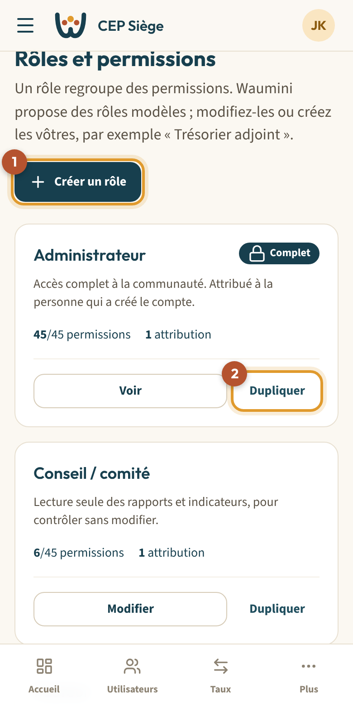
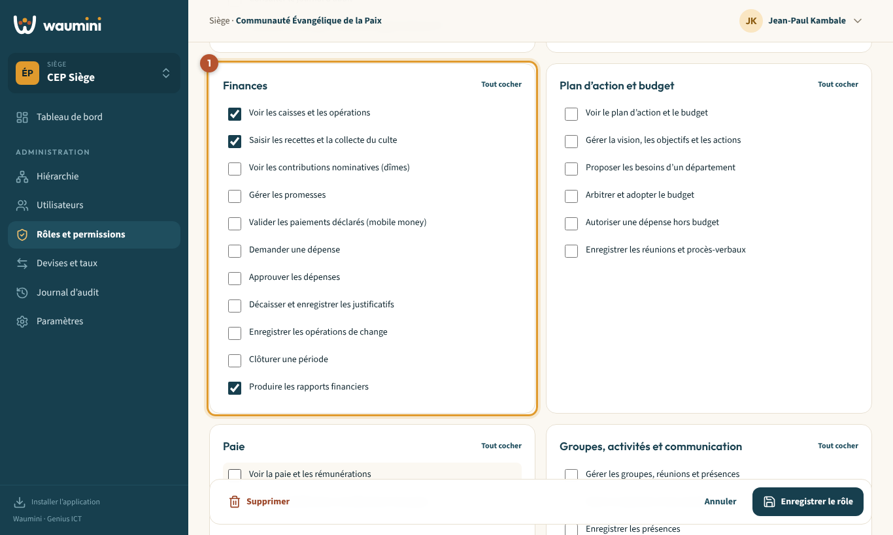

# 6. Rôles et permissions

Un **rôle** est un ensemble de **permissions**, c'est-à-dire de choses qu'on a le droit de voir ou de faire : *Voir le registre des membres*, *Saisir les recettes*, *Approuver les dépenses*…

Waumini installe des **rôles modèles** dans chaque nouvelle communauté : Administrateur, Pasteur, Secrétaire, Trésorier, Responsable de département, Conseil / comité, Responsable de niveau. Vous pouvez les modifier, ou créer les vôtres en cochant des cases.

> Permission nécessaire : **Créer et modifier les rôles** (rôle Administrateur par défaut).

<table><tr>
<td width="68%"></td>
<td width="32%"></td>
</tr></table>

Chaque carte indique la description du rôle, son nombre de permissions et le nombre de personnes qui l'ont reçu.

- **Créer un rôle** ① part d'une page vide.
- **Dupliquer** ② crée un nouveau rôle à partir d'un rôle existant : c'est le plus rapide pour un rôle proche, comme *Trésorier adjoint* à partir de *Trésorier*.
- **Modifier** ouvre le rôle. Le rôle **Administrateur** ne se modifie pas : il donne toujours accès à tout.
- Les rôles définis par un **niveau supérieur** (le siège, par exemple) sont visibles mais pas modifiables dans une paroisse : dupliquez-les pour les adapter.

## Créer ou modifier un rôle

<table><tr>
<td width="68%"></td>
<td width="32%"></td>
</tr></table>

1. Donnez un **nom** et une courte **description** (ce que fait cette personne).
2. Cochez les **permissions**, regroupées par module ① : Communauté, Membres, Finances, Plan d'action et budget, Paie, Groupes, Documents, Suivi pastoral, Consolidation. **Tout cocher** coche tout un module d'un coup.
3. Touchez **Enregistrer le rôle**.

Le changement s'applique **immédiatement** à toutes les personnes qui ont ce rôle.

Pour supprimer un rôle, retirez-le d'abord aux personnes qui l'ont reçu, puis touchez **Supprimer**.

## Quelques conseils

- **Séparez les tâches d'argent** : la personne qui *demande* une dépense ne devrait pas être celle qui l'*approuve*, ni celle qui *décaisse*.
- **Les dîmes nominatives sont sensibles** : la permission *Voir les contributions nominatives* est réservée par défaut au pasteur et au trésorier. Le secrétaire ne l'a pas.
- **La paie est confidentielle** : seuls les rôles qui ont *Voir la paie et les rémunérations* voient ce que chacun reçoit.
- **Le conseil contrôle sans modifier** : le rôle *Conseil / comité* lit les rapports mais ne peut rien changer.
