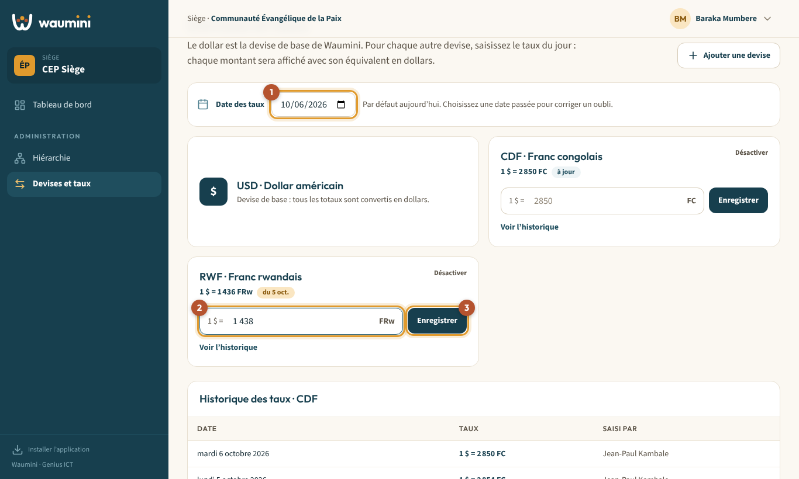
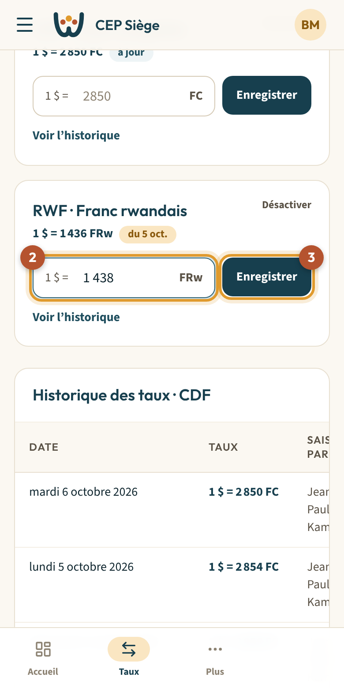

# 7. Devises et taux du jour

Le **dollar américain (USD)** est la devise de base de Waumini : tous les totaux sont calculés en dollars. Votre communauté ajoute les autres devises qu'elle utilise (franc congolais, franc rwandais, shilling ougandais, euro…), et le trésorier saisit chaque jour leur **taux**.

Chaque montant saisi dans une autre devise sera ensuite affiché **dans sa devise et avec son équivalent en dollars**, au taux du jour de l'opération.

> Permission nécessaire : **Gérer les devises et saisir le taux du jour** (rôle Trésorier par défaut).

<table><tr>
<td width="68%"></td>
<td width="32%"></td>
</tr></table>

## Saisir le taux du jour

Le taux s'exprime en **nombre d'unités pour 1 dollar** : `1 $ = 2 850 FC`.

1. Vérifiez la **date des taux** ① : c'est aujourd'hui par défaut.
2. Dans la carte de la devise, saisissez le taux ②. Vous pouvez écrire `2850`, `2 850` ou `2850,5`.
3. Touchez **Enregistrer** ③.

La carte affiche alors le nouveau taux avec la mention **à jour**.

> **Un oubli hier ?** Choisissez la date d'hier en haut de l'écran, saisissez le taux, puis enregistrez. Saisir un taux pour une date déjà renseignée le **corrige**, et la correction est inscrite au [journal d'audit](09-journal.md).

## Les mentions sur chaque devise

| Mention | Signification |
|---|---|
| **à jour** | Le taux d'aujourd'hui est saisi. |
| **du 5 oct.** | Le dernier taux saisi date de ce jour : pensez à le mettre à jour. |
| **taux du niveau supérieur** | Ce niveau n'a pas saisi de taux : Waumini utilise celui de la région ou du siège. |
| **Aucun taux saisi** | Il faut saisir un taux avant d'utiliser cette devise. |

Une **paroisse** qui ne saisit pas de taux utilise automatiquement celui de son **niveau supérieur**. Si elle a son propre taux (celui du marché de son quartier, par exemple), le sien est prioritaire.

## Ajouter ou désactiver une devise

- **Ajouter une devise** : touchez le bouton en haut de l'écran, choisissez la devise, puis touchez **Ajouter**. Saisissez ensuite son taux du jour.
- **Désactiver** : une devise qui ne sert plus disparaît des saisies, mais **son historique est conservé**. **Réactiver** la rend de nouveau utilisable.

## L'historique des taux

**Voir l'historique** affiche, sous les cartes, tous les taux saisis pour cette devise : la date, le taux et la personne qui l'a saisi.
