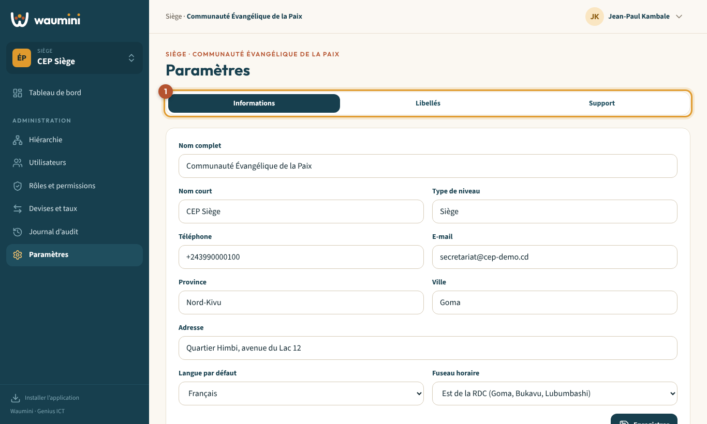
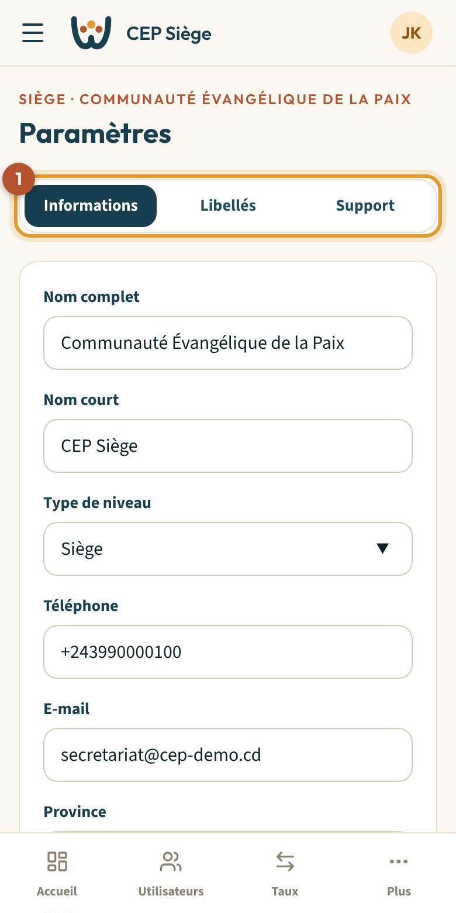
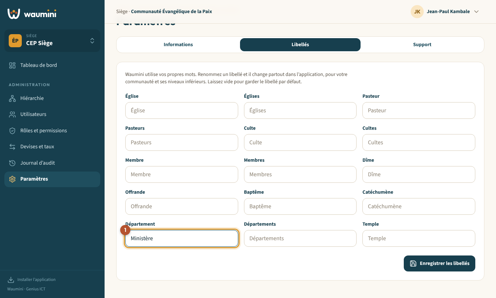
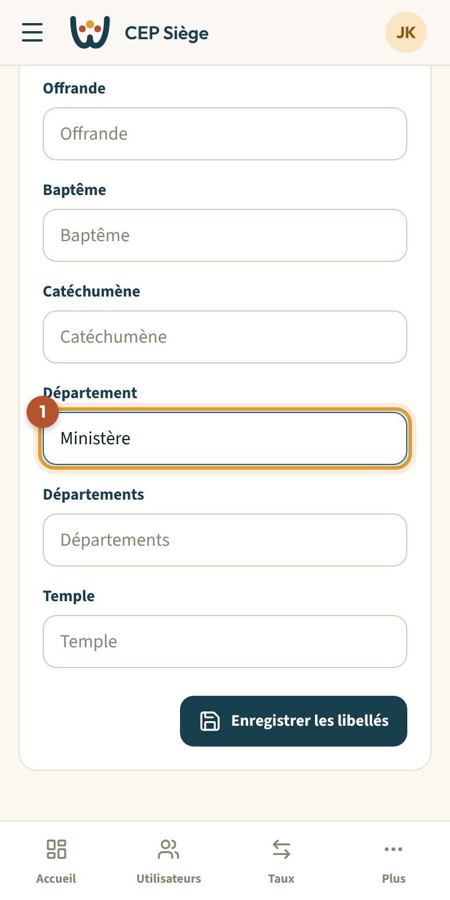
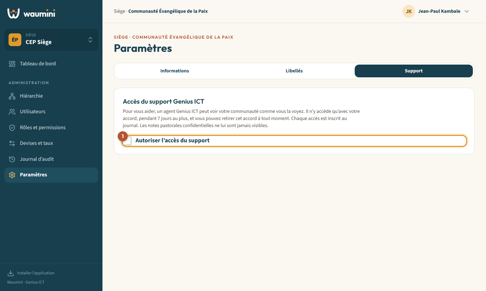
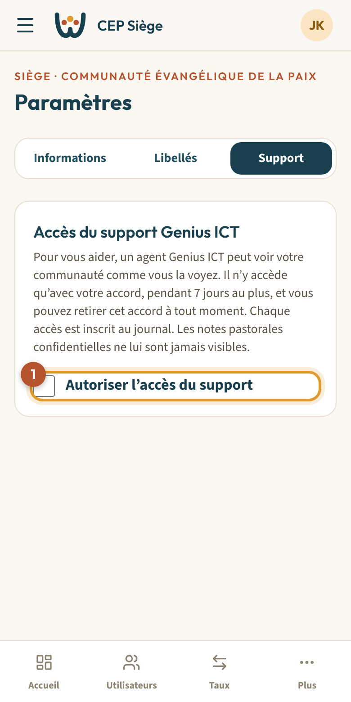

# 8. Paramètres, libellés et accès du support

> Permission nécessaire : **Modifier les paramètres, le logo et les libellés** (rôle Administrateur par défaut).

Les paramètres concernent **la communauté affichée**. Ils sont répartis en trois onglets ① : **Informations**, **Libellés** et **Support**.

<table><tr>
<td width="68%"></td>
<td width="32%"></td>
</tr></table>

## Informations

- **Nom complet** et **nom court**. Le nom court s'affiche dans les menus et sur téléphone (*CEP Himbi* plutôt que *Communauté Évangélique de la Paix, paroisse de Himbi*).
- **Type de niveau** : Siège, Région, Paroisse, Église…
- **Téléphone**, **e-mail**, **province**, **ville** et **adresse** : ils figureront sur les documents et le site vitrine.
- **Langue par défaut** des nouveaux utilisateurs.
- **Fuseau horaire** : *Est de la RDC* pour Goma, Bukavu et Lubumbashi ; *Ouest de la RDC* pour Kinshasa et Matadi.

Touchez **Enregistrer** en bas du formulaire.

## Libellés : vos propres mots

Waumini parle comme votre communauté. Renommez un libellé, et il change **partout** dans l'application, pour votre communauté **et ses niveaux inférieurs**.

<table><tr>
<td width="68%"></td>
<td width="32%"></td>
</tr></table>

1. Chaque case porte le libellé par défaut (*Pasteur*, *Culte*, *Dîme*, *Département*…).
2. Écrivez votre mot dans la case ① : par exemple *Ministère* au lieu de *Département*, *Berger* au lieu de *Pasteur*, *Imam* pour une mosquée.
3. Laissez une case **vide** pour garder le libellé par défaut, ou celui de votre niveau supérieur.
4. Touchez **Enregistrer les libellés**.

## Accès du support Genius ICT

Pour vous aider, un agent du support Genius ICT peut voir votre communauté **comme vous la voyez**. Il n'y accède **qu'avec votre accord**.

<table><tr>
<td width="68%"></td>
<td width="32%"></td>
</tr></table>

- Cochez **Autoriser l'accès du support** ① : l'accès est ouvert pour **7 jours** au plus, et la date de fin s'affiche.
- Décochez la case pour **retirer l'accès immédiatement**.
- Chaque accès est inscrit au [journal d'audit](09-journal.md).
- Les **notes pastorales confidentielles** ne sont **jamais** visibles par le support.

Cette case demande la permission **Autoriser ou révoquer l'accès du support Genius ICT**.
