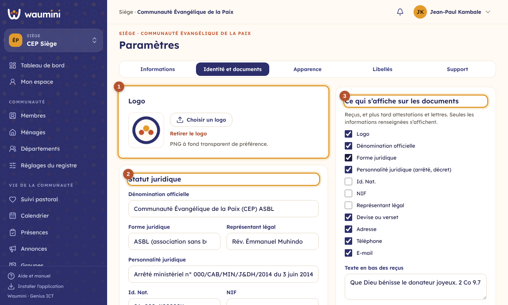
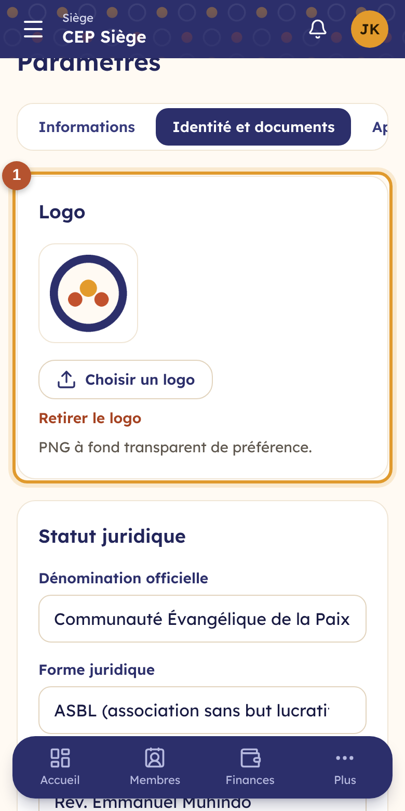
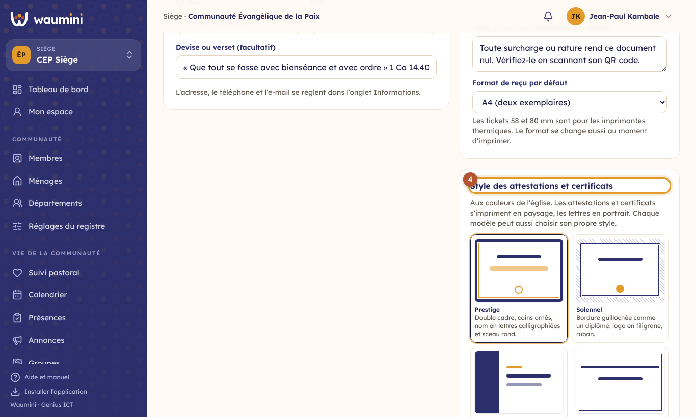
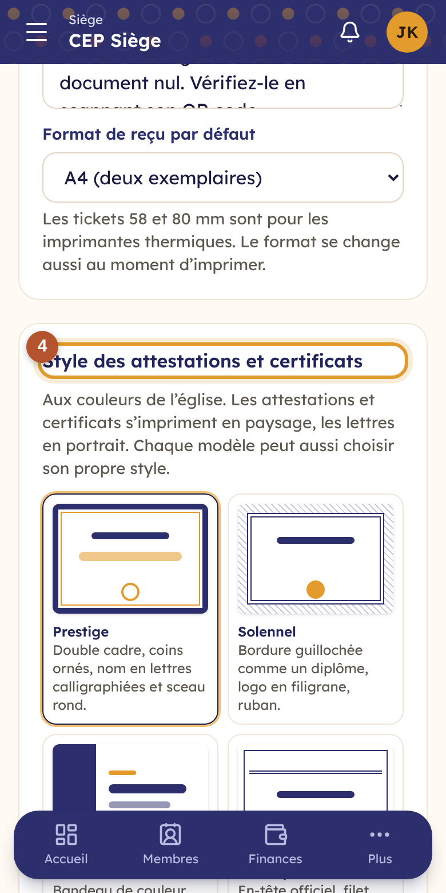
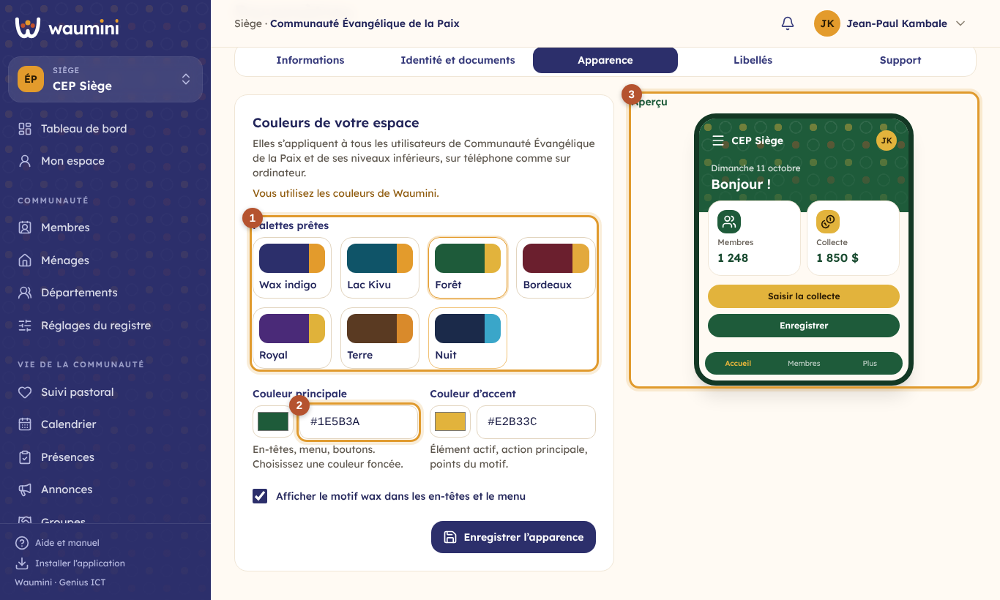
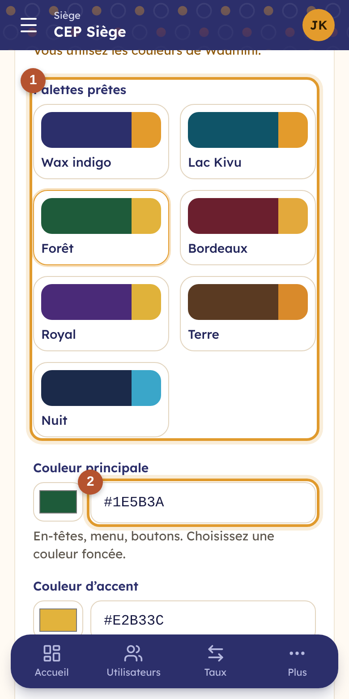

# 8. Paramètres, apparence, libellés et accès du support

> Permission nécessaire : **Modifier les paramètres, le logo et les libellés** (rôle Administrateur par défaut).

Les paramètres concernent **la communauté affichée**. Ils sont répartis en cinq onglets ① : **Informations**, **Identité et documents**, **Apparence**, **Libellés** et **Support**.

<table><tr>
<td width="68%"></td>
<td width="32%"></td>
</tr></table>

## Informations

- **Nom complet** et **nom court**. Le nom court s'affiche dans les menus et sur téléphone (*CEP Himbi* plutôt que *Communauté Évangélique de la Paix, paroisse de Himbi*).
- **Type de niveau** : Siège, Région, Paroisse, Église…
- **Téléphone**, **e-mail**, **province**, **ville** et **adresse** : ils figureront sur les documents et le site vitrine.
- **Langue par défaut** des nouveaux utilisateurs.
- **Fuseau horaire** : *Est de la RDC* pour Goma, Bukavu et Lubumbashi ; *Ouest de la RDC* pour Kinshasa et Matadi.

Touchez **Enregistrer** en bas du formulaire.

## Identité et documents : le statut juridique sur les reçus

Une église est une personne morale : ses reçus, et plus tard ses attestations et ses lettres, portent son identité juridique. L'onglet **Identité et documents** la renseigne, et **l'église décide de ce qui s'affiche**.

<table><tr>
<td width="68%"></td>
<td width="32%"></td>
</tr></table>

① **Le logo** (PNG à fond transparent de préférence).

② **Le statut juridique** : dénomination officielle, forme juridique (ASBL, établissement d'utilité publique, confession religieuse reconnue…), arrêté ou décret de personnalité juridique, Id. Nat., NIF, représentant légal, et une devise ou un verset.

③ **Ce qui s'affiche sur les documents** : cochez ou décochez chaque élément (logo, dénomination, forme juridique, personnalité juridique, Id. Nat., NIF, représentant, devise, adresse, téléphone, e-mail, nom du niveau supérieur). Seules les informations renseignées s'affichent. Choisissez aussi le **texte en bas des reçus**, celui **en bas des attestations et lettres** (voir [Les documents](29-documents.md)), et le **format de reçu par défaut** (A4, ticket 80 mm ou 58 mm).

<table><tr>
<td width="68%"></td>
<td width="32%"></td>
</tr></table>

④ **Le style des documents** : Prestige, Solennel, Moderne, Classique ou Épuré, choisi sur des vignettes, toujours aux couleurs de l'église. Un modèle peut avoir son propre style (voir [Le style des documents](29-documents.md#le-style-des-documents)).

**Dans une dénomination**, l'identité juridique est celle du **siège** : les paroisses la reçoivent telle quelle, avec le logo du siège si elles n'ont pas le leur. Chaque paroisse garde son nom, son adresse et son téléphone, et peut régler ce qui s'affiche sur ses propres documents ; sinon, elle suit le réglage de son niveau supérieur.

## Apparence : les couleurs de votre espace

Chaque communauté peut habiller Waumini à ses couleurs. Le choix s'applique à **tous ses utilisateurs**, sur téléphone comme sur ordinateur, et à ses **niveaux inférieurs**, sauf si l'un d'eux choisit ses propres couleurs.

<table><tr>
<td width="68%"></td>
<td width="32%"></td>
</tr></table>

1. Touchez une **palette prête** ① : Wax indigo (par défaut), Lac Kivu, Forêt, Bordeaux, Royal, Terre ou Nuit.
2. Ou choisissez vos propres couleurs ② :
   - la **couleur principale** colore les en-têtes, le menu et les boutons. Elle doit être **foncée**, pour que le texte blanc posé dessus reste lisible : Waumini refuse une couleur trop claire ;
   - la **couleur d'accent** marque l'élément actif, l'action principale et les points du motif.
3. Cochez ou décochez **Afficher le motif wax**.
4. Regardez l'**aperçu** ③ : il montre le résultat sur un téléphone. Touchez ensuite **Enregistrer l'apparence**.

**Couleurs par défaut** revient aux couleurs de Waumini, ou à celles de votre niveau supérieur.

## Libellés : vos propres mots

Waumini parle comme votre communauté. Renommez un libellé, et il change **partout** dans l'application, pour votre communauté **et ses niveaux inférieurs**.

<table><tr>
<td width="68%"></td>
<td width="32%"></td>
</tr></table>

1. Chaque case porte le libellé par défaut (*Pasteur*, *Culte*, *Dîme*, *Département*…).
2. Écrivez votre mot dans la case ① : par exemple *Ministère* au lieu de *Département*, *Berger* au lieu de *Pasteur*, *Imam* pour une mosquée.
3. Laissez une case **vide** pour garder le libellé par défaut, ou celui de votre niveau supérieur.
4. Touchez **Enregistrer les libellés**.

## Accès du support Genius ICT

Pour vous aider, un agent du support Genius ICT peut **voir** votre communauté, en **lecture seule**. Il n'y accède **qu'avec votre accord**.

<table><tr>
<td width="68%"></td>
<td width="32%"></td>
</tr></table>

- Choisissez la durée (**1, 3 ou 7 jours**), puis cochez **Autoriser l'accès du support** ① : la date de fin s'affiche.
- Décochez la case pour **retirer l'accès immédiatement** : l'agent est renvoyé hors de votre communauté à son prochain clic.
- L'agent voit le registre, les finances, les rapports, le budget et la paie, avec un bandeau « lecture seule » : il ne peut **rien modifier**. Il ne voit **jamais** le suivi pastoral ni les données sensibles des membres.
- **Les visites du support** : chaque entrée et chaque sortie d'un agent, avec son nom et l'heure. Elles sont aussi inscrites au [journal d'audit](09-journal.md).

Pour poser une question au support, utilisez plutôt une [demande de support](35-support.md) : l'agent vous répond dans Waumini.

Cette case demande la permission **Autoriser ou révoquer l'accès du support Genius ICT**.
