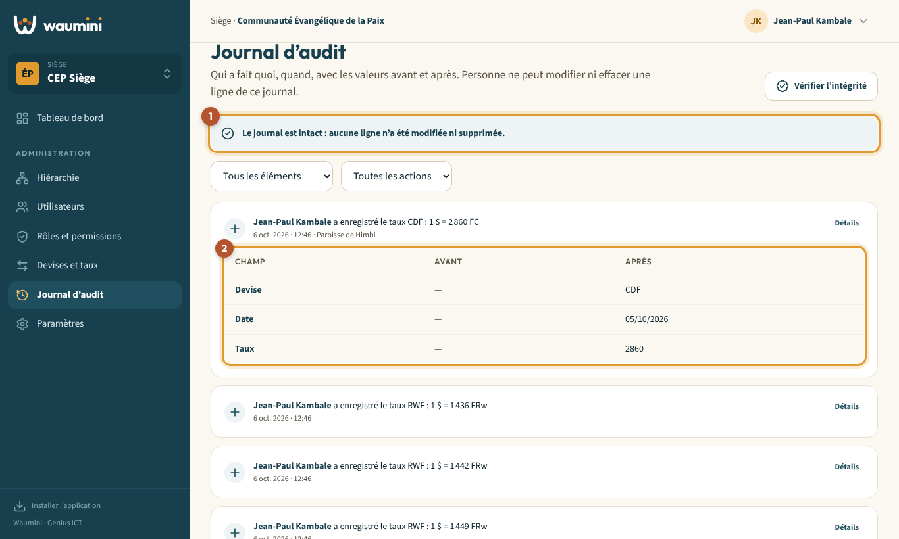
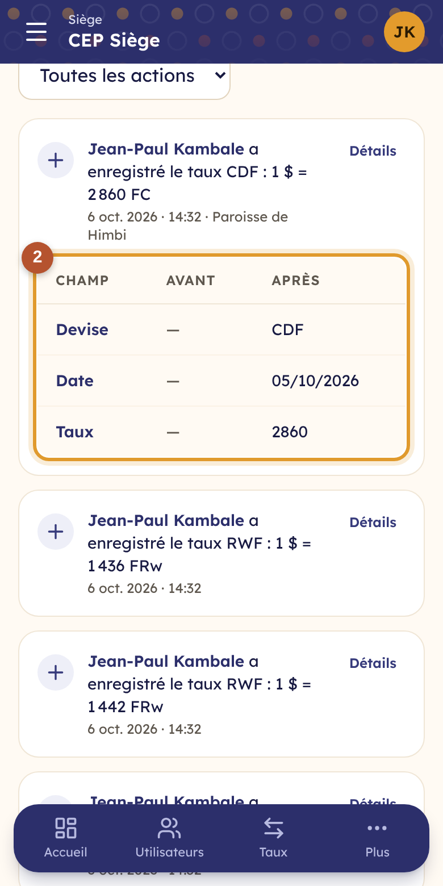

# 33. Le journal d'audit

Le journal d'audit garde la trace de **tout ce qui se passe** dans la communauté : qui a fait quoi, quand, depuis quel appareil, avec les **valeurs avant et après** chaque modification.

**Personne ne peut modifier ni effacer** une ligne du journal, pas même l'administrateur. C'est ce qui permet à chacun de faire confiance aux chiffres.

> Permission nécessaire : **Consulter le journal d'audit** (rôles Administrateur, Pasteur et Conseil par défaut).

<table><tr>
<td width="68%"></td>
<td width="32%"></td>
</tr></table>

## Lire le journal

Chaque ligne indique **qui**, **quoi** et **quand**, par exemple : *Jean-Paul Kambale a enregistré le taux CDF : 1 $ = 2 860 FC*, avec la date, l'heure et l'adresse de l'appareil.

- Une ligne d'un **niveau inférieur** (une paroisse, par exemple) indique de quel niveau il s'agit.
- **Détails** ② déplie le tableau des valeurs **avant** et **après** la modification.
- Les deux listes en haut filtrent par **type d'élément** (utilisateurs, rôles, taux…) et par **action** (créations, modifications, suppressions).

Les mots de passe n'apparaissent **jamais** dans le journal.

## Vérifier l'intégrité

Touchez **Vérifier l'intégrité**. Waumini contrôle toute la chaîne du journal :

- **« Le journal est intact »** ① : aucune ligne n'a été modifiée ni supprimée.
- Un message **rouge** signale qu'une ligne a été retouchée en dehors de Waumini, directement dans la base de données. Contactez alors le support Genius ICT.

> **Comment ça marche ?** Chaque ligne contient une empreinte calculée à partir de son contenu et de l'empreinte de la ligne précédente. Changer ou effacer une seule ligne casse la chaîne, et cela se voit.
