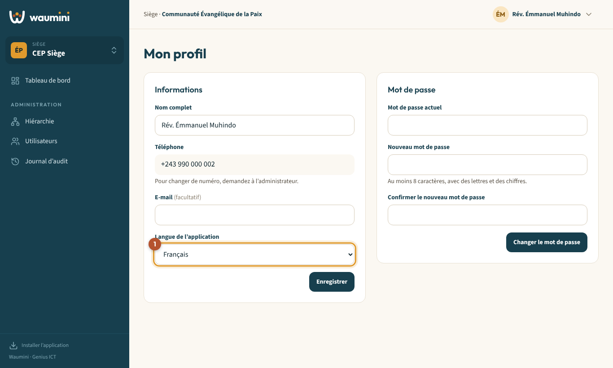
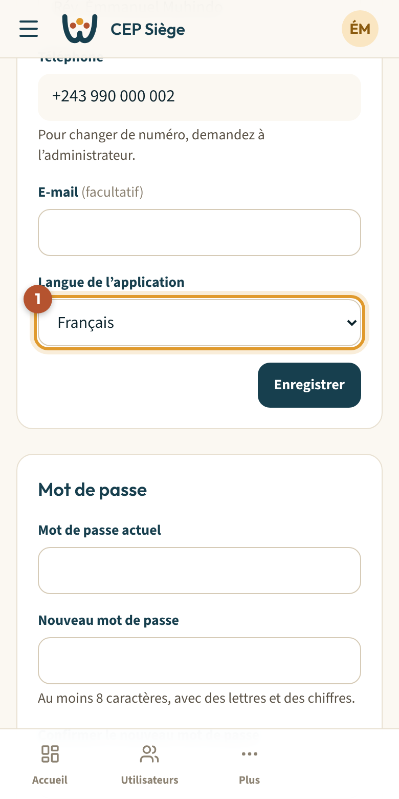

# 10. Mon profil : langue et mot de passe

Touchez votre nom ou vos initiales en haut à droite, puis **Mon profil**.

<table><tr>
<td width="68%"></td>
<td width="32%"></td>
</tr></table>

## Informations

- **Nom complet** et **e-mail** (facultatif).
- Le **téléphone** est votre identifiant de connexion. Pour en changer, demandez à l'administrateur.
- **Langue de l'application** ① : français, kiswahili, lingála, kikongo ou tshiluba. Après **Enregistrer**, Waumini s'affiche dans la langue choisie. Les textes pas encore traduits restent en français.

## Changer son mot de passe

1. Saisissez votre **mot de passe actuel**.
2. Saisissez le **nouveau mot de passe** : au moins 8 caractères, avec des lettres et des chiffres.
3. Saisissez-le une deuxième fois pour **confirmer**, puis touchez **Changer le mot de passe**.

Ne communiquez jamais votre mot de passe, même à un responsable : chacun a le sien, et le journal enregistre qui fait quoi.
