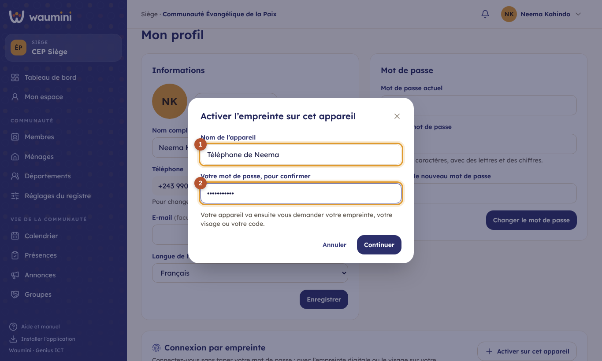
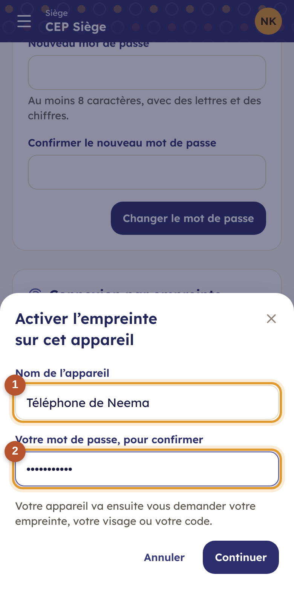

# 10. Mon profil : langue, mot de passe et empreinte

Touchez votre nom ou vos initiales en haut à droite, puis **Mon profil**.

<table><tr>
<td width="68%"></td>
<td width="32%"></td>
</tr></table>

## Informations

- **Photo de profil** : **Ajouter une photo** (ou **Changer la photo**), choisie dans la galerie ou prise avec l'appareil photo. Elle est recadrée en carré et remplace vos initiales en haut de l'écran et dans la liste des utilisateurs. Seules les personnes de votre communauté la voient. **Retirer la photo** revient aux initiales.
- **Nom complet** et **e-mail** (facultatif).
- Le **téléphone** est votre identifiant de connexion. Pour en changer, demandez à l'administrateur.
- **Langue de l'application** ① : français, kiswahili, lingála, kikongo ou tshiluba. Après **Enregistrer**, Waumini s'affiche dans la langue choisie. Les textes pas encore traduits restent en français.

## Changer son mot de passe

1. Saisissez votre **mot de passe actuel**.
2. Saisissez le **nouveau mot de passe** : au moins 8 caractères, avec des lettres et des chiffres.
3. Saisissez-le une deuxième fois pour **confirmer**, puis touchez **Changer le mot de passe**.

## Se connecter avec son empreinte

Sur votre téléphone, vous pouvez vous connecter avec votre **empreinte digitale** ou votre **visage**. Sur l'ordinateur, avec **Windows Hello** (visage, empreinte ou code PIN). Votre empreinte ne quitte jamais votre appareil : Waumini ne la reçoit pas.

<table><tr>
<td width="68%"></td>
<td width="32%"></td>
</tr></table>

1. Sur l'appareil à activer, ouvrez **Mon profil**, bloc **Connexion par empreinte**, puis touchez **Activer sur cet appareil**.
2. Donnez un **nom à l'appareil** ①, par exemple *Mon téléphone* ou *Ordinateur du secrétariat*.
3. Retapez votre **mot de passe** ② pour confirmer que c'est bien vous, puis touchez **Continuer**.
4. Votre appareil vous demande votre empreinte, votre visage ou votre code : validez.

L'appareil apparaît dans la liste. À la prochaine connexion, touchez **Se connecter avec l'empreinte** sur l'écran de connexion.

- Activez l'empreinte **sur chaque appareil** que vous utilisez.
- Un appareil perdu ou vendu ? Retirez-le de la liste avec la corbeille : il devra de nouveau utiliser le mot de passe.
- Votre mot de passe reste valable : gardez-le, il sert sur les autres appareils.

Ne communiquez jamais votre mot de passe, même à un responsable : chacun a le sien, et le journal enregistre qui fait quoi.
