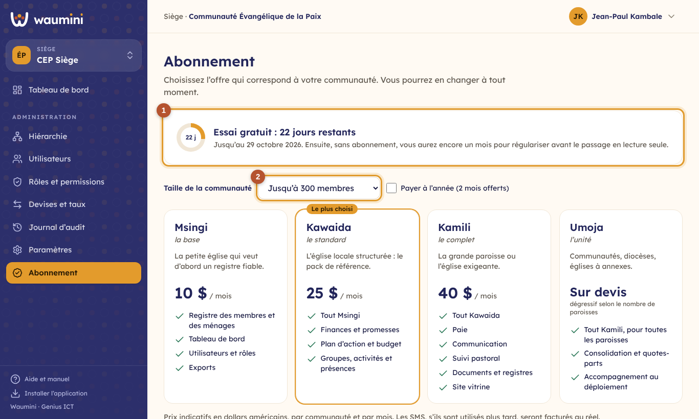
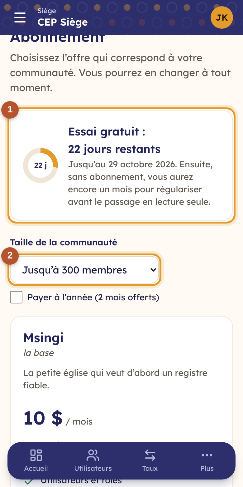

# 11. L'abonnement

> Permission nécessaire : **Modifier les paramètres, le logo et les libellés** (rôle Administrateur par défaut).

Ouvrez **Abonnement** dans le menu, ou touchez le badge **Essai gratuit** du tableau de bord.

<table><tr>
<td width="68%"></td>
<td width="32%"></td>
</tr></table>

① **L'état de votre abonnement** : les jours d'essai qui restent et la date de fin.

② **La taille de votre communauté** : le prix des offres dépend du nombre de membres. Cochez **Payer à l'année** pour voir le prix annuel, avec deux mois offerts.

## Les offres

| Offre | Pour qui | Contenu |
|---|---|---|
| **Msingi** (*la base*) | La petite église qui veut d'abord un registre fiable | Registre des membres et des ménages, tableau de bord, utilisateurs, exports |
| **Kawaida** (*le standard*) | L'église locale structurée | Msingi, plus finances et promesses, plan d'action et budget, groupes et activités |
| **Kamili** (*le complet*) | La grande paroisse ou l'église exigeante | Kawaida, plus paie, communication, suivi pastoral, documents, site vitrine |
| **Umoja** (*l'unité*) | Communautés, diocèses, églises à annexes | Kamili pour toutes les paroisses, consolidation, accompagnement ; sur devis |

Les prix s'affichent dans l'application, pendant l'essai.

## Souscrire

Contactez Genius ICT depuis le bloc **Souscrire** (WhatsApp ou e-mail) pour choisir votre offre. Le paiement se fait par mobile money. Bientôt, vous pourrez déclarer votre paiement directement dans Waumini.

## Et si l'abonnement n'est pas payé ?

- À la fin de l'essai ou de la période payée, vous avez encore **un mois** pour régulariser.
- Ensuite, la communauté passe **en lecture seule** : un bandeau l'indique en haut de chaque écran. Vos données restent **consultables et exportables**, mais plus aucune saisie n'est possible.
- Dès le paiement enregistré, tout redevient normal. **Rien n'est jamais supprimé.**
