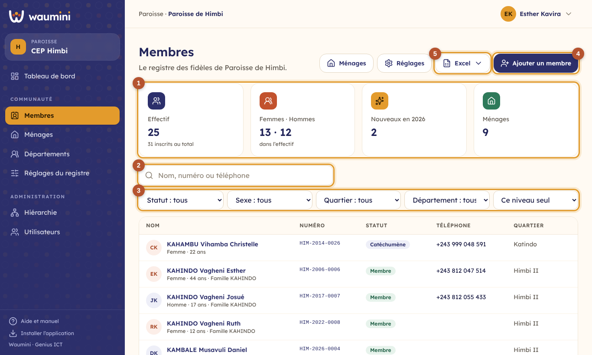
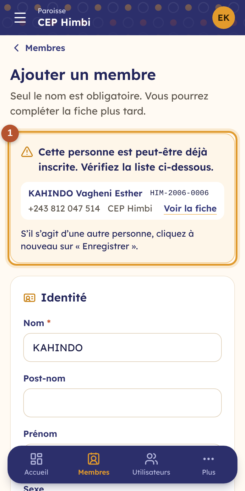
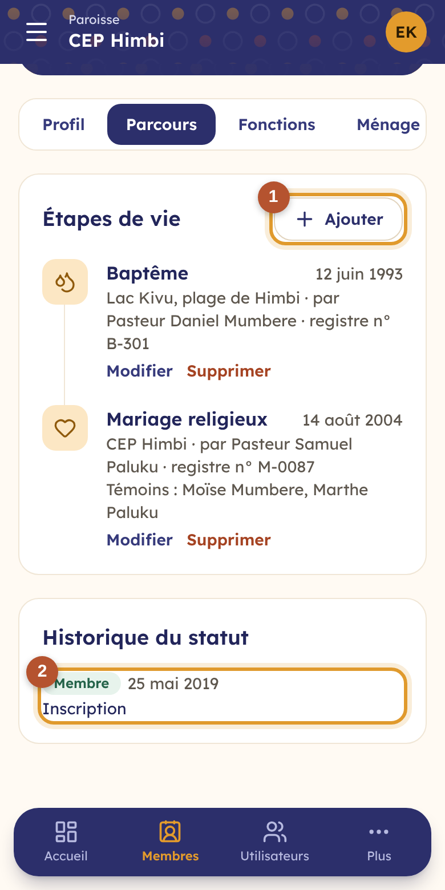
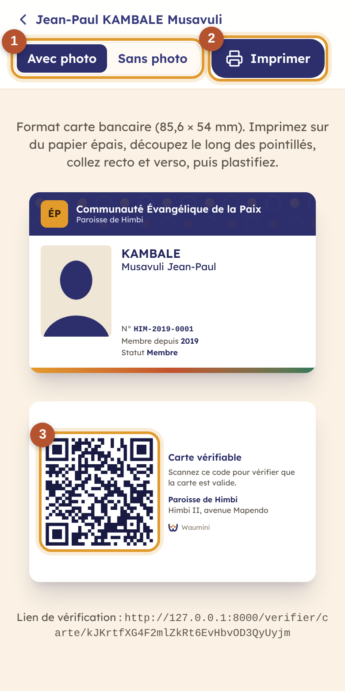

# 12. Le registre des membres

Le **registre** rassemble les fidèles de la communauté : identité, contacts, adresse, ménage, statut, fonctions et étapes de vie (baptême, mariage…). Chaque personne reçoit un **numéro de membre** qui ne change jamais.

> Les membres n'ont pas besoin d'un compte pour figurer au registre. Seules les personnes qui travaillent dans Waumini (secrétaire, trésorier…) sont des [utilisateurs](05-utilisateurs.md).

> Permissions nécessaires : **Voir le registre des membres** pour consulter, **Ajouter et modifier les membres et les ménages** pour le reste. Les notes confidentielles et les champs sensibles demandent **Voir les informations sensibles des membres**.

## La liste des membres

<table><tr>
<td width="68%"></td>
<td width="32%"></td>
</tr></table>

① **Les effectifs** : les personnes qui comptent dans l'effectif (selon leur statut), les femmes et les hommes, les nouveaux de l'année et les ménages.

② **La recherche** trouve une personne par son nom, son post-nom, son prénom, son numéro de membre ou son téléphone. Quelques chiffres du téléphone suffisent.

③ **Les filtres** : statut, sexe, quartier et département. Sur téléphone, touchez le bouton des filtres pour les afficher. Au siège ou dans une région, un dernier filtre montre aussi les membres **des niveaux inférieurs** ; la colonne « Niveau » indique alors la paroisse de chacun.

④ **Ajouter un membre** ouvre le formulaire. ⑤ Le menu **Excel** sert à [importer l'ancien registre ou exporter la liste](14-import-export.md).

## Ajouter un membre

<table><tr>
<td width="68%"></td>
<td width="32%"></td>
</tr></table>

1. Touchez **Ajouter un membre**.
2. Saisissez au moins le **nom**. Le post-nom, le prénom et tout le reste sont facultatifs : vous pourrez compléter la fiche plus tard. Le nom est toujours enregistré en majuscules (KAHINDO).
3. Complétez si vous le pouvez : sexe, date de naissance, téléphone, quartier et avenue, état civil, profession, statut, date d'adhésion, et les **champs propres à votre communauté** (cellule de prière, voix à la chorale…).
4. Ajoutez une **photo d'identité** si vous en avez une. Elle est recadrée au format passeport (35 × 45 mm) et sert aussi pour la [carte de membre](#la-carte-de-membre).
5. Touchez **Enregistrer**.

**Doublons** ① : si une personne porte déjà le même nom et le même prénom, ou le même téléphone, dans votre communauté **ou dans une autre paroisse de la dénomination**, Waumini l'affiche avant d'enregistrer. Ouvrez sa fiche pour vérifier. S'il s'agit bien d'une autre personne, touchez à nouveau **Enregistrer**.

**Le numéro de membre** ② est attribué automatiquement, selon le format choisi par le siège (voir [Réglages du registre](15-reglages-registre.md)). Pour une personne qui avait déjà un numéro dans votre ancien registre papier, ouvrez **Reprendre un numéro de l'ancien registre** et recopiez-le.

**Le ménage** ③ : vous pouvez créer tout de suite le ménage de la personne (« Famille KAHINDO », à son adresse), ou l'ajouter à un ménage existant. Voir [Ménages et départements](13-menages-departements.md).

## La fiche d'un membre

<table><tr>
<td width="68%"></td>
<td width="32%"></td>
</tr></table>

En haut de la fiche : la photo, le numéro, le nom officiel (NOM Post-nom Prénom), l'âge et le statut. Les boutons **Appeler** et **WhatsApp** ouvrent directement l'application du téléphone.

- **Carte** ① prépare la [carte de membre](#la-carte-de-membre) à imprimer.
- **Statut** ② change le statut de la personne (voir ci-dessous).
- **Modifier** ouvre le formulaire de la fiche. Le menu **⋯** permet de supprimer la fiche ; elle reste visible dans le [journal d'audit](09-journal.md).

Les onglets ③ :

| Onglet | Contenu |
|---|---|
| **Profil** | Identité, contact, vie dans la communauté, informations propres à la communauté, notes confidentielles. |
| **Parcours** | Les étapes de vie et l'historique du statut. |
| **Fonctions** | Les fonctions et mandats : diacre depuis 2021, ancien de 2016 à 2020… |
| **Ménage** | Les personnes du même ménage, et les départements de la personne. |

### Changer le statut

Le statut indique où en est chaque personne : Membre, Sympathisant, Catéchumène, Enfant, Inactif, Transféré, Décédé… La liste est fixée par le siège. Touchez **Statut**, choisissez le nouveau statut, la date et le motif (« Transféré à la paroisse de Kadutu »). Le changement est gardé dans l'**historique du statut**.

### Les étapes de vie

<table><tr>
<td width="68%"></td>
<td width="32%"></td>
</tr></table>

Dans l'onglet **Parcours**, touchez **Ajouter** ① pour enregistrer un baptême, une confirmation, une présentation d'enfant, un mariage religieux, une consécration ou toute autre étape. Indiquez la date, le lieu, l'officiant, les témoins et le **numéro dans le registre**, même celui d'un ancien registre papier.

L'**historique du statut** ② montre chaque changement, avec la date, le motif et la personne qui l'a fait.

### Les fonctions et mandats

Dans l'onglet **Fonctions**, touchez **Ajouter**, choisissez la fonction (Pasteur, Ancien, Diacre, Choriste…) et les dates. Laissez la date de fin vide tant que le mandat est en cours. Les mandats terminés restent dans la fiche : c'est l'histoire du service de la personne.

## La carte de membre

<table><tr>
<td width="68%"></td>
<td width="32%"></td>
</tr></table>

Depuis la fiche, touchez **Carte**. La carte est au format carte bancaire (85,6 × 54 mm), avec au recto le nom de la communauté, la photo, le nom, le numéro, l'année d'adhésion et le statut.

① **Avec photo** ou **Sans photo** : la photo d'identité, au format passeport, est facultative. Si la fiche n'a pas encore de photo, un cadre « Photo passeport » est prévu pour en coller une.

② **Imprimer** : imprimez sur du papier épais, découpez le long des pointillés, collez le recto et le verso, puis plastifiez.

③ **Le QR code** du verso : en le scannant avec n'importe quel téléphone, on ouvre une page de Waumini qui dit si la carte est **valide**. Pour protéger la vie privée, cette page ne montre que le nom, le numéro et la communauté. Une carte n'est plus valide si la personne a quitté le registre ou si son statut ne compte plus dans l'effectif (transféré, décédé…).
