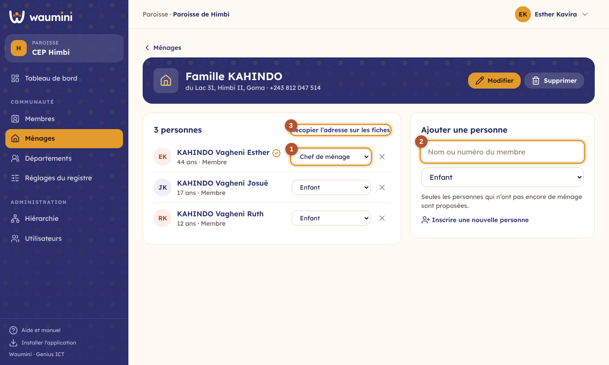
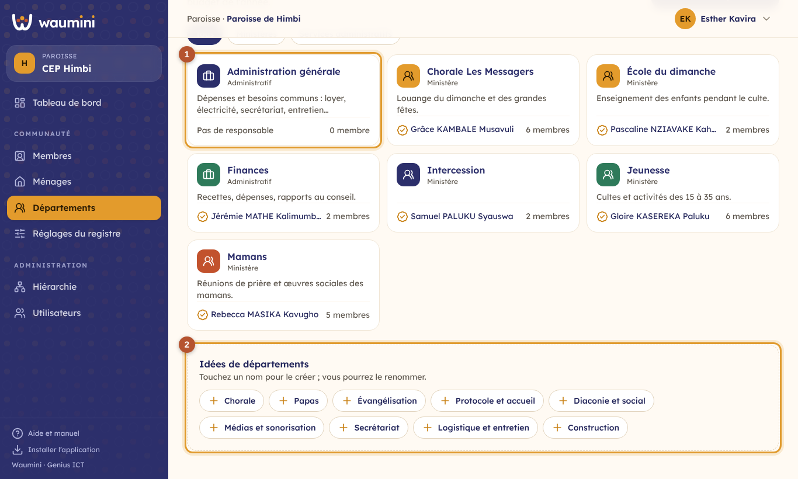
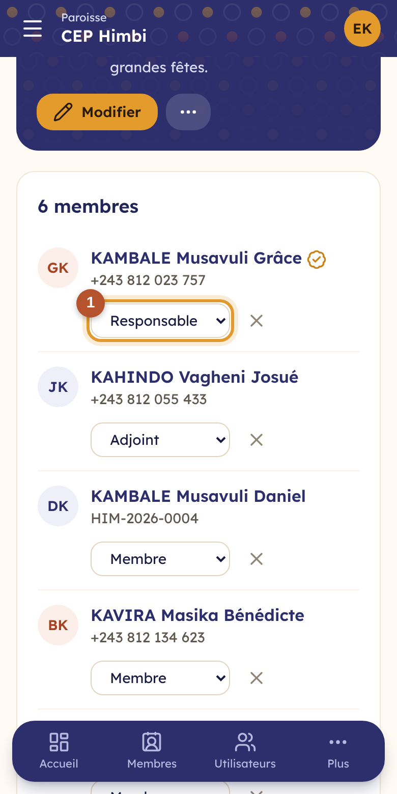

# 13. Ménages et départements

## Les ménages

Un **ménage** regroupe les personnes qui vivent ensemble : le chef de ménage, son conjoint ou sa conjointe, les enfants et les personnes à charge. Le ménage a son adresse et son téléphone.

> Permissions nécessaires : **Voir le registre des membres** pour consulter, **Ajouter et modifier les membres et les ménages** pour modifier.

<table><tr>
<td width="68%"></td>
<td width="32%"></td>
</tr></table>

**Créer un ménage** :

- depuis le formulaire d'un nouveau membre, avec **Créer un nouveau ménage** ;
- depuis la fiche d'un membre, onglet **Ménage**, avec **Créer son ménage** ;
- depuis **Membres › Ménages**, avec **Nouveau ménage**.

**Dans un ménage** :

- ① la **place** de chacun se change dans la liste. Il n'y a qu'**un seul chef de ménage** : si vous en nommez un autre, l'ancien devient conjoint(e) ;
- ② **Ajouter une personne** : recherchez un membre par son nom ou son numéro. Seules les personnes qui n'ont pas encore de ménage sont proposées ;
- ③ **Recopier l'adresse sur les fiches** met l'adresse du ménage sur la fiche de chacun, en une fois ;
- la croix retire une personne du ménage, sans supprimer sa fiche.

Supprimer un ménage ne supprime pas les fiches des personnes.

## Les départements

Les **départements** sont les ministères (chorale, jeunesse, mamans, école du dimanche…) et les services administratifs (finances, secrétariat…) de la communauté. Chaque niveau a ses propres départements : une paroisse crée ceux qui lui conviennent.

Chaque niveau a d'office un département **Administration générale**, pour les besoins et les dépenses communs (loyer, électricité, secrétariat, entretien). Il ne peut pas être supprimé.

> Permissions nécessaires : **Voir le registre des membres** pour consulter, **Créer et gérer les départements** pour le reste. Par défaut, seul l'administrateur et le secrétaire peuvent créer des départements.

<table><tr>
<td width="68%"></td>
<td width="32%"></td>
</tr></table>

① Chaque carte montre le département, son type, sa mission, son **responsable** et son nombre de membres. Touchez-la pour l'ouvrir.

② **Idées de départements** : touchez un nom pour créer le département ; vous pourrez le renommer (« Chorale » devient « Chorale Les Messagers »). Ou touchez **Nouveau département** et choisissez le type, la mission et une couleur.

### Responsables et membres

<table><tr>
<td width="68%"></td>
<td width="32%"></td>
</tr></table>

① Chaque personne a un **rôle** dans le département : **Responsable**, **Adjoint** ou **Membre**. Changez-le directement dans la liste.

② **Ajouter un membre** : recherchez la personne, choisissez son rôle, touchez son nom.

Un département qui ne sert plus peut être **mis en sommeil** (menu **⋯**) : il disparaît des choix mais garde son historique. Il ne peut être supprimé que s'il n'a plus de membres.

Dans le registre, le filtre **Département** montre les membres d'un département.

> Bientôt : chaque département présentera ses **besoins pour le budget de l'année**, tiendra ses réunions et fera ses demandes de dépense (voir la [feuille de route](../feuille-de-route.html)).
