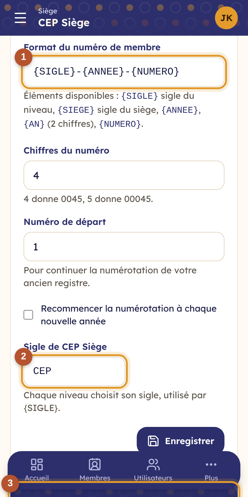

# 15. Réglages du registre

Les réglages du registre décident du **format du numéro de membre**, des **statuts**, des **fonctions** et des **champs de la fiche**.

**C'est le siège qui décide.** Dans une dénomination, les réglages du siège s'appliquent à toutes ses régions et paroisses : même format de numéro, mêmes statuts, mêmes champs communs. Chaque paroisse peut seulement **ajouter** ses propres champs et ses propres fonctions, et choisir son sigle. Une église indépendante règle tout elle-même.

> Permission nécessaire : **Régler le registre : numéro, statuts, champs, fonctions**. Ouvrez **Réglages du registre** dans le menu.

## Le numéro de membre

<table><tr>
<td width="68%"></td>
<td width="32%"></td>
</tr></table>

① **Le format du numéro** (siège seulement), avec ces éléments :

| Élément | Remplacé par | Exemple |
|---|---|---|
| `{SIGLE}` | le sigle du niveau où la personne est inscrite | HIM |
| `{SIEGE}` | le sigle du siège | CEP |
| `{ANNEE}` | l'année d'inscription | 2026 |
| `{AN}` | l'année sur 2 chiffres | 26 |
| `{NUMERO}` | le numéro d'ordre, sur le nombre de chiffres choisi | 0045 |

Le format doit contenir `{NUMERO}`. Le siège choisit aussi le **nombre de chiffres**, le **numéro de départ** (pour continuer l'ancien registre papier, par exemple à 1250) et si la numérotation **recommence chaque année**.

② **Le sigle** de votre niveau : chaque paroisse choisit le sien (HIM pour Himbi, KAT pour Katindo).

③ **L'exemple du prochain numéro** se met à jour pendant que vous tapez. Un numéro déjà attribué ne change jamais, même si le format change.

## Les statuts

Onglet **Statuts** (siège seulement) : ajoutez, renommez ou supprimez des statuts, choisissez leur couleur et indiquez s'ils **comptent dans l'effectif**. Le statut **par défaut** est donné aux nouveaux membres. Un statut ne peut pas être supprimé tant que des membres l'ont.

## Les fonctions

Onglet **Fonctions** : la liste des fonctions et titres (Pasteur, Ancien, Diacre, Évangéliste, Choriste…). Le siège fixe les fonctions communes ; chaque paroisse peut en **ajouter** (Sentinelle…), visibles chez elle seulement.

## Les champs de la fiche

<table><tr>
<td width="68%"></td>
<td width="32%"></td>
</tr></table>

- **Champs courants** (siège seulement) : certaines informations ne servent pas à toutes les communautés (lieu de naissance, niveau d'études, église d'origine…). Décochez-les : elles disparaissent du formulaire, de la fiche et du modèle Excel.
- **Champs ajoutés** ① : touchez **Ajouter** pour une information propre à votre communauté : cellule de prière, carte d'électeur, groupe sanguin… Choisissez son type (texte, nombre, date, liste de choix, oui/non, téléphone), s'il est **obligatoire**, et s'il est **sensible** : un champ sensible n'est visible que par les personnes autorisées à voir les informations sensibles.

Les champs du siège s'appliquent à toutes les paroisses ; ceux d'une paroisse restent chez elle.

## Quand une église rejoint un siège

Une paroisse inscrite seule dans Waumini peut [demander à rejoindre son siège](04-hierarchie.md). Quand le siège accepte :

- ses membres **gardent leur numéro** ; les nouveaux suivent le format du siège ;
- ses statuts qui portent **le même nom** que ceux du siège sont remplacés par ceux du siège ;
- ses autres statuts restent sur les fiches, marqués **« à harmoniser »** : changez le statut de ces membres pour un statut du siège ;
- ses propres champs et fonctions sont conservés.
