# 16. Les finances : comptes, recettes, reçus et opérations

Waumini tient la caisse de la communauté comme un cahier de caisse qui ne s'efface jamais : chaque entrée et chaque sortie est datée, signée par la personne qui l'a saisie, et ne peut être qu'**annulée**, avec un motif, jamais supprimée.

> Permissions nécessaires : **Voir les caisses et les opérations** pour consulter ; **Saisir les recettes et la collecte du culte** pour les recettes ; **Gérer les caisses et les catégories** pour les comptes. Le rôle Trésorier a tout cela par défaut.

## Le tableau des finances

<table><tr>
<td width="68%">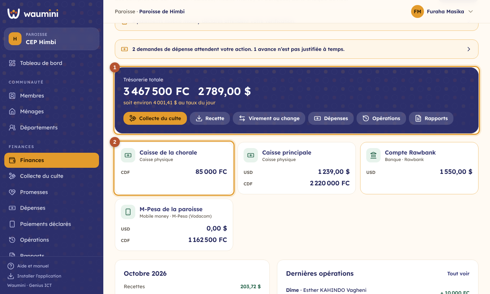</td>
<td width="32%">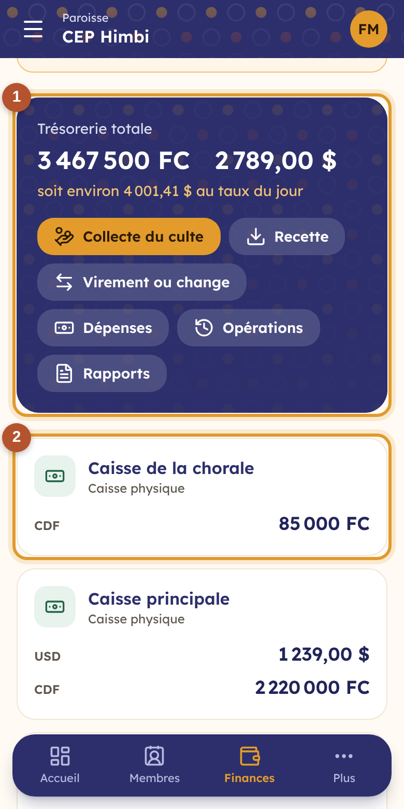</td>
</tr></table>

① **La trésorerie totale**, devise par devise, avec son équivalent en dollars au taux du jour. Les boutons mènent à la collecte du culte, aux recettes, aux virements et au change, aux dépenses, aux opérations et aux rapports.

② **Chaque compte** et son solde dans chacune de ses devises. Touchez un compte pour voir ses opérations.

Plus bas : les recettes et les dépenses du mois, les recettes par catégorie et les dernières opérations. Quand quelque chose attend la trésorière (paiements mobile money déclarés, demandes de dépense, avances en retard), un bandeau orange l'annonce en haut de l'écran.

## Les comptes : caisses, mobile money, banques

Un **compte**, c'est un endroit où se trouve l'argent : une **caisse physique** (la caisse principale, celle de la chorale), un **compte mobile money** (M-Pesa, Airtel Money, Orange Money) ou un **compte bancaire**. Chaque compte tient **les devises que vous choisissez** : par exemple la caisse principale en dollars et en francs, le compte Rawbank en dollars seulement.

Ouvrez **Finances › Comptes et catégories**, puis **Nouveau compte**, ou touchez un compte pour le modifier.

<table><tr>
<td width="68%">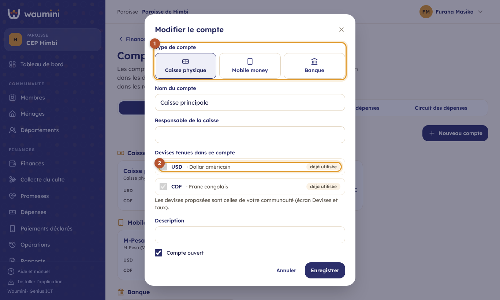</td>
<td width="32%">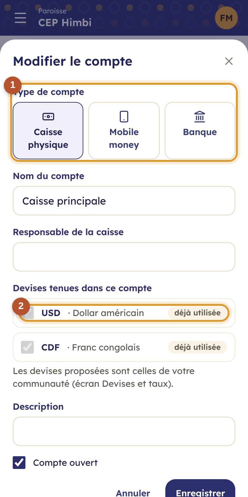</td>
</tr></table>

① **Le type de compte**, son nom, et selon le type : le responsable de la caisse, l'opérateur et le numéro mobile money, ou la banque et le numéro de compte.

② **Les devises tenues**, chacune avec son **solde de départ** et sa date : ce qu'il y avait dans la caisse le jour où vous commencez avec Waumini. Une devise qui a déjà des opérations est marquée « déjà utilisée » : son solde de départ ne change plus.

Un compte qui ne sert plus se **ferme** (case *Compte ouvert* décochée) : il disparaît des listes de saisie, mais son historique reste.

### Les catégories

Les onglets **Catégories de recettes** et **Catégories de dépenses** classent l'argent dans les rapports. Waumini en propose d'office (offrande du culte, dîme, action de grâce, don, promesses et projets ; loyer, électricité, transport, entretien, évangélisation, œuvres sociales…). Vous pouvez les renommer, en ajouter ou désactiver celles qui ne servent pas.

Chaque catégorie de recette a une **nature** :

- **Collective** : l'offrande de toute l'assemblée, sans nom (la boîte du culte) ;
- **Personnelle** : la dîme ou le don d'une personne, enregistré à son nom ;
- **De groupe** : la contribution d'un département (la chorale qui remet le produit d'un concert).

## Enregistrer une recette

**Finances › Recette**.

<table><tr>
<td width="68%">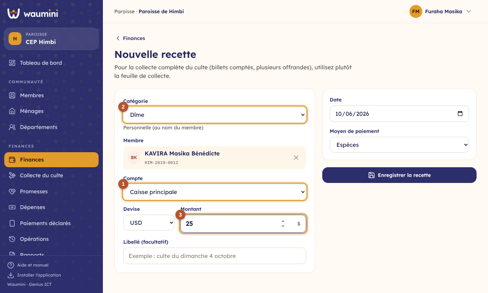</td>
<td width="32%">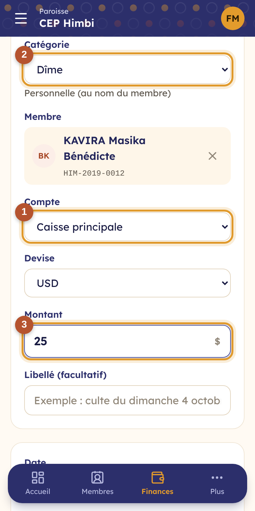</td>
</tr></table>

① **Le compte** qui reçoit l'argent, puis la devise.

② **La catégorie**. Selon sa nature, Waumini demande le membre (dîme), le département (contribution de groupe) ou rien (offrande collective). Une personne qui n'est pas membre peut être indiquée par son nom.

③ **Le montant**, la date et le moyen de paiement. Pour le mobile money, indiquez l'**ID de la transaction** : Waumini refuse un ID déjà enregistré, ce qui évite de compter deux fois le même paiement.

Pour la collecte complète du culte (boîte, enveloppes, comptage des billets), utilisez plutôt la [feuille de collecte](17-collecte.md).

## Le reçu

Chaque recette reçoit un **numéro de reçu** (R-2026-000071), dans l'ordre, sans trou. Le bouton imprimante d'une recette ouvre le reçu.

<table><tr>
<td width="68%">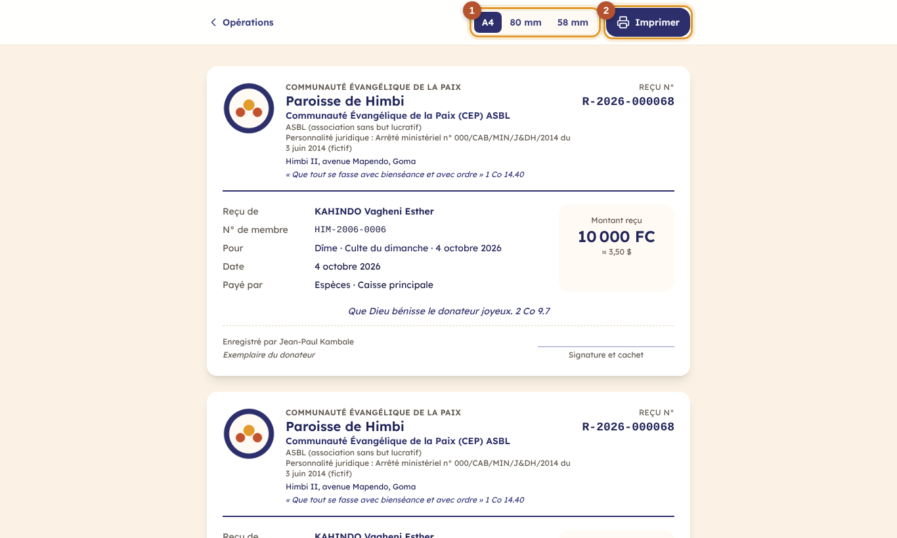</td>
<td width="32%">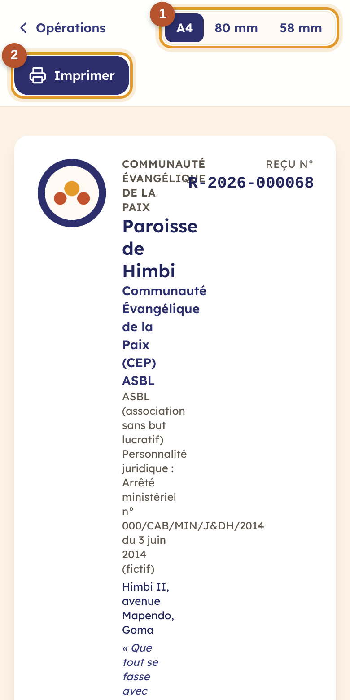</td>
</tr></table>

① **Trois formats** : A4, ou ticket de **80 mm** et de **58 mm** pour les petites imprimantes thermiques.

② **Imprimer**. Pour envoyer le reçu par WhatsApp, choisissez « Enregistrer au format PDF » comme imprimante.

Le reçu porte le logo et l'**identité juridique** de l'église (dénomination, forme juridique, arrêté de personnalité juridique, numéros d'identification, adresse). C'est l'église qui décide de ce qui s'affiche : voir [Paramètres › Identité et documents](08-parametres.md). Un reçu au nom d'un membre n'est visible que par les personnes qui ont la permission **Voir les contributions nominatives**.

## Virements et change

**Finances › Virement ou change**.

<table><tr>
<td width="68%">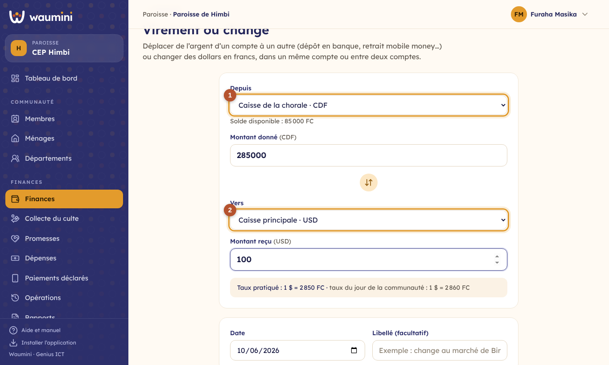</td>
<td width="32%">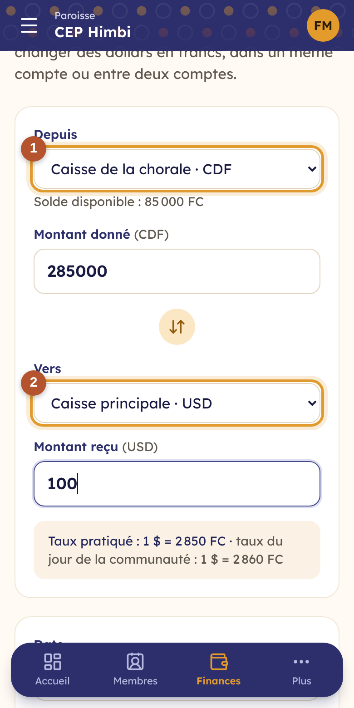</td>
</tr></table>

① **D'où part l'argent** : le compte et la devise.

② **Où il arrive.**

- Entre deux comptes dans la **même devise**, c'est un **virement** : le dépôt des offrandes à la banque, l'approvisionnement de la caisse depuis M-Pesa.
- Dès que la **devise change**, c'est un **change** : vous indiquez le montant donné et le montant reçu (par exemple 285 000 FC changés contre 100 $ au marché). Le taux réel du change apparaît dans le libellé.

Un virement ou un change n'est ni une recette ni une dépense : il ne modifie pas le résultat du mois.

## Les opérations

**Finances › Opérations** montre toutes les opérations, mois par mois.

<table><tr>
<td width="68%">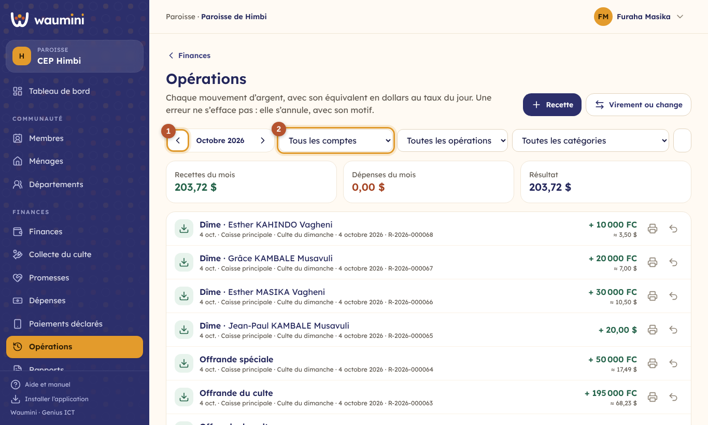</td>
<td width="32%">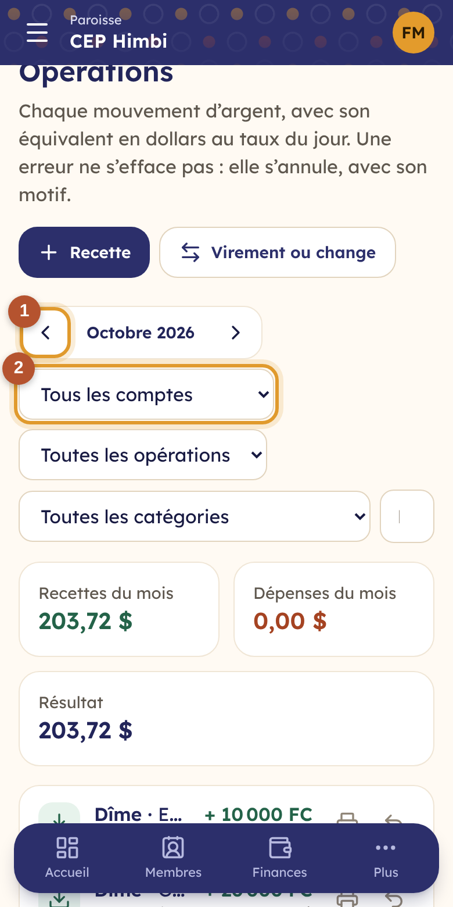</td>
</tr></table>

① **Changer de mois.** Un cadenas à côté du mois indique qu'il est [clôturé](20-clotures-rapports.md).

② **Filtrer** par compte, par type (recettes, dépenses, virements, change) ou par catégorie, ou chercher un nom, un numéro de reçu, un ID de transaction.

**Annuler une opération** : la flèche de retour, puis le motif. L'opération reste visible, barrée, avec la date, l'auteur et le motif de l'annulation. Les deux côtés d'un virement ou d'un change sont annulés ensemble. Dans un mois clôturé, plus rien ne s'annule.

## Questions fréquentes

**Le solde d'une caisse ne correspond pas à l'argent compté.** Regardez les opérations du compte depuis le dernier comptage : une recette oubliée, une dépense saisie dans le mauvais compte ou la mauvaise devise. Corrigez en annulant l'opération fausse et en la saisissant de nouveau.

**Waumini refuse une dépense : « Solde insuffisant ».** Une caisse ne peut pas descendre sous zéro. Enregistrez d'abord l'argent reçu, ou un virement depuis un autre compte.

**Waumini demande le taux du jour.** Pour chaque opération en francs, Waumini calcule l'équivalent en dollars. Saisissez le taux dans [Devises et taux](07-devises.md).
