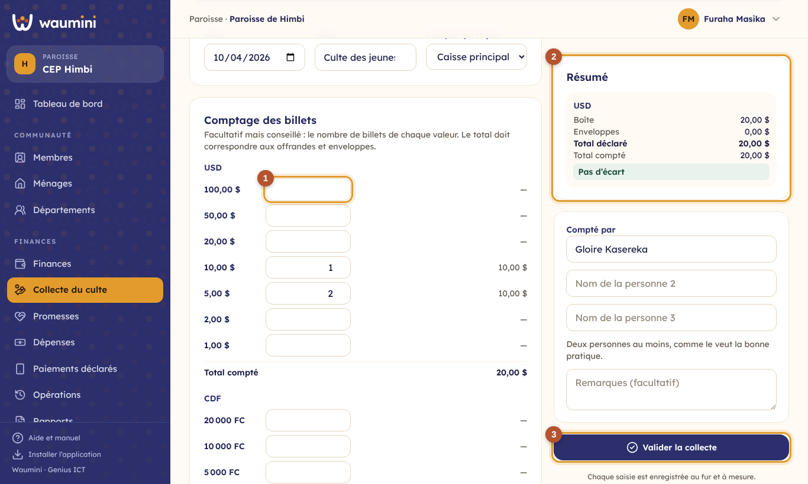
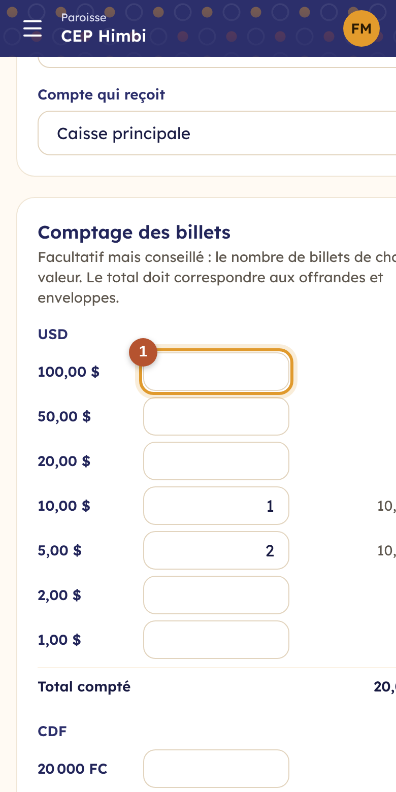

# 17. La collecte du culte

La **feuille de collecte** remplace le cahier du comptage : les offrandes de la boîte, les enveloppes au nom des membres et le comptage des billets, devise par devise, puis un procès-verbal à signer.

> Permission nécessaire : **Saisir les recettes et la collecte du culte**.

## Créer la feuille

**Finances › Collecte du culte**, puis **Nouvelle feuille** : la date et le culte (culte du dimanche, culte des jeunes, veillée…), et la caisse qui reçoit l'argent.

<table><tr>
<td width="68%"></td>
<td width="32%"></td>
</tr></table>

① **Le comptage des billets** (facultatif mais conseillé) : le nombre de billets de chaque valeur. Waumini calcule le total compté.

② **Le résumé** compare, pour chaque devise, ce qui est déclaré (boîte et enveloppes) à ce qui est compté. Un écart s'affiche en rouge.

③ **Valider la collecte** : chaque ligne devient une recette dans la caisse, avec son reçu. Les enveloppes nominatives deviennent des dîmes ou des dons au nom des membres.

Dans la feuille, vous saisissez aussi :

- **les offrandes de la boîte**, par catégorie et par devise (offrande du culte, offrande spéciale…) ;
- **les enveloppes nominatives** : le membre (ou un nom), la catégorie et le montant ;
- **les personnes qui ont compté** : deux au moins, comme le veut la bonne pratique.

Tout est enregistré au fur et à mesure : vous pouvez fermer la feuille et la reprendre. Tant qu'elle n'est pas validée, c'est un **brouillon**, qui peut être supprimé.

## Le procès-verbal

Le bouton **Procès-verbal** ouvre la feuille prête à imprimer, avec l'en-tête de l'église, le détail des offrandes, le comptage des billets et la place des signatures.

## Annuler une feuille validée

Une erreur après validation ? **Annuler la feuille**, avec un motif : toutes ses recettes sont annulées dans les opérations. Refaites ensuite une nouvelle feuille. Une feuille d'un mois clôturé ne s'annule plus.
