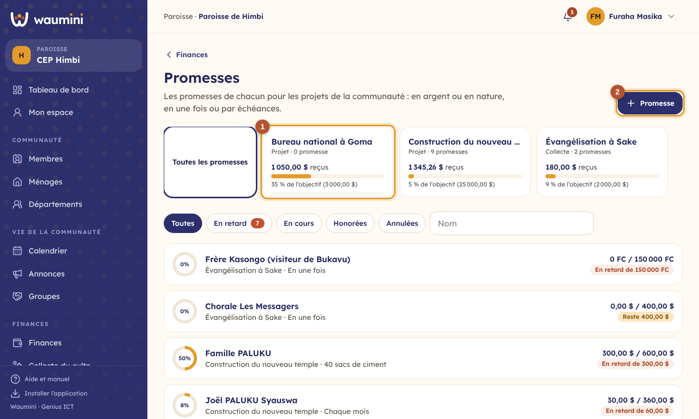
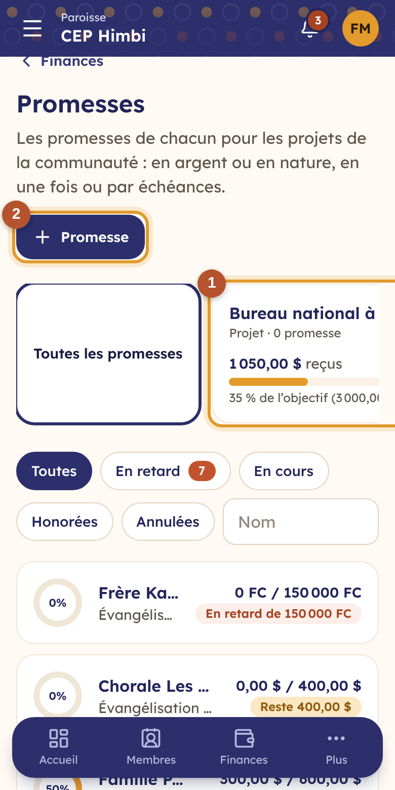
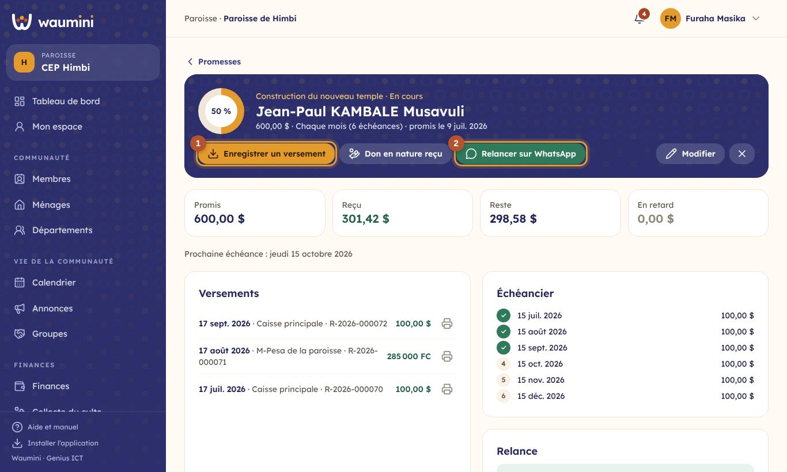
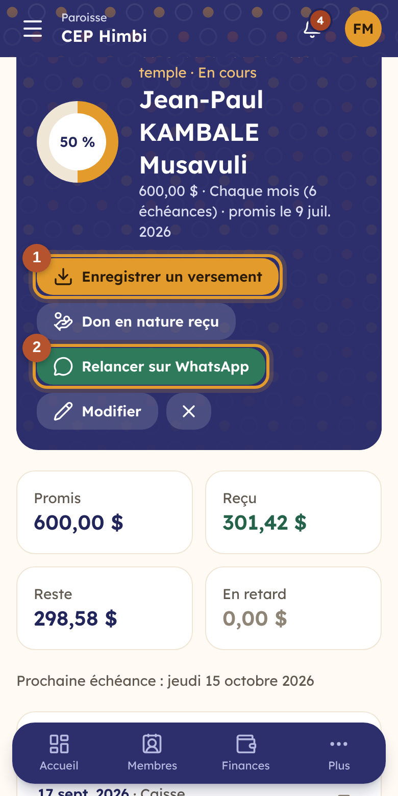
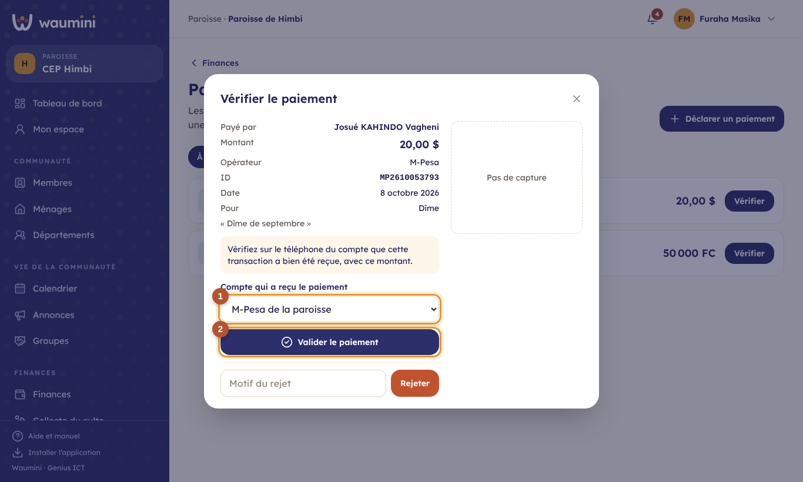
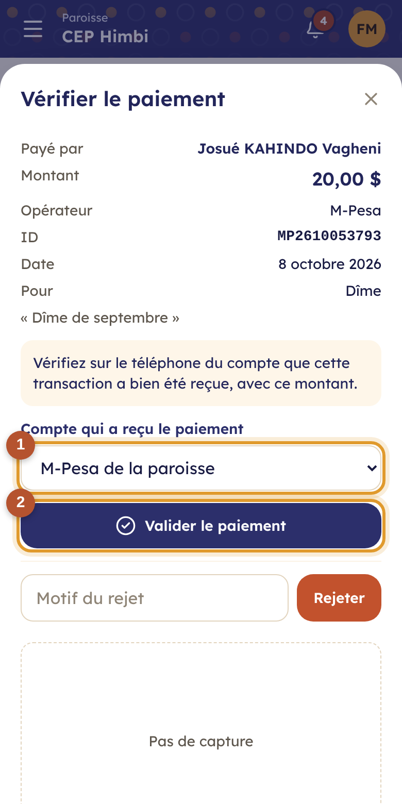

# 18. Promesses et paiements déclarés

## Les promesses

Une **promesse**, c'est un engagement à donner : 600 $ pour la construction du temple, en six mois ; 40 sacs de ciment ; 150 000 FC pour l'évangélisation. N'importe qui peut promettre : un **membre**, un **ménage**, un **département**, ou une personne extérieure (un visiteur, un ami de l'église).

Une promesse se rattache, le plus souvent, à un **[projet](23-projets-reunions.md)** : la parcelle, le temple, la convention. Le projet rassemble ses promesses, son objectif, et tout l'argent reçu. Une promesse peut aussi être générale, sans projet.

> Permission nécessaire : **Gérer les promesses**. Enregistrer un versement demande aussi **Saisir les recettes**.

<table><tr>
<td width="68%"></td>
<td width="32%"></td>
</tr></table>

① **Les projets** qui reçoivent des promesses : ce qui est reçu, et la part de l'objectif. Touchez un projet pour ne voir que ses promesses, et ouvrir sa fiche.

② **Nouvelle promesse** : qui promet, le projet (ou « Sans projet »), le montant et la devise, ou un **don en nature** (ciment, tôles, chaises) avec sa valeur estimée. Pour un montant, choisissez le rythme : **en une fois**, **chaque semaine** ou **chaque mois**, avec le nombre d'échéances et la date de la première.

## Suivre une promesse

<table><tr>
<td width="68%"></td>
<td width="32%"></td>
</tr></table>

① **Enregistrer un versement** : le compte, la devise, le montant. Le versement est une recette avec son reçu, marquée pour le projet de la promesse. Un versement en francs sur une promesse en dollars est converti au taux du jour.

② **Relancer sur WhatsApp** : Waumini prépare un message courtois (ce qui est promis, reçu, et ce qui reste) et l'ouvre dans WhatsApp, sur votre téléphone. Vous le relisez avant de l'envoyer. La relance est notée dans la promesse.

L'**échéancier** montre chaque échéance : payée (coche verte), en retard (rouge) ou à venir. Les cartes du haut donnent le promis, le reçu, le reste et le retard.

Pour un **don en nature**, **Don en nature reçu** enregistre ce qui a été livré et sa valeur ; la promesse avance d'autant.

## Les paiements mobile money déclarés

Un membre qui envoie sa dîme par M-Pesa ou Airtel Money la **déclare** lui-même depuis son [espace membre](32-espace-membre.md), ou un visiteur depuis le [site vitrine](34-site-vitrine.md) ; sinon il prévient l'église et la trésorière la déclare dans Waumini. La finance vérifie ensuite sur le téléphone de l'église que l'argent est bien arrivé, puis valide.

> Permission nécessaire : **Valider les paiements déclarés**.

<table><tr>
<td width="68%"></td>
<td width="32%"></td>
</tr></table>

Chaque déclaration porte l'opérateur, l'**ID de la transaction**, le montant, la date, l'objet (dîme, offrande, promesse…) et, si possible, la capture d'écran du message de confirmation.

① **Le compte** mobile money qui a reçu l'argent.

② **Valider** crée la recette, avec son reçu. **Refuser** demande un motif (paiement introuvable, montant différent).

Waumini signale un **ID déjà utilisé** : c'est peut-être un doublon, ou une tentative de fraude.
