# 12. Les dépenses et les avances

Aucune sortie d'argent ne se fait sans trace. Chaque dépense suit un **circuit** en cinq étapes :

**Demande** → **Contrôle** → **Approbation** → **Décaissement** → **Justification**

| Étape | Qui | Permission |
|---|---|---|
| Demande | le responsable de département, le secrétaire… | Demander une dépense |
| Contrôle | la finance (trésorier) | Décaisser et enregistrer les justificatifs |
| Approbation | le pasteur, le conseil… : **une, deux ou trois signatures** | Approuver les dépenses |
| Décaissement | la finance | Décaisser et enregistrer les justificatifs |
| Justification | la finance, avec les factures | Décaisser et enregistrer les justificatifs |

**Le demandeur ne signe jamais sa propre demande**, et une même personne ne signe qu'une fois.

## La liste des dépenses

**Finances › Dépenses**.

<table><tr>
<td width="68%">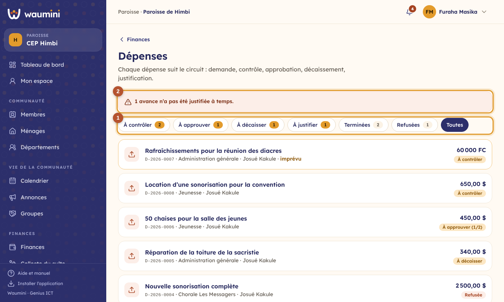</td>
<td width="32%">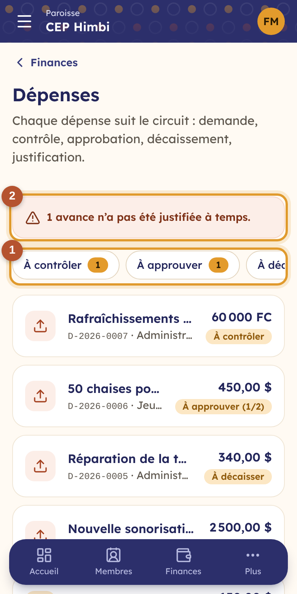</td>
</tr></table>

① **Les étapes**, avec le nombre de demandes qui attendent dans chacune. Waumini ouvre la liste sur ce qui vous attend : *À approuver* pour le pasteur, *À contrôler* pour la trésorière. Une demande en cours d'approbation montre ses signatures (1/2).

② **Les avances en retard** : l'argent a été remis, mais les factures ne sont pas revenues dans le délai.

Un responsable de département ne voit que **ses propres demandes**.

## Demander une dépense

**Demander une dépense**.

<table><tr>
<td width="68%">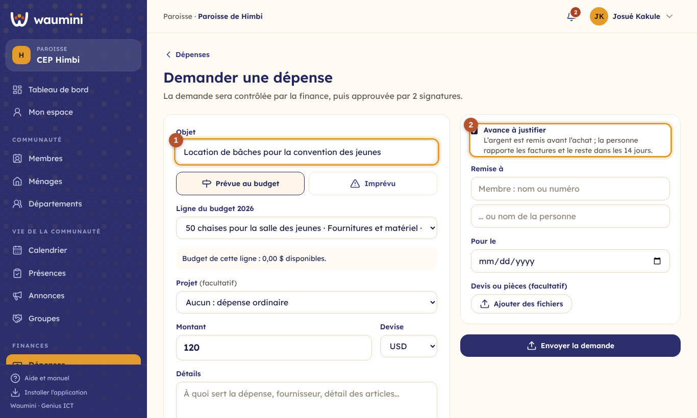</td>
<td width="32%">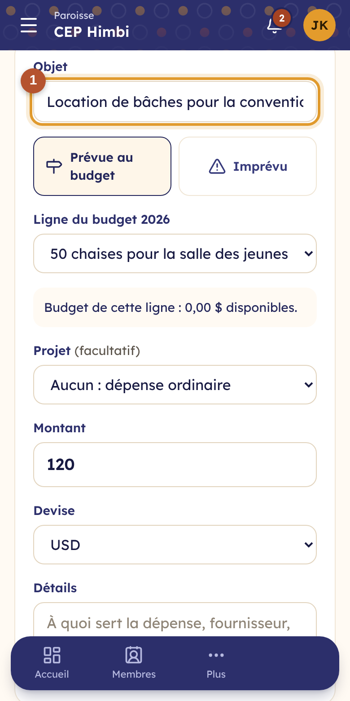</td>
</tr></table>

① **L'objet**, le **rattachement au budget**, le montant et la devise, et les détails.

**Prévue au budget ou imprévu.** Quand le budget de l'exercice est adopté, une dépense se rattache d'abord à **une ligne du budget** : choisissez-la dans la liste, rangée par département, avec ce qui **reste** sur chacune (« Chaises pour la salle des jeunes · Fournitures et matériel · reste 450 $ »). Le département et la catégorie de la dépense sont ceux de la ligne.

Si la dépense n'était pas prévue (une toiture qui cède, un deuil, une réunion convoquée en urgence), choisissez **Imprévu** : indiquez le département et la catégorie, et dites **pourquoi ce n'était pas prévu**. La dépense est marquée **Imprévu** dans la liste et sur sa fiche. S'il ne reste rien pour ce département et cette catégorie, elle passera par une [autorisation de dépassement](22-suivi-budget.md) du pasteur, qui dit d'où viendra l'argent.

**Le projet** (facultatif) : une dépense pour le temple, la convention ou la parcelle se rattache à son [projet](23-projets-reunions.md), avec ce qu'il a de **disponible**. Une ligne du budget qui appartient à un projet y rattache la dépense d'elle-même.

Sans budget adopté pour l'exercice, la dépense est simplement classée par département (*Administration générale* pour les dépenses communes) et par catégorie.

② **Avance à justifier** : cochez-la quand l'argent est remis **avant** l'achat (le transport d'une mission, les courses d'une fête). Indiquez la personne qui reçoit l'argent et rapportera les factures et le reste.

Ajoutez la date souhaitée et les **devis** (photo ou PDF). La demande reçoit un numéro (D-2026-0007) et part au contrôle.

## Contrôler

La trésorière vérifie le montant, les pièces et que la dépense est prévue, puis touche **Contrôlée, à approuver**, avec une remarque si besoin. Elle peut aussi **Refuser**, avec un motif que le demandeur verra.

Quand un budget est adopté pour l'exercice, Waumini montre la ligne du budget de la dépense (prévu, dépensé, engagé, disponible). Une dépense qui dépasse le disponible, ou qui n'est pas prévue, demande d'abord une **autorisation de dépassement** du pasteur, qui dit d'où viendra l'argent. Voir [Le suivi du budget et les dépassements](22-suivi-budget.md).

Une **dépense de projet** ne passe pas non plus si **le projet n'a pas encore l'argent** : Waumini dit ce qui manque. Il faut attendre les contributions, ou réduire la dépense.

## Approuver

<table><tr>
<td width="68%">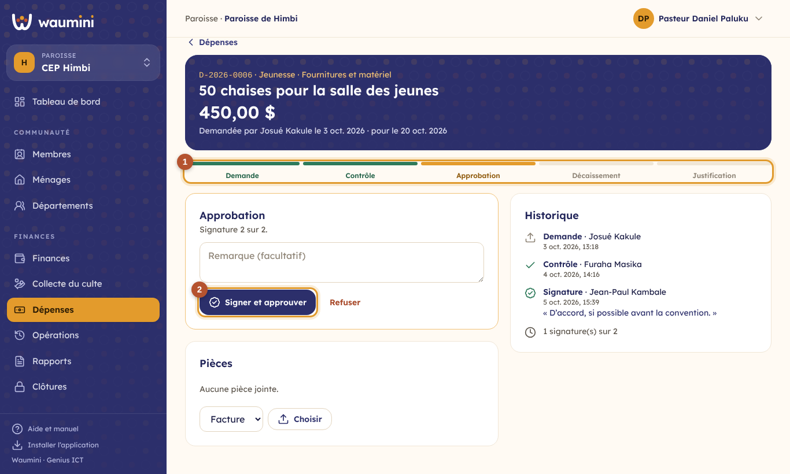</td>
<td width="32%">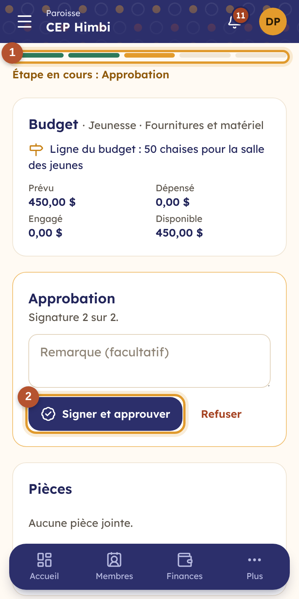</td>
</tr></table>

① **Le circuit** : les étapes faites en vert, l'étape en cours en orange.

② **Signer et approuver.** Waumini indique la signature attendue (« Signature 2 sur 2 »). Quand le nombre de signatures est atteint, la dépense passe au décaissement. **Refuser** arrête le circuit.

L'**historique**, à droite (en bas sur téléphone), garde chaque geste : qui, quand, avec quelle remarque.

## Décaisser

<table><tr>
<td width="68%">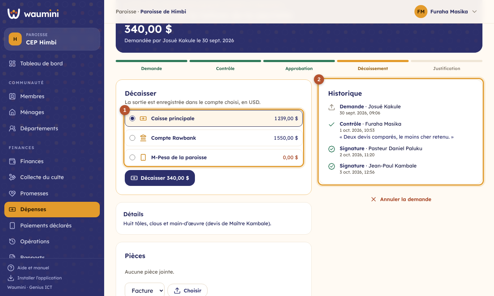</td>
<td width="32%">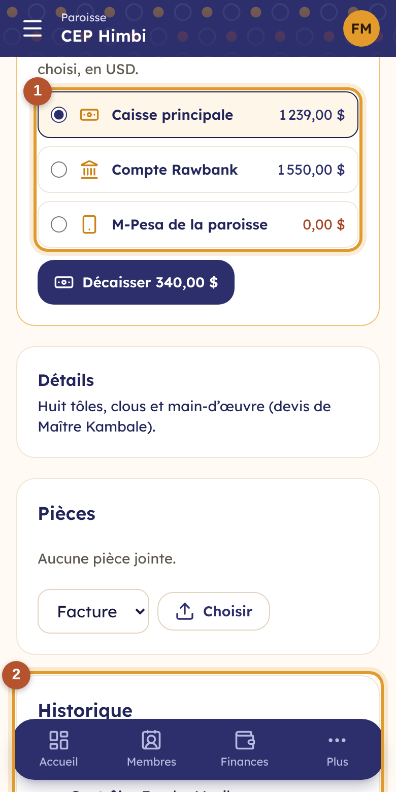</td>
</tr></table>

① **Le compte** d'où sort l'argent. Seuls les comptes qui tiennent la devise de la demande sont proposés, avec leur solde ; un solde trop faible s'affiche en rouge. Pour une dépense de projet, le compte du projet est proposé en premier.

Pour une dépense ordinaire, si l'argent libre ne suffit pas et que le décaissement prendrait sur **l'argent réservé aux projets**, Waumini avertit avant de décaisser.

② **L'historique** de la demande.

**Décaisser** enregistre la dépense dans le compte. Pour une avance, Waumini fixe la **date limite de justification**.

## Justifier

<table><tr>
<td width="68%">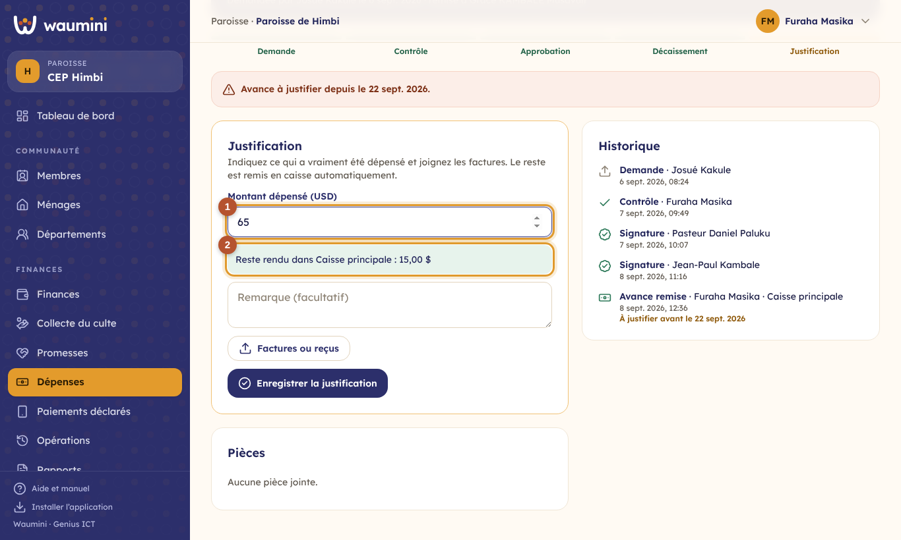</td>
<td width="32%">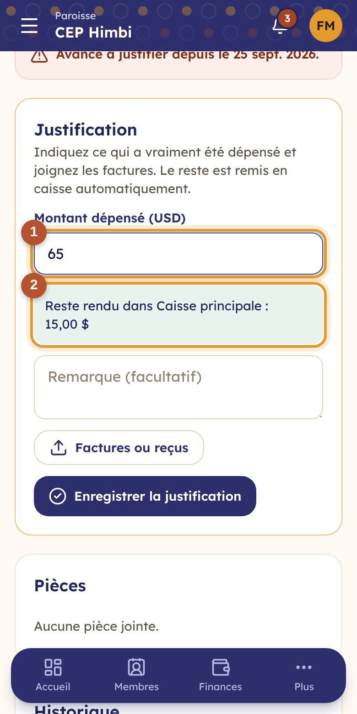</td>
</tr></table>

① **Le montant réellement dépensé**, et les **factures ou reçus** en photo ou en PDF.

② **Le reste**, s'il y en a, est **remis automatiquement dans le compte** : une recette « Retour sur avance » est enregistrée.

Pour une dépense ordinaire, la justification consiste à joindre la facture. Des pièces peuvent être ajoutées à tout moment depuis le bloc **Pièces**.

**Annuler la demande** : possible jusqu'au décaissement, par le demandeur ou la finance. Une dépense déjà décaissée s'annule dans les **Opérations**.

## Régler le circuit

**Finances › Comptes et catégories**, onglet **Circuit des dépenses** (permission **Gérer les caisses et les catégories**).

<table><tr>
<td width="68%">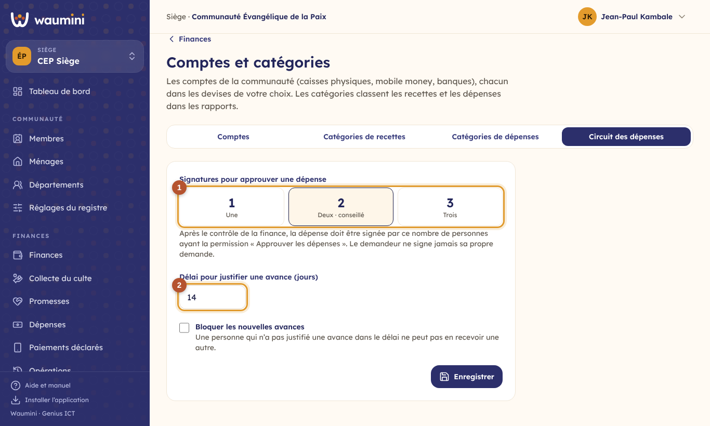</td>
<td width="32%">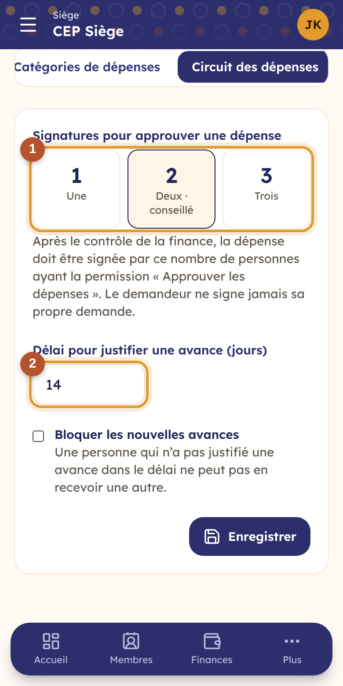</td>
</tr></table>

① **Le nombre de signatures** : une, deux (conseillé, par défaut) ou trois.

② **Le délai pour justifier une avance**, en jours (14 par défaut).

**Bloquer les nouvelles avances** : une personne qui n'a pas justifié une avance dans le délai ne peut pas en recevoir une autre.

Le nombre de signatures vaut pour les **nouvelles demandes** ; le délai, pour les avances remises après le changement. Le siège peut fixer le circuit pour toutes ses paroisses ; une paroisse qui enregistre ses propres réglages les utilise à la place.
