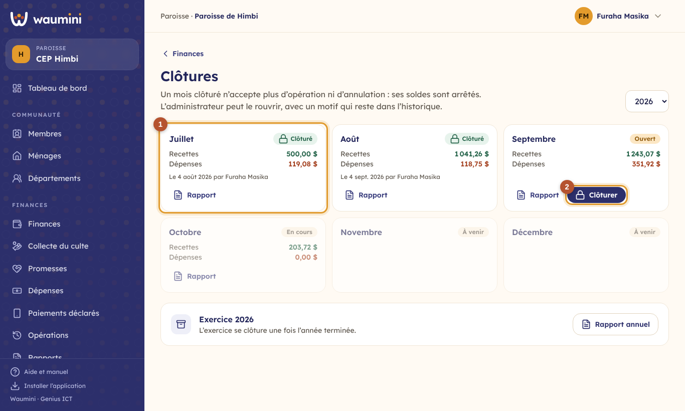
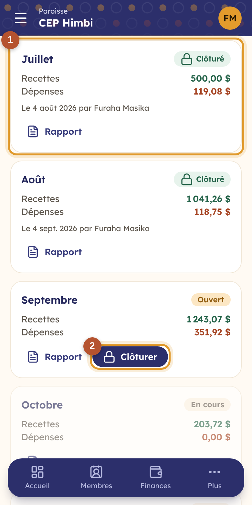
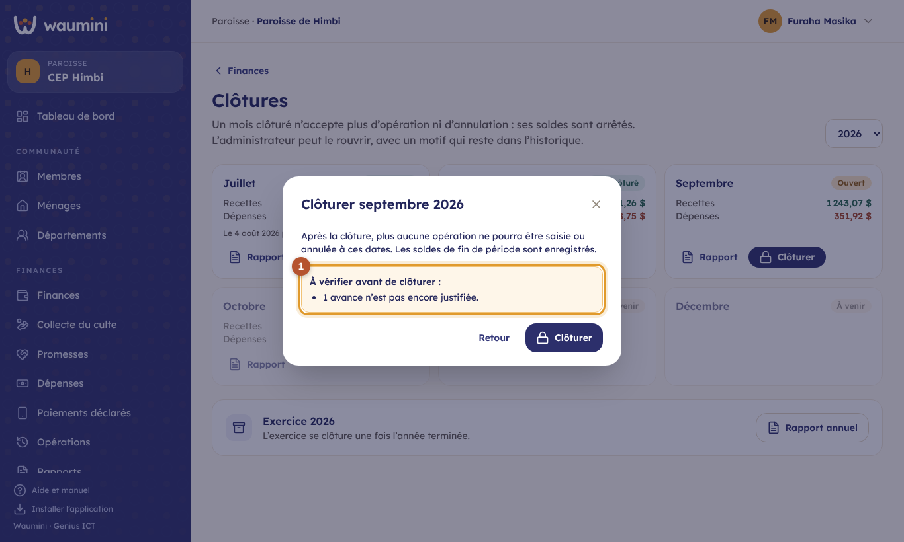
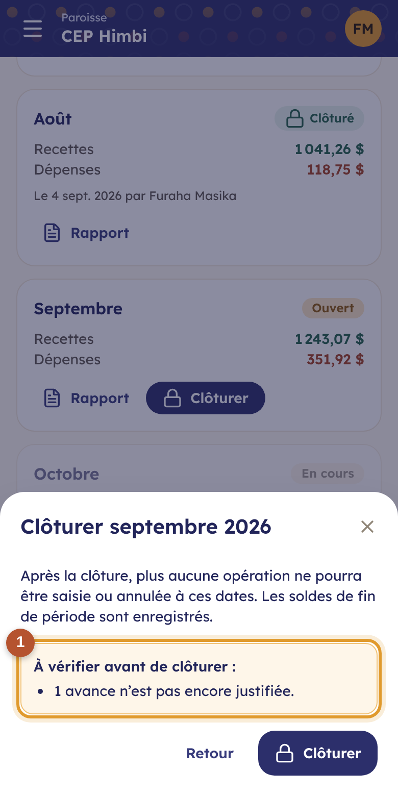
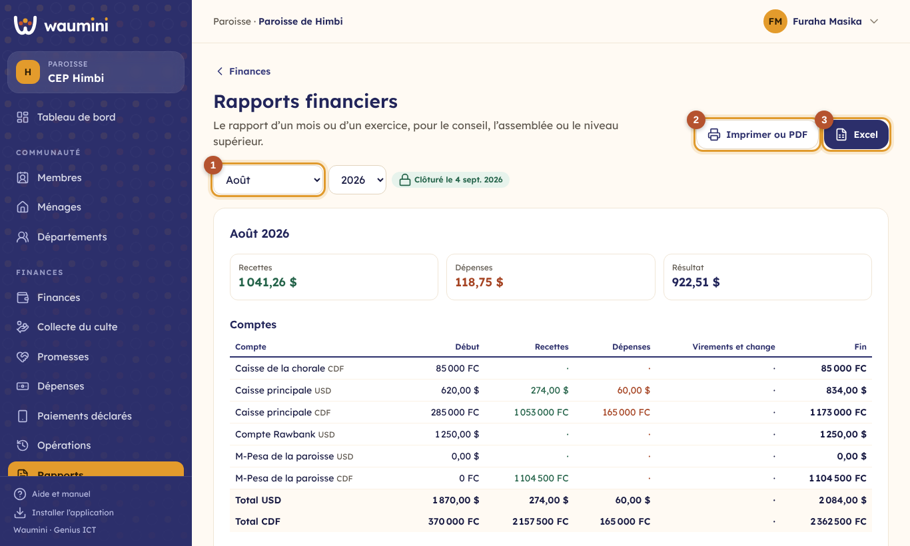
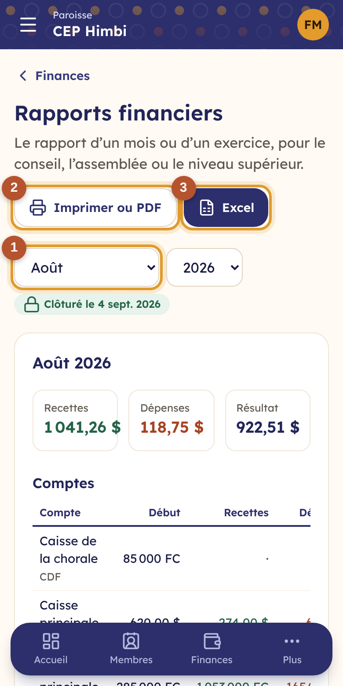
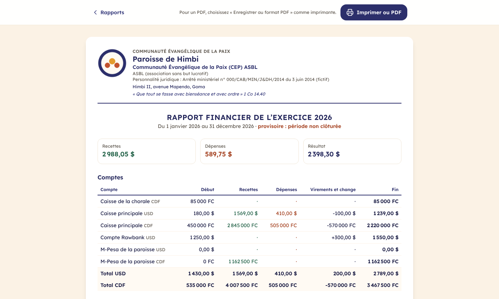

# 20. Clôtures et rapports financiers

## Clôturer un mois

Clôturer un mois, c'est **arrêter ses comptes** : plus aucune opération ne peut être saisie ou annulée à ces dates, et les soldes de fin de mois sont enregistrés. C'est la garantie que le rapport présenté au conseil ne changera plus.

> Permissions nécessaires : **Clôturer une période** (trésorier) ; **Rouvrir une période clôturée** (administrateur seulement, par défaut).

**Finances › Clôtures**.

<table><tr>
<td width="68%"></td>
<td width="32%"></td>
</tr></table>

① **Un mois clôturé** : le cadenas vert, la date et la personne qui a clôturé, les recettes et les dépenses du mois.

② **Clôturer** apparaît sur le mois suivant à clôturer. Les mois se clôturent **dans l'ordre**, et seulement une fois **terminés**.

Avant de clôturer, Waumini rappelle ce qui reste peut-être à faire :

<table><tr>
<td width="68%"></td>
<td width="32%"></td>
</tr></table>

① **À vérifier** : les feuilles de collecte non validées, les paiements déclarés non vérifiés, les avances non justifiées. Ces points n'empêchent pas la clôture, mais une recette oubliée ne pourra plus être enregistrée à sa vraie date sans rouvrir le mois.

## Rouvrir un mois

Une facture oubliée, une erreur découverte après la clôture ? L'**administrateur** touche **Rouvrir** sur le mois et donne un **motif** (dix caractères au moins). Le motif, la date et son nom restent affichés sur le mois et dans le journal d'audit.

Rouvrir un mois rouvre aussi **les mois suivants déjà clôturés** et l'exercice : leurs soldes dépendent du mois corrigé. Après la correction, la trésorière les clôture de nouveau, dans l'ordre ; les soldes enregistrés sont alors mis à jour.

## Clôturer l'exercice

Quand l'année est terminée et que tous ses mois sont clôturés, **Clôturer l'exercice** arrête l'année entière. Le **rapport annuel** est alors définitif.

## Les rapports financiers

**Finances › Rapports** (permission **Produire les rapports financiers** : trésorier, pasteur, conseil).

<table><tr>
<td width="68%"></td>
<td width="32%"></td>
</tr></table>

① **La période** : un mois, ou l'exercice entier. Un badge indique si la période est **clôturée** ou si le rapport est **provisoire**.

② **Imprimer ou PDF** : le rapport sur papier A4, avec l'en-tête de l'église et la place des signatures du trésorier et du pasteur. Pour un PDF à envoyer par WhatsApp ou par e-mail, choisissez « Enregistrer au format PDF » comme imprimante.

③ **Excel** : le même rapport en classeur, une feuille par tableau, pour le retravailler ou l'envoyer au niveau supérieur.

Le rapport contient :

- **les recettes, les dépenses et le résultat**, en dollars ;
- **les comptes** : pour chaque compte et chaque devise, le solde de début, les recettes, les dépenses, les virements et le change, et le solde de fin ; puis le total de chaque devise ;
- **les recettes par catégorie** et **les dépenses par catégorie**, dans chaque devise et en équivalent dollars ;
- **les dépenses par département** ;
- pour un exercice, **le mois par mois**.

Les montants restent dans la devise de chaque compte : 2 220 000 FC restent des francs. L'équivalent en dollars est calculé **au taux du jour de chaque opération**, enregistré au moment de la saisie. Les opérations annulées ne sont pas comptées. Le rapport ne montre **aucun nom de donateur**.

