# 14. Le budget

Le budget se prépare ensemble, une fois par exercice :

1. **les départements proposent** leurs dépenses prévues et leurs recettes prévues, séparément, avec leur justification ;
2. **la finance arbitre** : elle reprend les propositions, la masse salariale et les projets de l'année, ajuste les montants, ajoute les charges et les recettes communes, puis **présente** le budget ;
3. **le pasteur approuve**, ou renvoie le budget avec ses remarques. Le budget approuvé est **adopté**.

En cours d'année, le budget peut être **révisé** : chaque révision est une nouvelle version, présentée et approuvée de la même façon. Les anciennes versions restent consultables.

| Qui | Ce qu'il fait | Permission |
|---|---|---|
| Responsable de département | Propose les dépenses et les recettes de **ses** départements | Proposer les besoins d'un département |
| Finance (trésorier) | Arbitre, ajoute des lignes, présente le budget, renvoie une proposition | Arbitrer le budget et le présenter |
| Pasteur | Approuve le budget et ses révisions, ou les renvoie | Approuver le budget et ses révisions |

**Celui qui présente le budget ne l'approuve pas** : il faut deux personnes.

Les montants du budget sont **en dollars**, comme les rapports. Un besoin chiffré en francs est converti au taux du jour.

## L'exercice

L'exercice suit le choix de votre église : de janvier à décembre, ou de juillet à juin, par exemple. La finance le règle dans **Finances › Comptes et catégories**, onglet **Exercice**.

<table><tr>
<td width="68%">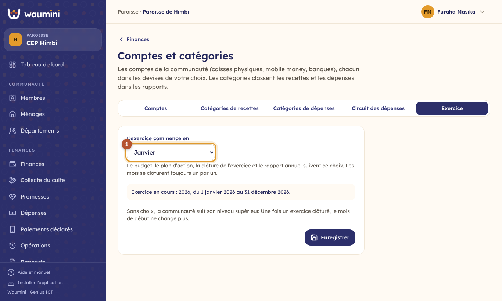</td>
<td width="32%">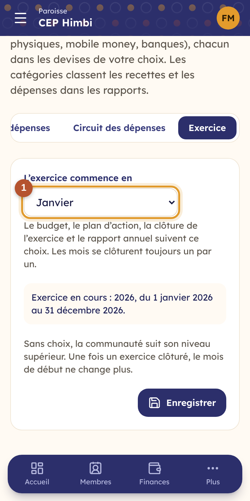</td>
</tr></table>

① **Le mois de début.** Le budget, les tranches des projets, la clôture de l'exercice et le rapport annuel suivent ce choix. Sans choix, une paroisse suit son niveau supérieur. Dès qu'un exercice est clôturé, le mois de début ne change plus.

## Relier le compte du responsable à sa fiche de membre

Pour qu'un responsable prépare le budget de **son** département, Waumini doit savoir qui il est dans le registre. L'administrateur ouvre **Utilisateurs**, puis le compte de la personne :

<table><tr>
<td width="68%">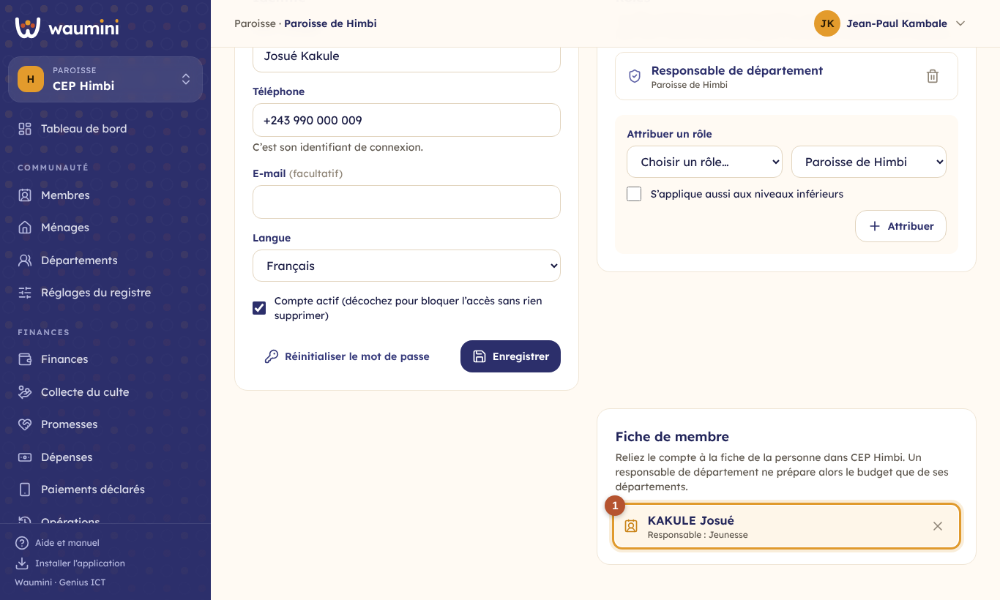</td>
<td width="32%"></td>
</tr></table>

① **Fiche de membre** : recherchez la personne et touchez son nom. Waumini affiche les départements dont elle est **responsable ou adjointe** (voir [Départements](13-menages-departements.md)). Ce sont ceux qu'elle pourra préparer.

## L'écran Budget

**Projets et budget › Budget**.

<table><tr>
<td width="68%">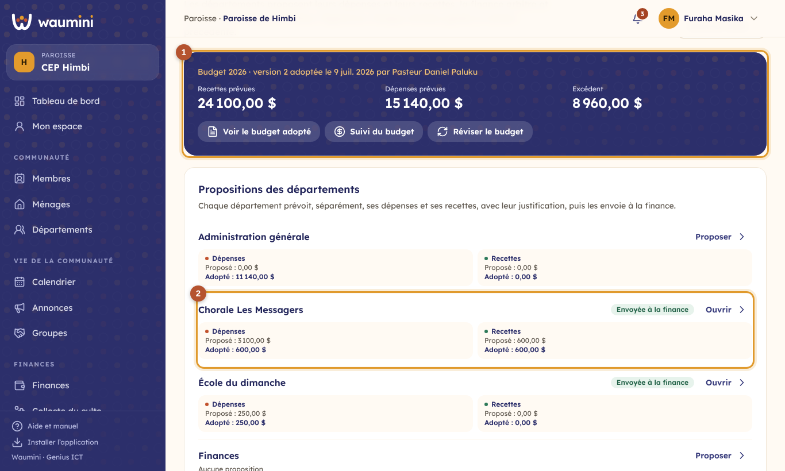</td>
<td width="32%">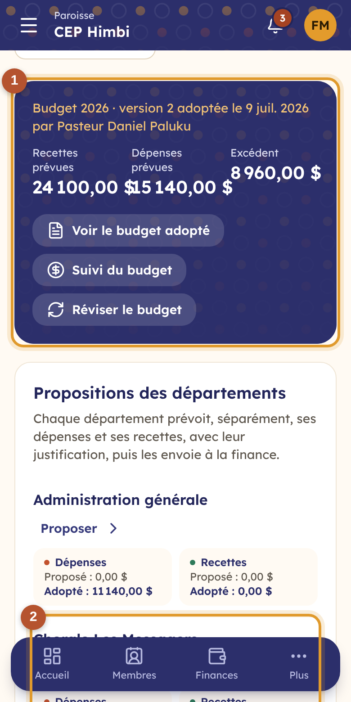</td>
</tr></table>

① **Le budget de l'exercice** : la version adoptée, par qui et quand, les recettes et les dépenses prévues, et l'excédent ou le déficit. Les boutons ouvrent le budget adopté, son [suivi](22-suivi-budget.md), ou créent une révision.

② **Les propositions des départements** : pour chacun, ses dépenses et ses recettes dans deux cadres séparés (ce qui est proposé et ce qui a été adopté), et où en est sa proposition. Choisissez l'exercice en haut à droite : en fin d'année, les départements préparent déjà l'exercice suivant.

## Proposer le budget d'un département

Touchez **Proposer** (ou **Ouvrir**) sur la ligne du département. Les dépenses et les recettes sont **dans deux onglets séparés**, chacun avec son total : **Dépenses prévues** (ce que le département aura besoin de dépenser) et **Recettes prévues** (ce qu'il pense recevoir ou collecter). Ouvrez l'onglet voulu, puis **Ajouter une dépense** ou **Ajouter une recette**.

<table><tr>
<td width="68%">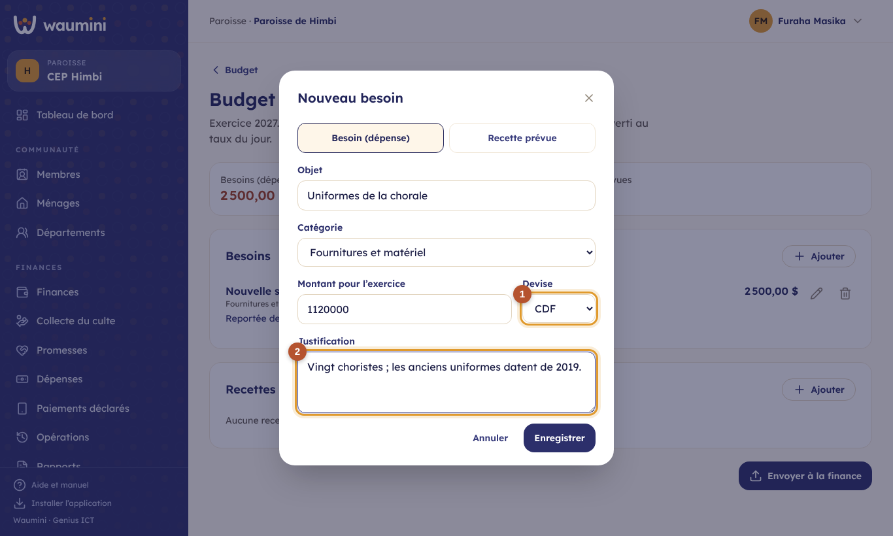</td>
<td width="32%">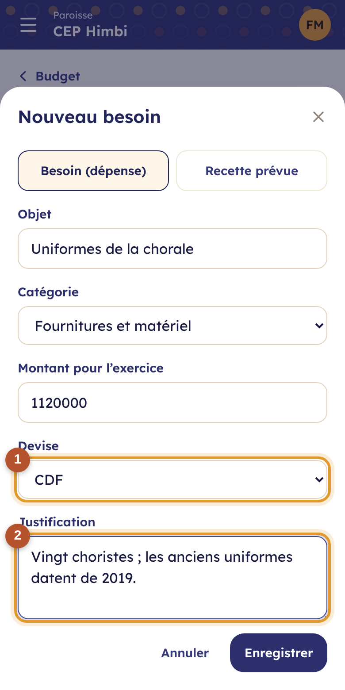</td>
</tr></table>

Pour chaque ligne : l'objet, la catégorie (les mêmes que dans les finances), le montant pour l'exercice et :

① **la devise** : un montant en francs est converti en dollars au taux du jour ; le montant d'origine reste affiché ;

② **la justification** : pourquoi cette dépense (ou d'où vient cette recette), comment le montant est calculé. C'est elle qui aide la finance à arbitrer.

Quand tout est prêt : **Envoyer à la finance**. La proposition n'est plus modifiable, sauf si la finance la **renvoie pour correction**, avec une remarque que le département voit en haut de sa proposition.

## Arbitrer et présenter le budget

La première fois, la finance touche **Préparer le budget** : Waumini crée la version 1 avec toutes les propositions reçues et **les projets de l'exercice**. **Reprendre les propositions** ajoute celles arrivées ensuite.

<table><tr>
<td width="68%">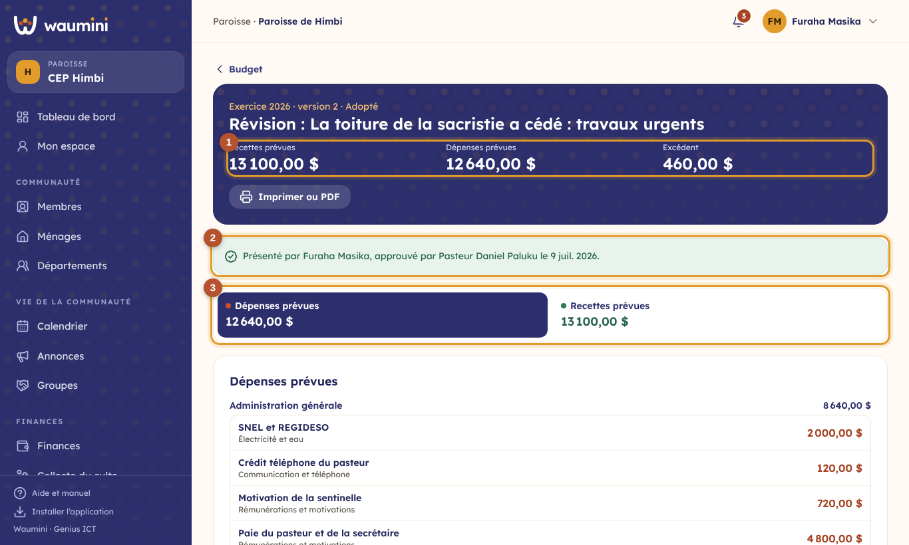</td>
<td width="32%">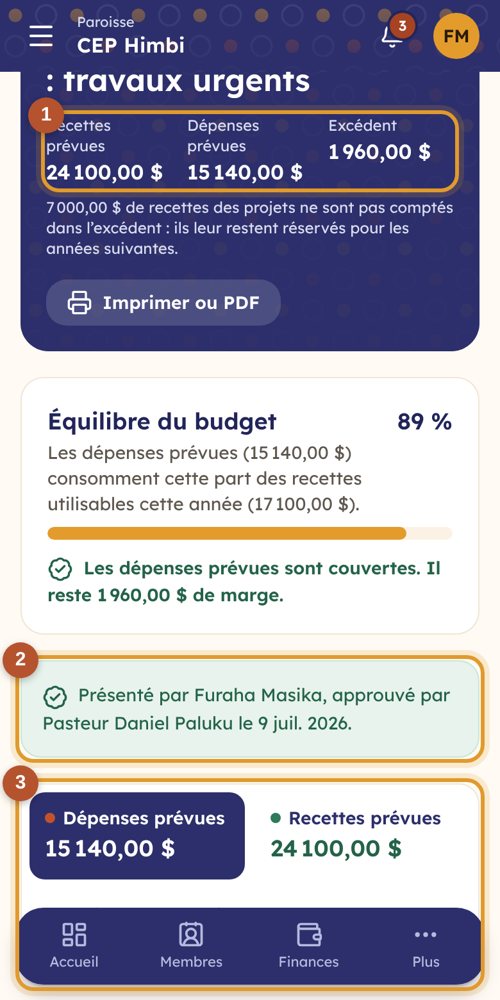</td>
</tr></table>

① **Les totaux** : recettes prévues, dépenses prévues et excédent (ou déficit). L'argent des projets qui n'est pas dépensé cette année leur reste réservé : il n'est pas compté dans l'excédent, et le bandeau le dit.

② **Qui a présenté et qui a approuvé**, et quand.

③ **Les onglets** : **Dépenses prévues**, **Recettes prévues** et **Projets de l'exercice**. Les lignes de chaque onglet sont regroupées par département, de la plus grande à la plus petite. Pendant l'arbitrage, la finance change le montant directement dans la ligne ; le **montant proposé** reste affiché quand il est différent, avec la remarque de l'arbitrage (« Reportée à l'an prochain »).

### L'équilibre : ce que chaque ligne apporte ou consomme

Un budget de 20 000 $ de dépenses doit dire **d'où viendront ces 20 000 $**. On ne relie pas chaque dépense à une recette : on regarde l'ensemble.

<table><tr>
<td width="68%">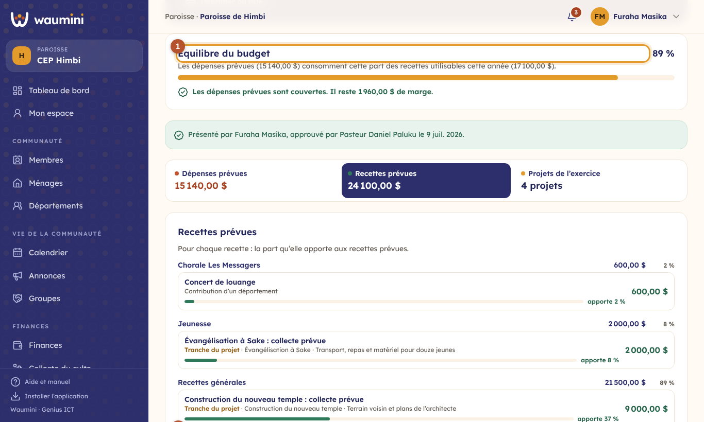</td>
<td width="32%">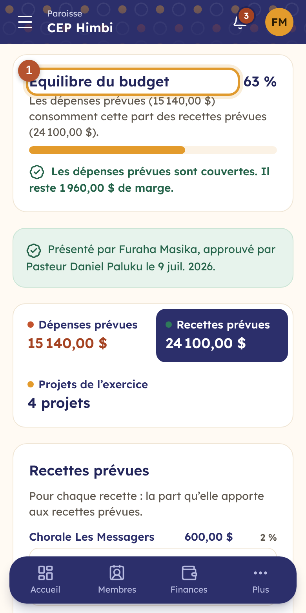</td>
</tr></table>

① **L'équilibre du budget** : la part des recettes prévues que les dépenses prévues consomment (63 % dans la démo), et la marge qui reste. Si les dépenses dépassent les recettes sur lesquelles on peut compter, Waumini dit **ce qui manque**, et le budget **ne peut pas être présenté** : il faut ajouter une recette prévue, ou réduire des dépenses.

② **Chaque ligne**, avec une barre et son pourcentage des recettes prévues : une recette dit ce qu'elle **apporte** (« Offrandes des cultes, apporte 31 % »), une dépense ce qu'elle **consomme** (« Paie du pasteur, consomme 20 % »). Les recettes et les dépenses se présentent de la même façon.

**Les promesses** : dans l'onglet **Recettes prévues**, Waumini rappelle ce que les promesses en cours (hors projets) attendent encore. **Ajouter aux recettes prévues** en fait une ligne, mise à jour si vous touchez de nouveau le bouton.

### Les projets de l'exercice

<table><tr>
<td width="68%">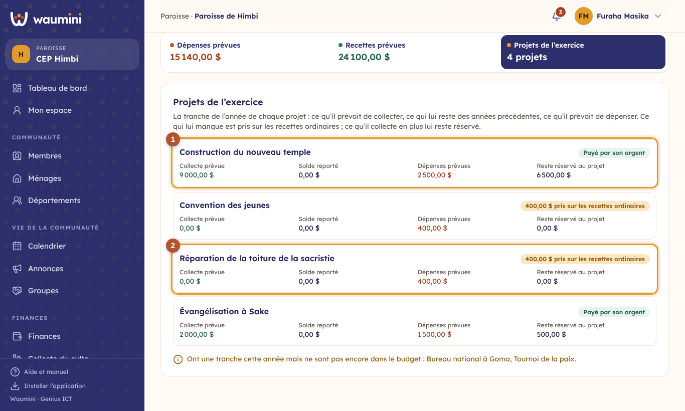</td>
<td width="32%">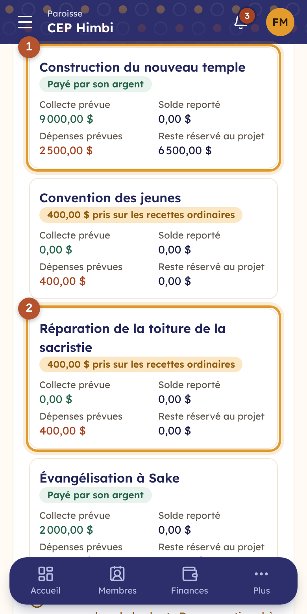</td>
</tr></table>

Chaque projet qui a une tranche cette année entre dans le budget avec **sa collecte prévue**, **son solde reporté** (ce qui lui reste des années précédentes) et **ses dépenses prévues**. **Reprendre les projets** met ces lignes à jour.

① **L'argent d'un projet ne paie que ce projet.** Ce qu'il collecte en plus de ses dépenses de l'année lui reste réservé, pour les années suivantes (« Payé par son argent »).

② **Ce qui manque à un projet est pris sur les recettes ordinaires** : la toiture de la sacristie n'a pas de collecte, ses 400 $ viennent des dîmes et des offrandes. Une fois le budget adopté, cette part est débloquée au rythme des recettes ordinaires réellement rentrées.

Si le solde reporté d'un projet a changé depuis la reprise (une dépense de fin d'année, une clôture), un bandeau le signale avec un bouton **Mettre à jour**.

### Les lignes communes

**Reprendre la masse salariale** ajoute les salaires : une ligne « Rémunérations et motivations » par personne payée, dans son département, calculée d'après la [paie](24-paie.md#la-paie-dans-le-budget).

La finance ajoute aussi les lignes communes : dans l'onglet **Dépenses prévues**, **Ajouter une dépense** pour les charges de l'Administration générale (électricité, sentinelle, entretien) ; dans l'onglet **Recettes prévues**, **Ajouter une recette** pour les recettes générales (offrandes, dîmes). Une ligne peut être rattachée à un projet. Puis **Présenter le budget**.

## Approuver

Le pasteur ouvre la version **À approuver** depuis l'écran Budget. Il **approuve**, avec une remarque s'il le souhaite (« Approuvé en conseil le 11 janvier »), ou **renvoie à la finance**, avec ses remarques. Une fois approuvé, le budget est **adopté** et ne se modifie plus.

**Imprimer ou PDF** donne le budget adopté sur papier, avec l'en-tête de l'église, ce que chaque ligne apporte ou consomme, et les noms de ceux qui l'ont présenté et approuvé, pour le conseil ou l'assemblée.

## Réviser le budget

Un imprévu en cours d'année (une toiture qui cède) : la finance touche **Réviser le budget** et indique le motif. Waumini crée une nouvelle version, copie du budget adopté. La finance la modifie, la présente, le pasteur l'approuve. **Jusque-là, le budget adopté reste en vigueur.** Ensuite, l'ancienne version est marquée **Remplacé** et reste consultable dans **Versions**.

Une version en préparation peut être **abandonnée** ; une version adoptée, jamais.
