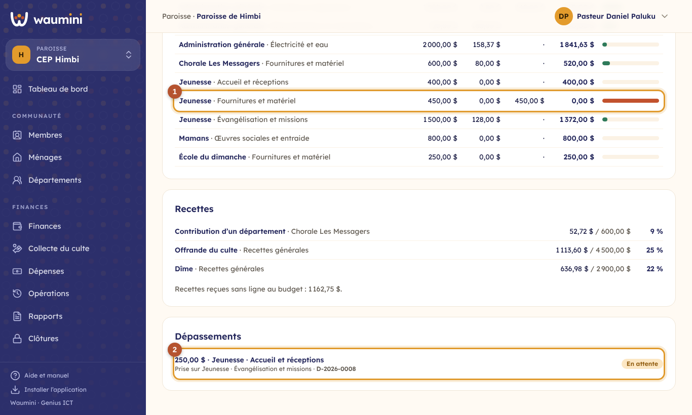
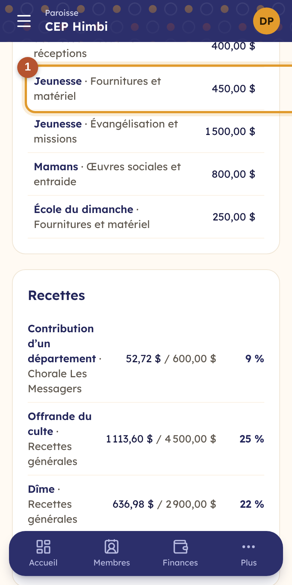
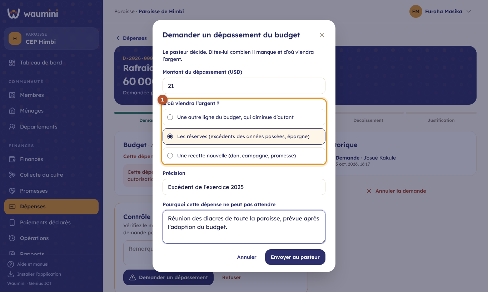
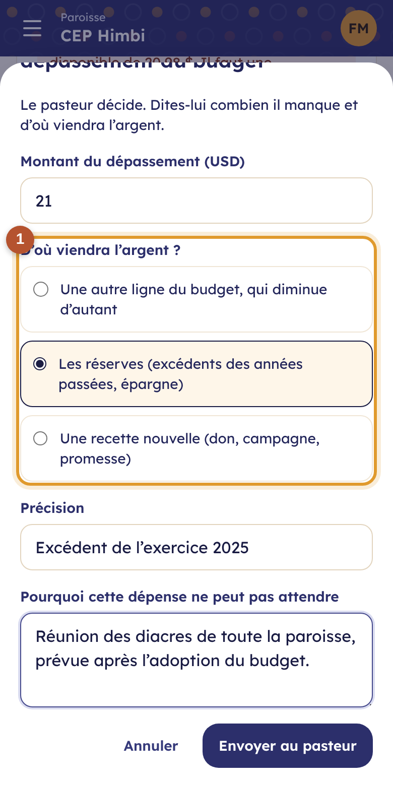
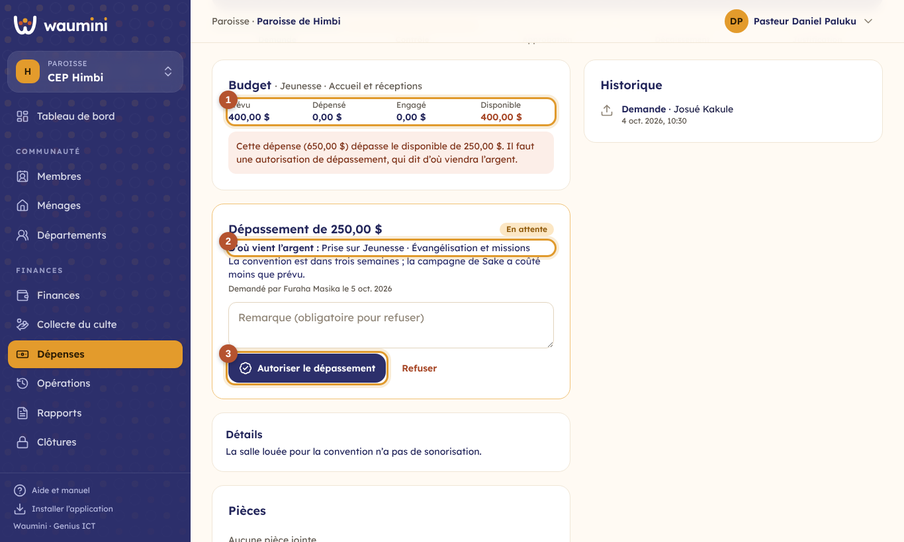
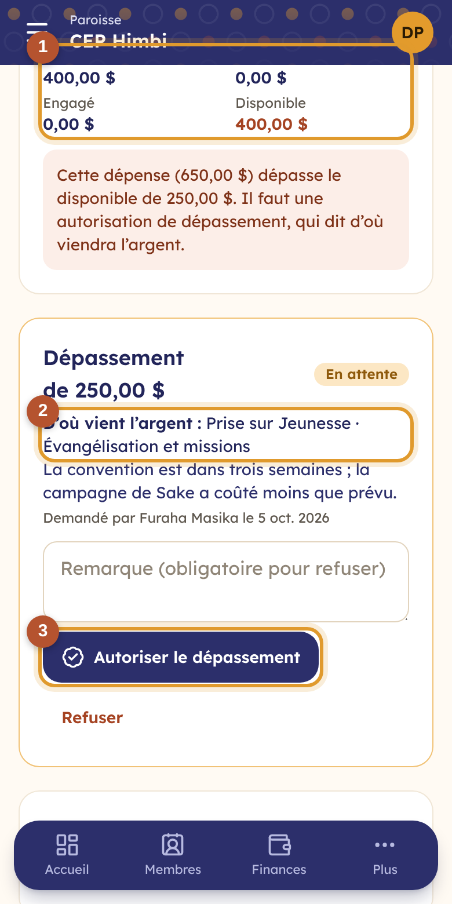

# 22. Le suivi du budget et les dépassements

Une fois le budget adopté, Waumini le compare chaque jour aux opérations : ce qui est dépensé, ce qui est engagé, ce qui reste. Et il **contrôle chaque dépense** : au-delà de ce qui reste, il faut une autorisation qui dit **d'où viendra l'argent**.

## Le suivi du budget

**Plan d'action › Suivi du budget** (permissions : voir le plan d'action, arbitrer, approuver, ou produire les rapports financiers).

<table><tr>
<td width="68%"></td>
<td width="32%"></td>
</tr></table>

En haut, les dépenses et les recettes prévues et réalisées, et la part de l'exercice déjà écoulée.

① **Chaque ligne de dépenses** (département et catégorie) :

- **Prévu** : le budget adopté, plus les dépassements autorisés, moins ce que la ligne a cédé à d'autres ;
- **Dépensé** : les dépenses payées, moins ce qui est revenu des avances ;
- **Engagé** : les dépenses contrôlées ou approuvées, pas encore payées ;
- **Disponible** : ce qui reste ;
- la barre : verte tant que la ligne suit le rythme de l'année, orange quand elle va plus vite, rouge quand elle est épuisée.

Plus bas : les **recettes**, réalisées face au prévu ; ce qui a été dépensé ou reçu **hors budget** ; et ② **les dépassements** demandés, avec leur source et leur décision.

## Le contrôle des dépenses

Quand la finance contrôle une demande de dépense (voir [Les dépenses](19-depenses.md)), Waumini montre la ligne du budget : prévu, dépensé, engagé, disponible.

- Si la dépense **tient dans le disponible**, la finance la contrôle comme d'habitude.
- Si elle **dépasse** le disponible, ou si elle **n'est pas prévue** au budget, le bouton **Contrôlée** disparaît : la finance doit **demander un dépassement**.

En demandant une dépense, le responsable voit déjà le disponible de la ligne qu'il choisit.

Sans budget adopté pour l'exercice, il n'y a pas de contrôle.

## Demander un dépassement

<table><tr>
<td width="68%"></td>
<td width="32%"></td>
</tr></table>

Le montant qui manque est proposé. La finance indique :

① **D'où viendra l'argent**, au choix :

- **une autre ligne du budget**, qui diminue d'autant (seules les lignes qui ont du disponible sont proposées) ;
- **les réserves** : l'excédent des années passées, l'épargne (précisez lesquelles) ;
- **une recette nouvelle** : un don, une campagne, une promesse (précisez laquelle).

Puis **pourquoi la dépense ne peut pas attendre**, et **Envoyer au pasteur**.

## Autoriser ou refuser

<table><tr>
<td width="68%"></td>
<td width="32%"></td>
</tr></table>

Le pasteur (permission **Autoriser une dépense hors budget**) voit les demandes en attente en haut de l'écran Budget. Sur la dépense :

① **la ligne du budget**, avec ce qui manque ;

② **la demande** : le montant, d'où vient l'argent, et le motif ;

③ **Autoriser le dépassement**, ou **Refuser**, avec un motif obligatoire.

Une fois le dépassement autorisé, la ligne est augmentée d'autant (et la ligne qui cède l'argent, diminuée) : la finance peut contrôler la dépense, qui suit ensuite son circuit. **Celui qui demande le dépassement ne l'autorise pas.**
