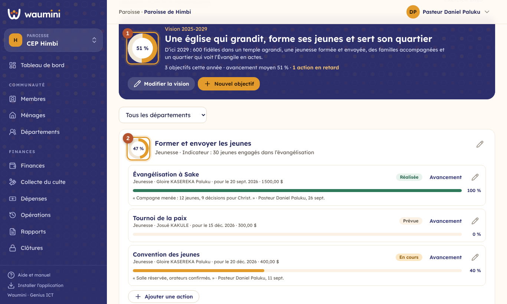
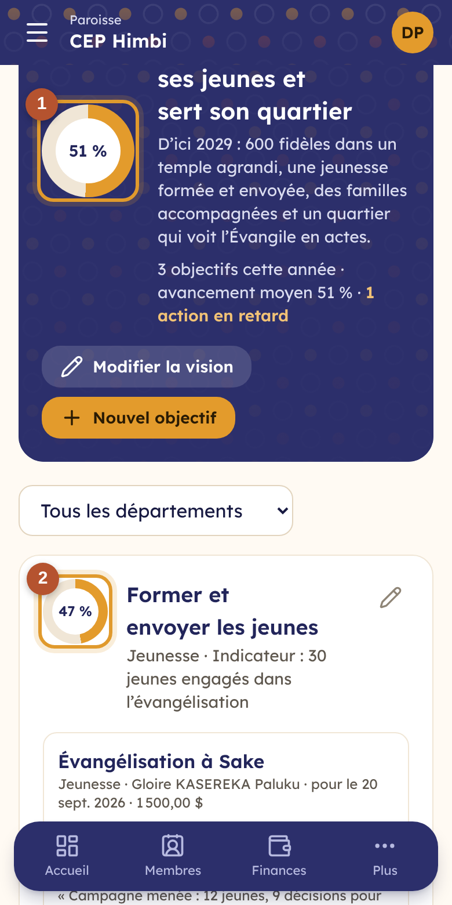
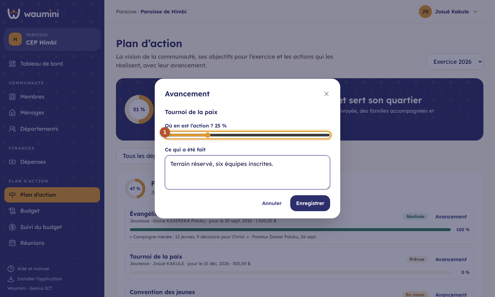
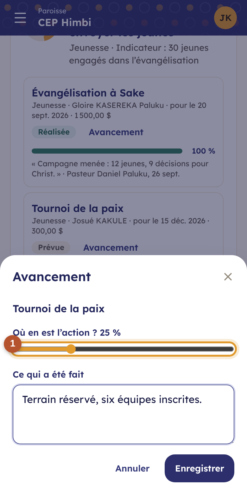
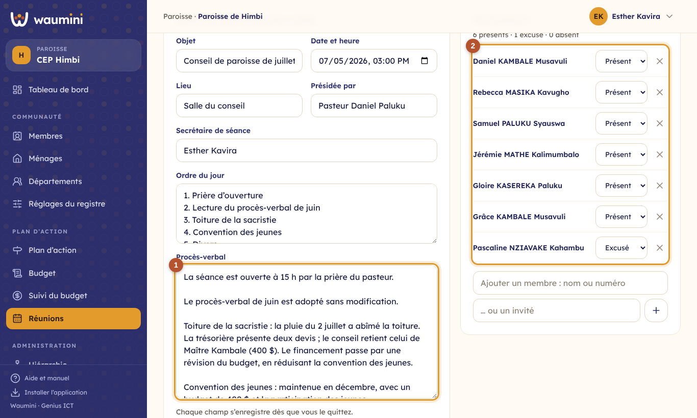
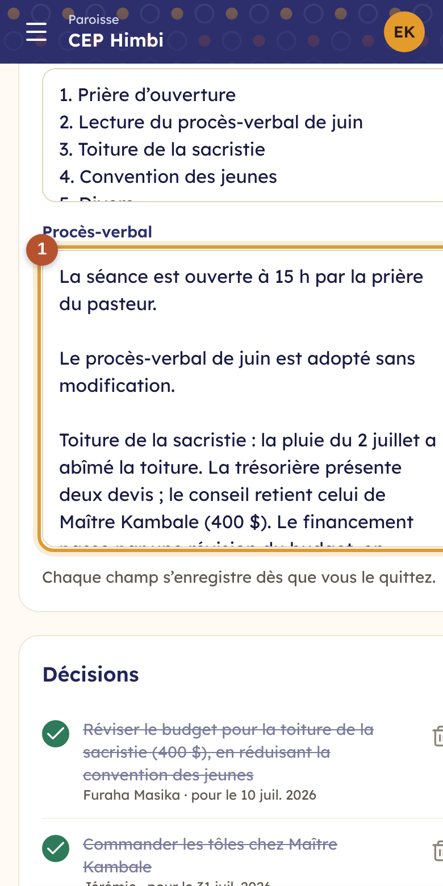

# 23. Le plan d'action et les réunions

## Le plan d'action

Le plan d'action dit où va la communauté et comment elle y va :

- **la vision**, sur plusieurs années (« une église qui grandit, forme ses jeunes et sert son quartier, d'ici 2029 ») ;
- **les objectifs** de l'exercice, chacun avec son indicateur (« 30 jeunes engagés dans l'évangélisation ») ;
- **les actions** qui réalisent chaque objectif : qui, quand, combien, et où elles en sont.

> Permissions : **Voir le plan d'action et le budget** pour consulter ; **Gérer la vision, les objectifs et les actions** (pasteur, par défaut) pour construire le plan. Un responsable de département met à jour l'avancement des actions de **ses** départements.

**Plan d'action › Plan d'action**.

<table><tr>
<td width="68%"></td>
<td width="32%"></td>
</tr></table>

① **La vision** et l'avancement moyen de l'exercice, avec le nombre d'actions en retard. **Écrire la vision** (ou la modifier) : la phrase, l'explication, et les années qu'elle couvre.

② **Chaque objectif** et son avancement : la moyenne de ses actions (sans celles qui sont abandonnées). **Nouvel objectif** : le titre, l'indicateur, et le département s'il en concerne un seul.

③ **Une action en retard** est encadrée en rouge : son échéance est passée et elle n'est pas finie.

**Ajouter une action** : le titre, le département, le responsable (un membre, ou un nom), le début, l'échéance, le **coût estimé** et l'état (prévue, en cours, réalisée, abandonnée). Le coût d'une action se finance par une ligne du budget : prévoyez-la dans la [proposition du département](21-budget.md).

### Mettre à jour l'avancement

Le bouton **Avancement** d'une action :

<table><tr>
<td width="68%"></td>
<td width="32%"></td>
</tr></table>

① **Le pourcentage**, de 5 en 5, et **ce qui a été fait**. La dernière note s'affiche sous l'action, avec son auteur et sa date ; les notes précédentes restent dans l'historique. Une action passe d'elle-même à **En cours** dès qu'elle avance, et à **Réalisée** à 100 %.

## Les réunions

**Plan d'action › Réunions** : le conseil, les comités, les départements, l'assemblée générale.

> Permissions : **Enregistrer les réunions et procès-verbaux** (pasteur et secrétaire, par défaut) pour créer et modifier ; **Voir le plan d'action** pour lire.

**Nouvelle réunion** : l'objet, le type (et le département pour une réunion de département), la date, l'heure et le lieu.

<table><tr>
<td width="68%"></td>
<td width="32%"></td>
</tr></table>

① **L'ordre du jour et le procès-verbal**, avec le président et le secrétaire de séance. Chaque champ s'enregistre **dès qu'on le quitte** : on peut rédiger pendant la réunion.

② **Les participants** : un membre (par son nom ou son numéro) ou un invité ; pour chacun, **présent**, **excusé** ou **absent**. Pour une réunion de département, **Ajouter tous les membres du département** les inscrit en une fois.

③ **Les décisions** : ce qui est décidé, qui la porte, pour quand, et l'action du plan qu'elle concerne. Touchez le rond pour marquer une décision **réalisée**. La liste des réunions rappelle combien de décisions restent à faire.

Quand la réunion a eu lieu : **La réunion s'est tenue**. **Procès-verbal** l'imprime (ou l'enregistre en PDF) avec l'en-tête de l'église, les présents, les excusés, le déroulement, les décisions et la place des signatures du président et du secrétaire.
