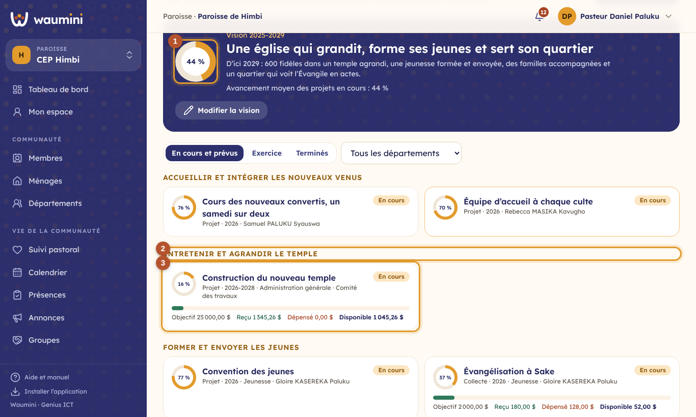
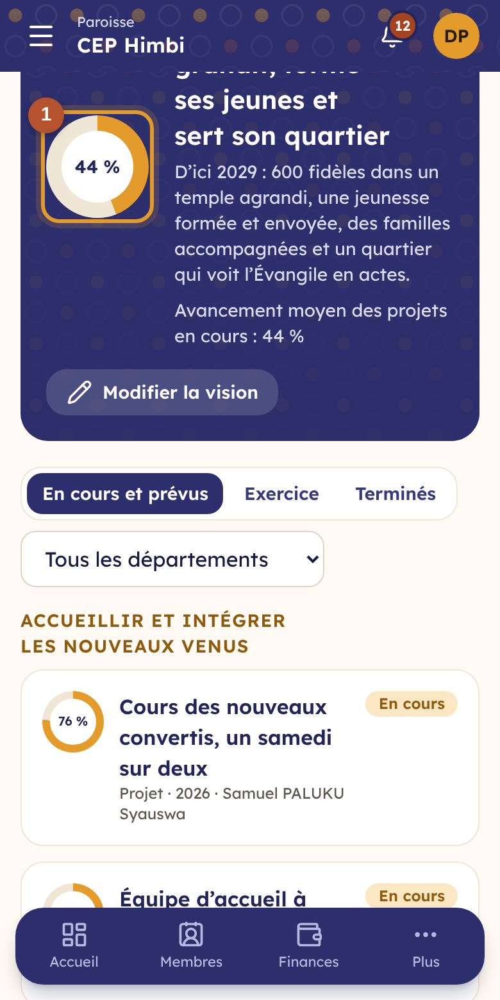
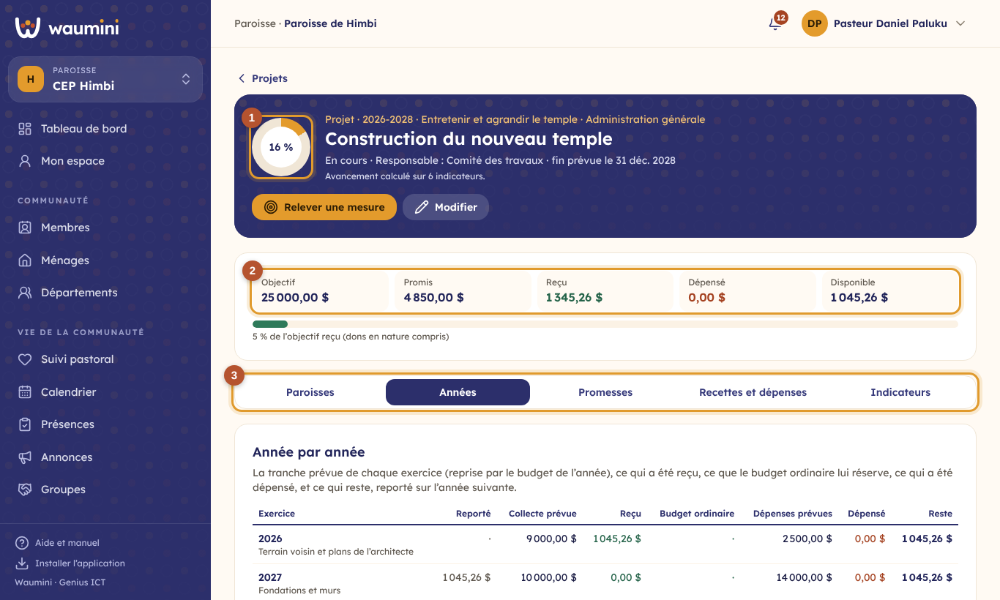
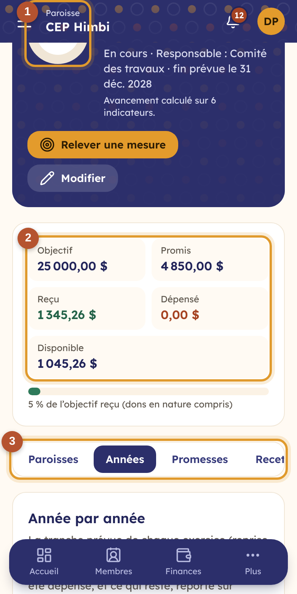
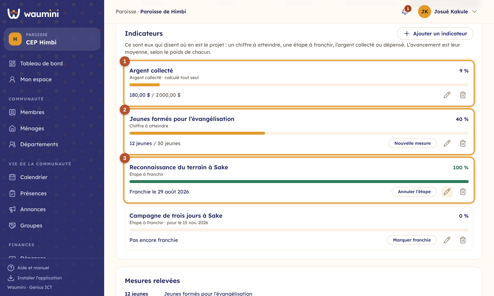
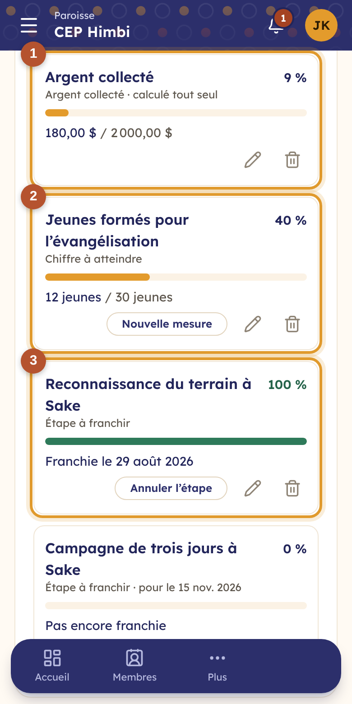
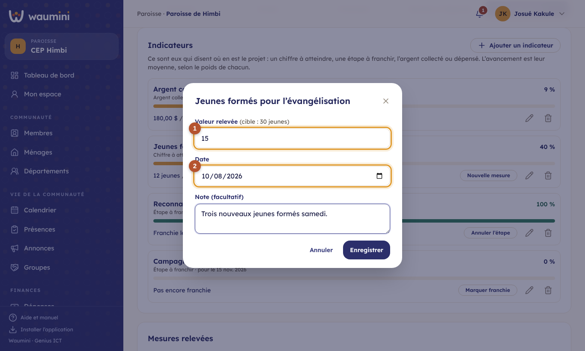
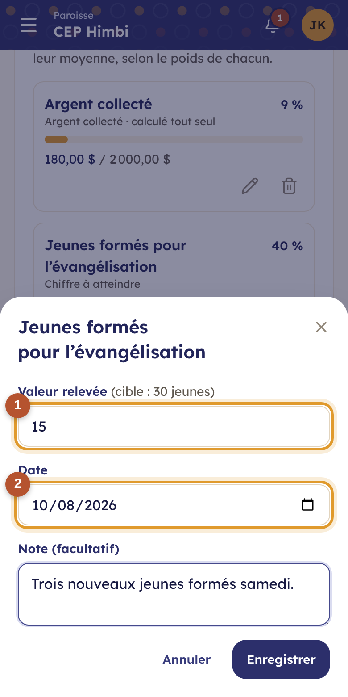

# 23. Les projets et les réunions

## Les projets

Un **projet**, c'est ce que la communauté veut réaliser : acheter la parcelle voisine, construire le temple, organiser la convention des jeunes, former des évangélistes, réparer la toiture. Les projets remplacent l'ancien plan d'action et les campagnes de promesses : tout ce qui concerne un projet se retrouve au même endroit.

- **La vision**, sur plusieurs années, reste au-dessus des projets (« une église qui grandit, forme ses jeunes et sert son quartier, d'ici 2029 »).
- Un projet dure **un an ou plusieurs**. Pour chaque exercice, il a sa **tranche** : ce qu'il prévoit de collecter et ce qu'il prévoit de dépenser cette année-là. Le [budget](21-budget.md) de l'année reprend la tranche tout seul.
- **Son argent porte sa marque** : promesses, versements, dons, collectes et dépenses disent à quel projet ils appartiennent, quel que soit le compte où se trouve l'argent. Le projet peut avoir son propre compte, mais ce n'est pas obligatoire.
- **Son avancement se mesure par ses indicateurs**, pas par un pourcentage tapé à la main.

> Permissions : **Voir les projets et le budget** pour consulter ; **Gérer la vision et les projets** (pasteur, par défaut) pour créer les projets. Un responsable de département définit les indicateurs et relève les mesures des projets de **ses** départements.

**Projets et budget › Projets**.

<table><tr>
<td width="68%"></td>
<td width="32%"></td>
</tr></table>

① **La vision** et l'avancement moyen des projets en cours. **Modifier la vision** : la phrase, l'explication, les années qu'elle couvre.

② **Les axes de la vision** : les projets sont rangés sous leur axe (« Entretenir et agrandir le temple »).

③ **Chaque projet** : son avancement, son état, son responsable, et ses chiffres (objectif, reçu, dépensé, disponible). Un projet en retard est encadré en rouge.

**Nouveau projet** : le nom, l'axe, le genre (projet, collecte, contribution régulière), le département et le responsable, les dates, l'objectif en argent, le compte du projet s'il en a un, et **les tranches** : pour chaque exercice, la collecte prévue et les dépenses prévues.

### La fiche d'un projet

<table><tr>
<td width="68%"></td>
<td width="32%"></td>
</tr></table>

① **L'avancement**, calculé à partir des indicateurs, et les boutons : **Nouvelle promesse**, **Recevoir un don** (une recette marquée pour le projet, avec son reçu), **Demander une dépense**.

② **Les chiffres du projet**, en dollars :

| | Ce que c'est |
|---|---|
| **Objectif** | La somme visée, ou à défaut le total des collectes prévues |
| **Promis** | Le total des promesses en cours |
| **Reçu** | Les versements, les dons et les collectes marqués pour le projet, plus les dons en nature |
| **Dépensé** | Ce qui est sorti pour le projet |
| **Disponible** | Reçu + part des recettes ordinaires − dépensé − dépenses approuvées pas encore payées |

**La part des recettes ordinaires** : un projet sans collecte propre (la toiture) peut être payé par les dîmes et les offrandes. Le budget le dit ; cette part est **débloquée au rythme des recettes ordinaires réellement rentrées**. Si la moitié des offrandes prévues est rentrée, la moitié de la part est disponible.

③ **Les onglets** :

- **Années** : la tranche de chaque exercice, ce qui a été reçu, ce que le budget ordinaire lui réserve, ce qui a été dépensé, et **ce qui reste, reporté sur l'année suivante**.
- **Promesses** : qui a promis quoi pour ce projet, et où en est chacun.
- **Recettes et dépenses** : chaque mouvement du projet, et ses demandes de dépense.
- **Indicateurs** : ce qui mesure l'avancement.

**Une dépense de projet** ne passe pas le contrôle de la finance si le projet n'a pas l'argent : il faut attendre les contributions, ou réduire la dépense (voir [Les dépenses](19-depenses.md)). Au décaissement, le compte du projet est proposé en premier.

### Les indicateurs et l'avancement

L'avancement d'un projet est **la moyenne de ses indicateurs**, chacun selon son poids. Personne ne tape de pourcentage : on relève des mesures.

<table><tr>
<td width="68%"></td>
<td width="32%"></td>
</tr></table>

Il y a quatre genres d'indicateurs :

| Genre | Exemple | Comment il avance |
|---|---|---|
| **Argent collecté** ① | 180 $ sur 2 000 $ | Tout seul : ce que le projet a reçu, par rapport à son objectif |
| **Chiffre à atteindre** ② | 12 jeunes formés sur 30 | Par les mesures relevées : la dernière mesure compte |
| **Étape à franchir** ③ | Reconnaissance du terrain | 0 % tant qu'elle n'est pas franchie, 100 % ensuite |
| **Dépenses réalisées** | 340 $ sur 400 $ de toiture | Tout seul : ce qui est dépensé, par rapport aux dépenses prévues |

**Ajouter un indicateur** : son genre, son nom, la cible (avec le point de départ et l'unité pour un chiffre), son **poids** (une étape importante peut compter double) et, si besoin, la date pour laquelle il doit être atteint. Un indicateur qui n'est pas atteint à sa date passe **en retard**, en rouge.

**Nouvelle mesure** (ou **Marquer franchie** pour une étape) :

<table><tr>
<td width="68%"></td>
<td width="32%"></td>
</tr></table>

① **La valeur relevée**, avec la cible en rappel. ② **La date** de la mesure (jamais dans le futur), et une note. Les mesures restent dans l'historique, avec leur auteur.

Le projet passe tout seul **En cours** dès qu'il avance, et **Terminé** quand tous ses indicateurs sont atteints. Sans indicateur, la fiche le signale : « Pas encore d'indicateur ».

### Les projets du siège

Un projet décidé au siège (ou dans une région) peut être porté par les paroisses : un bureau national, une école, un hôpital. Voir [Consolidation, quotes-parts et transferts de membres](33-consolidation.md#les-projets-du-siège).

## Les réunions

**Projets et budget › Réunions** : le conseil, les comités, les départements, l'assemblée générale.

> Permissions : **Enregistrer les réunions et procès-verbaux** (pasteur et secrétaire, par défaut) pour créer et modifier ; **Voir les projets et le budget** pour lire.

**Nouvelle réunion** : l'objet, le type (et le département pour une réunion de département), la date, l'heure et le lieu.

<table><tr>
<td width="68%"></td>
<td width="32%"></td>
</tr></table>

① **L'ordre du jour et le procès-verbal**, avec le président et le secrétaire de séance. Chaque champ s'enregistre **dès qu'on le quitte** : on peut rédiger pendant la réunion.

② **Les participants** : un membre (par son nom ou son numéro) ou un invité ; pour chacun, **présent**, **excusé** ou **absent**. Pour une réunion de département, **Ajouter tous les membres du département** les inscrit en une fois.

③ **Les décisions** : ce qui est décidé, qui la porte, pour quand, et le projet qu'elle concerne, s'il y en a un. Touchez le rond pour marquer une décision **réalisée**. La liste des réunions rappelle combien de décisions restent à faire.

Quand la réunion a eu lieu : **La réunion s'est tenue**. **Procès-verbal** l'imprime (ou l'enregistre en PDF) avec l'en-tête de l'église, les présents, les excusés, le déroulement, les décisions et la place des signatures du président et du secrétaire.
