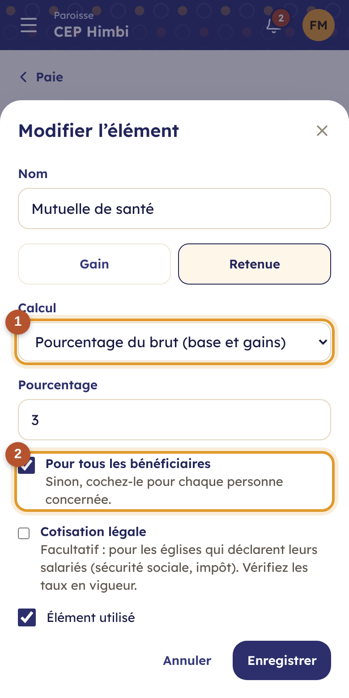
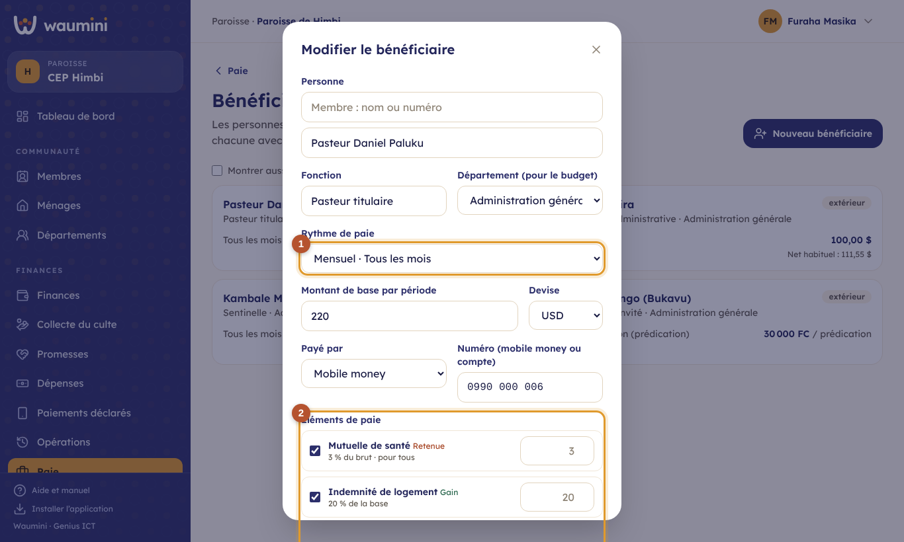
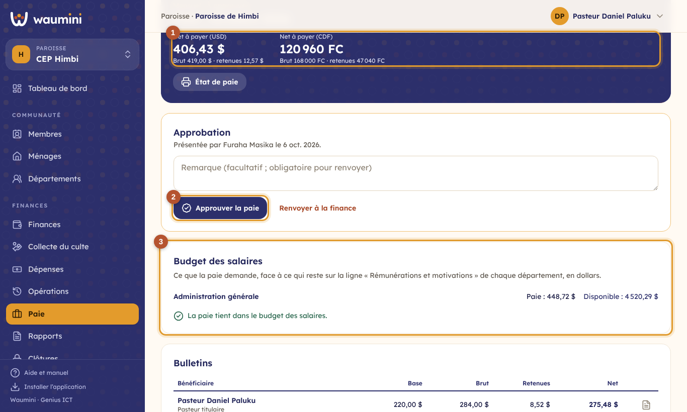
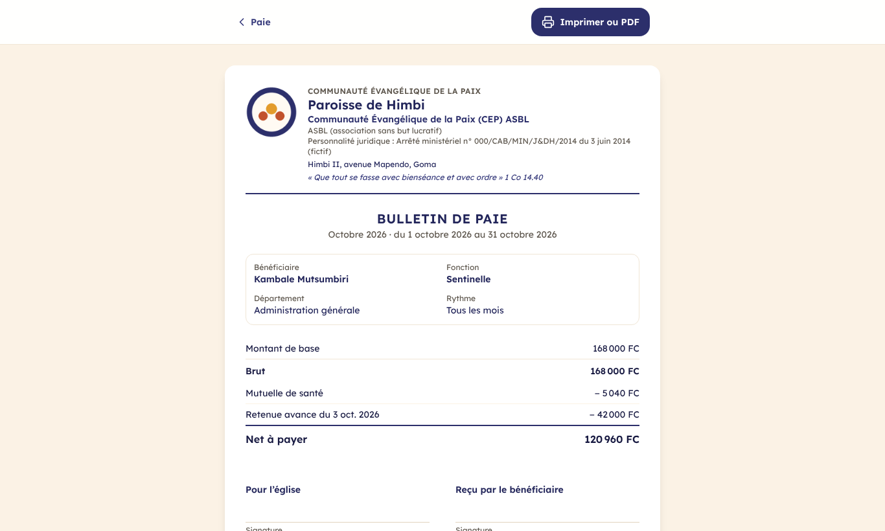
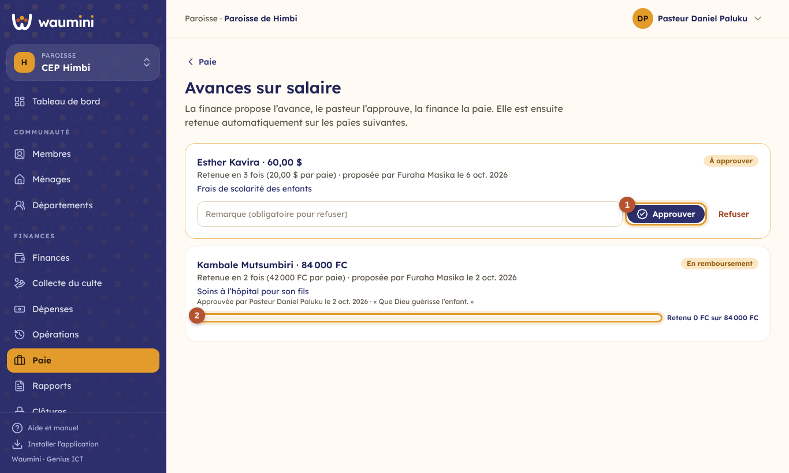

# 17. La paie

Waumini paie les serviteurs de la communauté selon **ses propres règles** : ses rythmes de paie, ses éléments (primes, indemnités, retenues, cotisations), ses devises. Chaque paie suit le même chemin :

1. **la finance prépare** la paie de la période et la **présente** ;
2. **le pasteur l'approuve**, ou la renvoie avec ses remarques ;
3. **la finance paie** depuis la caisse, le compte mobile money ou la banque.

| Qui | Ce qu'il fait | Permission |
|---|---|---|
| Finance (trésorier) | Bénéficiaires, éléments, rythmes ; prépare, présente et paie ; propose et paie les avances | Gérer les bénéficiaires, les éléments et les paies |
| Pasteur | Approuve les paies et les avances sur salaire | Approuver les paies et les avances sur salaire |

**Celui qui présente une paie ou propose une avance ne l'approuve pas.** Le secrétaire, lui, ne voit pas la paie.

## L'accueil de la paie

**Finances › Paie**.

<table><tr>
<td width="68%"></td>
<td width="32%"></td>
</tr></table>

En haut, **ce qui vous attend** : une paie à approuver, une paie approuvée à payer, une avance ou un dépassement à décider.

① **Le budget des salaires** de l'exercice : prévu, payé, engagé et disponible.

② **Les rythmes** et, pour chacun, le nombre de personnes et la masse habituelle à payer, devise par devise.

③ **Préparer une paie**, puis plus bas, **les paies** : leur période, leur montant net et leur étape.

## La paie dans le budget

Les salaires font partie du [budget](21-budget.md), sur la ligne **« Rémunérations et motivations »** du département de chaque personne :

- **Prévoir** : en préparant le budget, la finance touche **Reprendre la masse salariale**. Chaque bénéficiaire devient une ligne : son net habituel multiplié par le nombre de paies de l'exercice (12 pour un rythme mensuel, 52 pour un rythme hebdomadaire…), ou, à la prestation, la moyenne des douze derniers mois. Une deuxième reprise met les lignes à jour, sans les doubler.
- **Contrôler** : une paie présentée est **engagée** dans le budget. Si elle dépasse le disponible des salaires de son département, ou si cette ligne n'existe pas, la finance ne peut pas la présenter : elle demande d'abord un **dépassement**, en disant d'où viendra l'argent, et le pasteur l'autorise (voir [Le suivi du budget et les dépassements](22-suivi-budget.md)).
- **Suivre** : l'accueil de la paie montre le budget des salaires de l'exercice : prévu, payé, engagé et disponible.

Sans budget adopté pour l'exercice, la paie n'est pas contrôlée.

## Les rythmes de paie

Chaque église crée ses rythmes dans **Paie › Réglages**, onglet **Rythmes de paie**. « Mensuel » existe d'office.

<table><tr>
<td width="68%"></td>
<td width="32%"></td>
</tr></table>

① **Payé** : par mois (tous les 1, 2, 3… mois), par semaine (toutes les 1, 2… semaines), ou **à la prestation**.

② **À la prestation**, le montant de chaque personne est multiplié par le nombre de prestations de la période (prédications, cultes, journées), que la finance saisit au moment de la paie. C'est le rythme des prédicateurs invités, des intervenants d'une convention, des ouvriers payés à la journée.

## Les éléments de paie

Onglet **Éléments de paie** : ce qui s'ajoute au montant de base, ou s'en retire.

<table><tr>
<td width="68%"></td>
<td width="32%"></td>
</tr></table>

Un élément est un **gain** (indemnité de logement, transport, prime de fonction) ou une **retenue** (mutuelle, contribution, cotisation).

① **Le calcul** : un **montant fixe** (propre à chaque personne si besoin), un **pourcentage du montant de base**, ou, pour une retenue, un **pourcentage du brut** (la base et les gains).

② **Pour tous les bénéficiaires**, ou seulement pour ceux pour qui vous le cochez.

**Cotisation légale** : facultatif, pour les églises qui déclarent leurs salariés (sécurité sociale, impôt). Waumini ne fixe aucun taux : vérifiez ceux en vigueur.

## Les bénéficiaires

**Paie › Bénéficiaires**, puis **Nouveau bénéficiaire** ou une personne.

<table><tr>
<td width="68%"></td>
<td width="32%"></td>
</tr></table>

La personne : un **membre** du registre, ou une **personne extérieure** (un prédicateur invité, une sentinelle qui n'est pas membre). Puis sa fonction et son **département**, qui reçoit la dépense dans le [suivi du budget](22-suivi-budget.md).

① **Le rythme**, le **montant de base** (par période, ou par prestation) et la **devise** de sa paie ; comment elle est payée (espèces, mobile money avec le numéro, banque).

② **Ses éléments** : cochez ceux qui la concernent. Laissez la valeur vide pour garder celle de l'élément, ou indiquez la sienne (20 $ de transport au lieu de 15 $).

Une personne qui n'est plus payée se décoche (**Toujours payé**) : elle n'apparaît plus dans les nouvelles paies, son historique reste.

## Préparer et présenter une paie

**Préparer une paie** : choisissez le rythme ; Waumini propose la période qui suit la dernière paie. Chaque bénéficiaire du rythme reçoit son **bulletin**, calculé d'après sa fiche.

Dans la paie, la finance :

- saisit le **nombre de prestations** de chacun, pour un rythme à la prestation ;
- ajoute une **prime ou une retenue ponctuelle** sur un bulletin (le crayon), pour cette paie seulement ;
- **met à jour les bulletins** après avoir changé la fiche d'un bénéficiaire ;
- vérifie le **budget des salaires** : ce que la paie demande, département par département, face au disponible ; si elle dépasse, **Demander un dépassement** ;
- puis **présente la paie** au pasteur.

## Approuver

<table><tr>
<td width="68%"></td>
<td width="32%"></td>
</tr></table>

① **Le net à payer**, devise par devise, avec le brut et les retenues.

② **Approuver la paie**, avec une remarque si besoin, ou **Renvoyer à la finance** avec ses remarques (« ajoutez la prime de la secrétaire »).

③ **Le budget des salaires** : ce que la paie demande à chaque département, face au disponible.

Plus bas, **chaque bulletin** : base, brut, retenues (avances comprises) et net.

Le pasteur voit aussi le budget des salaires de la paie ; s'il y a une demande de dépassement, il l'autorise ou la refuse sur la même page.

## Payer

Une fois la paie approuvée, la finance choisit, pour chaque devise de bulletins, **le compte** et **la devise payée**. Si elle diffère (des bulletins en francs payés en dollars, faute de francs en caisse), Waumini calcule **l'équivalent au taux du jour**. Chaque bulletin devient une sortie « Rémunérations et motivations » du département de la personne, visible dans les opérations, les rapports et le suivi du budget.

**Annuler la paie** reste possible après le paiement, si le mois n'est pas clôturé : les sorties de caisse sont annulées, l'argent revient au compte et les retenues d'avances sont rendues.

Un bulletin dont **toute la paie rembourse une avance** (net à zéro) est réglé sans sortie de caisse : la retenue est bien enregistrée.

L'**état de paie** s'imprime (format paysage) avec une colonne pour la signature de chaque bénéficiaire, et les signatures de la finance et du pasteur.

## Le bulletin de paie

L'icône à droite de chaque bulletin l'ouvre, prêt à imprimer ou à enregistrer en PDF. Les églises qui n'en donnent pas n'ont pas à s'en servir.

## Les avances sur salaire

**Paie › Avances**.

<table><tr>
<td width="68%"></td>
<td width="32%"></td>
</tr></table>

**Nouvelle avance** : la personne, le montant (dans la devise de sa paie), en **combien de fois** elle sera retenue, et le motif. Waumini indique la retenue de chaque paie, et prévient si elle dépasse le net habituel de la personne.

① **Le pasteur approuve** l'avance, ou la refuse avec un motif.

La finance **paie l'avance** depuis un compte. Ensuite, elle est **retenue automatiquement** sur les paies suivantes, sans jamais rendre le net négatif, et jamais plus que ce qui reste dû, même si plusieurs paies ont été préparées d'avance. ② La barre montre ce qui est déjà retenu ; à la dernière retenue, l'avance est **remboursée**. Une avance payée par erreur s'annule tant qu'aucune retenue n'a été faite : son paiement est annulé et l'argent revient au compte.
