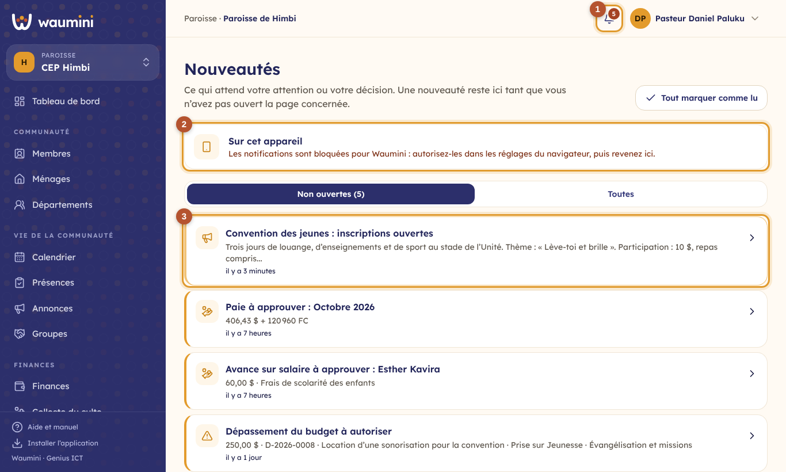
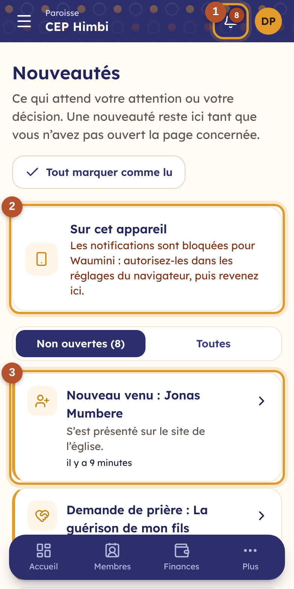

# 18. Les nouveautés et les notifications

Waumini vous prévient de **ce qui attend votre attention** : une dépense à approuver, une paie à valider, une annonce, un groupe qui vous est confié. Ces nouveautés arrivent :

- sur la **cloche** de l'en-tête, avec le nombre de nouveautés **pas encore ouvertes** ;
- sur votre **téléphone** ou votre ordinateur, même quand Waumini est fermé, si vous l'avez activé ;
- sur l'**icône de l'application** installée, avec le même nombre.

## La cloche et la page Nouveautés

Touchez la **cloche** ① en haut de l'écran.

<table><tr>
<td width="68%"></td>
<td width="32%"></td>
</tr></table>

① **La cloche** : le chiffre rouge compte les nouveautés que vous n'avez pas encore ouvertes, dans toutes vos communautés.

② **Sur cet appareil** : activez les notifications pour ce téléphone ou cet ordinateur (voir plus bas).

③ **Les nouveautés**, les plus récentes d'abord. Toucher une nouveauté ouvre la page concernée : la dépense, la paie, l'annonce… Si elle concerne une autre de vos communautés, Waumini vous y fait passer.

L'onglet **Non ouvertes** montre ce qui reste à voir ; l'onglet **Toutes** garde l'historique. **Tout marquer comme lu** vide la cloche d'un coup.

## Une nouveauté reste tant qu'elle n'est pas ouverte

Une nouveauté **reste non ouverte tant que vous n'avez pas ouvert la page qu'elle concerne**, que vous y alliez par la cloche, par le menu ou par un lien. Si vous ouvrez directement la dépense D-2026-0006 depuis la liste des dépenses, sa nouveauté disparaît de la cloche.

Et quand quelqu'un d'autre **règle la question** avant vous, la nouveauté se range aussi chez vous. Exemple : la trésorière et l'administrateur sont tous deux prévenus qu'une dépense est à vérifier ; dès que la trésorière l'a vérifiée, la nouveauté disparaît chez l'administrateur.

## Qui est prévenu de quoi ?

Ceux qui doivent agir, à chaque étape, sauf la personne qui vient d'agir :

| Ce qui se passe | Qui est prévenu |
|---|---|
| Une dépense est demandée | Ceux qui décaissent (la finance), pour la vérifier |
| Elle est vérifiée | Ceux qui approuvent les dépenses |
| Elle est approuvée | Le demandeur, et la finance pour le décaissement |
| Elle est refusée ou décaissée | Le demandeur, avec le motif ou la date de justification |
| Un dépassement du budget est demandé | Ceux qui autorisent les dépassements (le pasteur) ; puis le demandeur, de la décision |
| Un département envoie ses besoins | Ceux qui arbitrent le budget ; puis le département, s'il est renvoyé |
| Le budget est présenté | Ceux qui l'approuvent ; puis la finance, de la décision |
| Une paie ou une avance sur salaire est présentée | Ceux qui approuvent la paie ; puis la finance, de la décision |
| Un paiement mobile money est déclaré | Ceux qui valident les paiements déclarés |
| On vous confie un groupe | Vous, si votre compte est lié à votre fiche de membre |
| Une annonce est publiée | Ceux qu'elle concerne (voir [Les annonces](28-annonces.md)) |

Seules les personnes qui ont un rôle **dans la communauté elle-même** sont prévenues : les responsables de la région ou du siège ne reçoivent pas les nouveautés de chaque paroisse.

## Recevoir les nouveautés sur son téléphone

Sur la page **Nouveautés**, dans le cadre **Sur cet appareil**, touchez **Activer**, puis acceptez quand le navigateur demande l'autorisation. Faites-le **sur chaque appareil** : votre téléphone, l'ordinateur du bureau…

- Une nouveauté s'affiche alors comme un message, même Waumini fermé. La toucher ouvre la bonne page.
- Sur **iPhone**, installez d'abord Waumini sur l'écran d'accueil (voir [Installer Waumini](02-installer.md)), puis activez les notifications depuis l'application installée.
- Si le cadre indique que **les notifications sont bloquées**, autorisez-les pour Waumini dans les réglages du navigateur (le cadenas à gauche de l'adresse), puis revenez sur la page.
- **Désactiver** arrête les notifications sur cet appareil seulement ; la cloche continue de compter.

> **Pour l'hébergeur.** L'envoi sur les téléphones utilise des clés de signature créées une fois pour toutes avec `php artisan waumini:vapid`. Ne les changez pas ensuite : chaque appareil devrait être réactivé.
