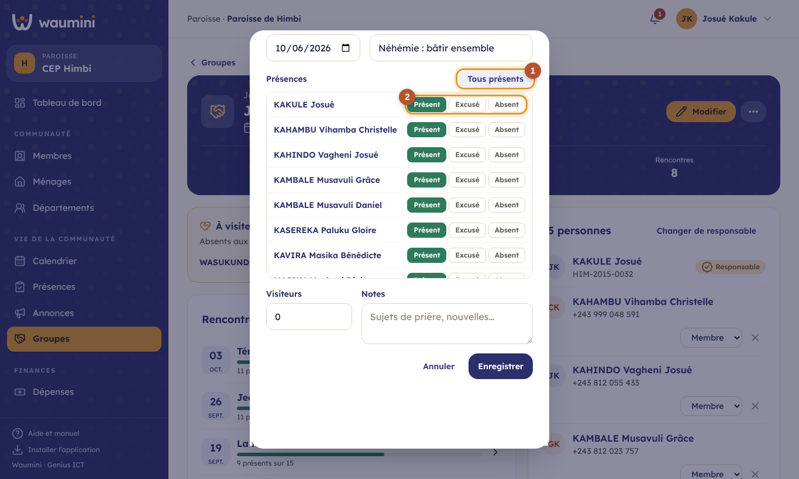

# 26. Les groupes

Cellules de quartier, chorales, groupes de prière, études bibliques, équipes de service : un **groupe** rassemble quelques membres qui se rencontrent régulièrement. À la différence d'un [département](13-menages-departements.md), qui organise un ministère de la communauté, un groupe est une **petite assemblée** dont on suit les rencontres et les présences.

Chaque groupe a **toujours un responsable**, choisi parmi les membres. On le **remplace**, on ne le retire jamais. Il peut avoir des **adjoints**.

| Qui | Ce qu'il fait |
|---|---|
| Secrétaire, administrateur | Crée tous les groupes, nomme et remplace les responsables |
| Responsable de département | Crée et gère les groupes rattachés à **son** département |
| Responsable et adjoints du groupe | Gèrent les membres, notent les rencontres et les présences de **leur** groupe |
| Pasteur, ceux qui voient le registre | Consultent tous les groupes |

Le responsable et ses adjoints sont reconnus **par leur fiche de membre** : pour qu'ils gèrent leur groupe dans Waumini, leur compte doit être lié à leur fiche (voir [Gérer les utilisateurs](05-utilisateurs.md), section « Fiche de membre »). Ils n'ont pas besoin d'autres droits.

## La liste des groupes

**Vie de la communauté › Groupes**.

<table><tr>
<td width="68%"></td>
<td width="32%"></td>
</tr></table>

① **Chaque groupe** : son type, son département s'il en a un, le nombre de personnes, son **responsable**, le jour, l'heure et le lieu de rencontre, et la **dernière rencontre** avec ses présents.

② **Nouveau groupe** : nom, type, département (facultatif), **responsable** (obligatoire, cherché parmi les membres), jour, heure et lieu de rencontre. Sans responsable, le groupe n'est pas créé.

## La fiche du groupe

Touchez un groupe pour l'ouvrir.

<table><tr>
<td width="68%"></td>
<td width="32%"></td>
</tr></table>

En haut : le nombre de personnes, la **présence moyenne** des huit dernières rencontres et le nombre de rencontres notées.

① **À visiter** : les personnes **absentes aux trois dernières rencontres sans s'être excusées**, avec leur téléphone pour les appeler. C'est souvent le premier signe qu'un fidèle s'éloigne.

② **Noter une rencontre** : voir ci-dessous.

③ **Les personnes** : le responsable d'abord, puis les adjoints et les membres. Le rôle de chacun (adjoint ou membre) se change dans la liste ; la croix retire un membre du groupe.

**Ajouter un membre** : cherchez-le par son nom, son numéro ou son téléphone, choisissez son rôle, touchez son nom.

**Changer de responsable** (secrétaire, ou responsable du département du groupe) : choisissez le nouveau responsable. L'ancien **reste dans le groupe** comme simple membre. Le nouveau est prévenu dans ses [nouveautés](25-nouveautes.md).

## Noter une rencontre et ses présences

Après chaque rencontre, le responsable (ou un adjoint) touche **Noter une rencontre**.

<table><tr>
<td width="68%"></td>
<td width="32%"></td>
</tr></table>

- Indiquez la **date** et, si vous voulez, le **thème**.
- ① **Tous présents** coche tout le monde d'un coup ; il ne reste qu'à corriger les absents.
- ② Pour chaque personne : **Présent**, **Excusé** ou **Absent**. Une personne excusée n'est pas signalée « à visiter ».
- Ajoutez le nombre de **visiteurs** et des **notes** (sujets de prière, nouvelles).

Une seule rencontre par jour : noter de nouveau la même date **corrige** la rencontre. Pour la modifier plus tard, touchez-la dans la liste des rencontres ; **Supprimer** l'efface avec ses présences.

## Les groupes d'un membre

Sur la fiche d'un membre, l'onglet **Fonctions** montre ses mandats, ses **départements** et ses **groupes**, avec son rôle dans chacun.
