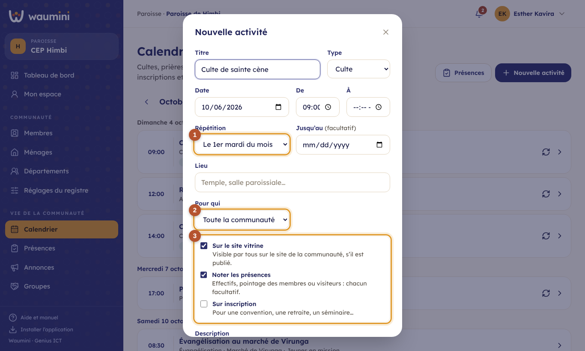
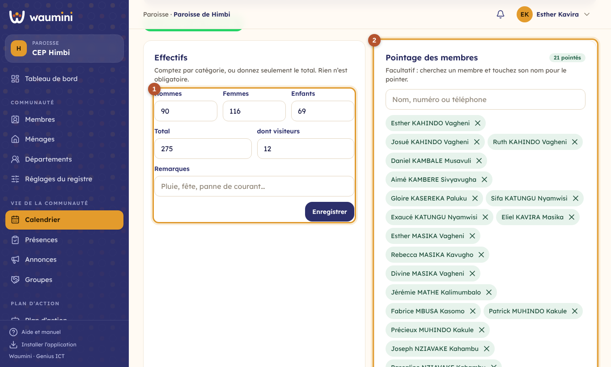
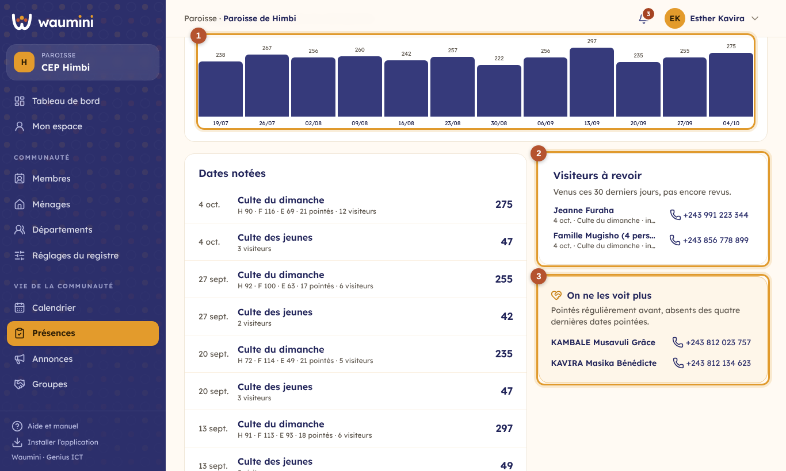
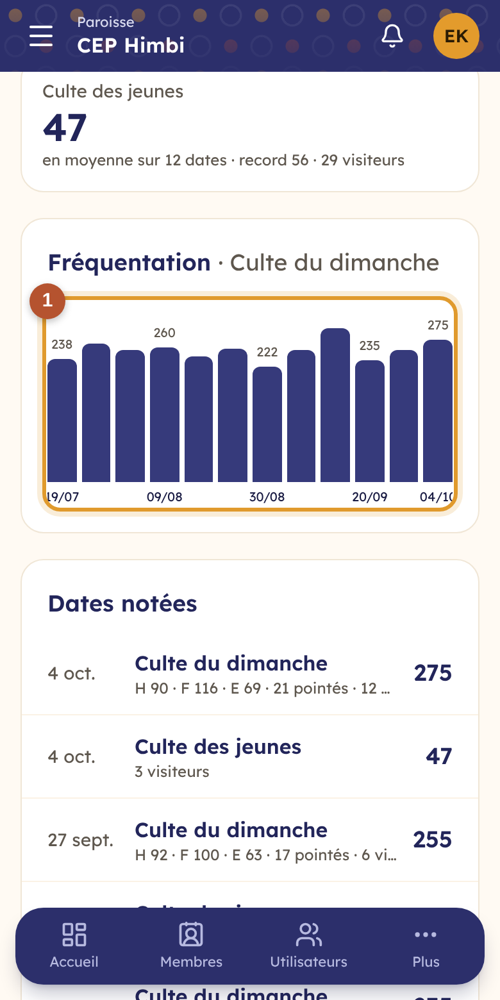
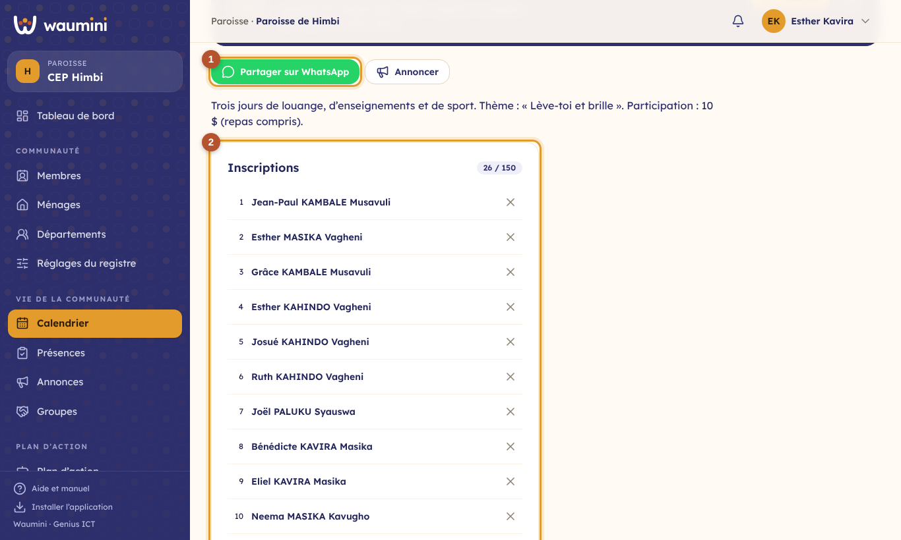

# 20. Le calendrier et les présences

Le **calendrier** réunit les cultes, les prières, les enseignements et les événements de la communauté. Ouvrir une date permet d'y noter les **présences** et, pour un événement, de prendre les **inscriptions**.

| Qui | Ce qu'il fait | Permission |
|---|---|---|
| Secrétaire, pasteur | Programme toutes les activités | Gérer le calendrier et les activités |
| Responsable de département ou de groupe | Programme les activités de son département ou de son groupe | — |
| Secrétaire, responsables | Notent les effectifs, le pointage et les visiteurs | Enregistrer les présences |
| Tout le monde | Consulte le calendrier, s'inscrit à un événement | Voir le tableau de bord |

## Le calendrier

**Vie de la communauté › Calendrier**.

<table><tr>
<td width="68%"></td>
<td width="32%"></td>
</tr></table>

① **Le mois** : les flèches passent au mois précédent ou suivant, **Aujourd'hui** y revient.

② **Une activité**, jour par jour : l'heure, le titre, le type, le lieu et pour qui elle est. Le symbole ↻ signale une activité qui se répète. Une fois notées, les présences s'affichent (« 275 présents »), comme les inscriptions (« 26 inscrits / 150 »).

③ **Nouvelle activité**.

Le **tableau de bord** montre aussi les activités des sept prochains jours, dans le cadre **Cette semaine**.

## Programmer une activité

<table><tr>
<td width="68%"></td>
<td width="32%"></td>
</tr></table>

Donnez un **titre**, un **type** (culte, prière, enseignement, événement, évangélisation, autre), la **date** et les heures.

① **Répétition** : une seule fois, chaque semaine, chaque mois à la même date, ou chaque mois **le même jour de la semaine**. Waumini écrit la règle d'après la date choisie : « Le 1er dimanche du mois », « Le dernier vendredi du mois »… Indiquez si vous voulez une date de fin (**Jusqu'au**). Pour un événement de plusieurs jours (une convention), donnez plutôt le **dernier jour**.

② **Pour qui** : toute la communauté, un département ou un groupe. Un responsable de département ou de groupe ne programme que pour les siens.

③ **Noter les présences** (coché d'office) et **Sur inscription**, avec un nombre de **places** si elles sont limitées. **Sur le site vitrine** montre l'activité sur le [site de la communauté](34-site-vitrine.md) ; la case est cochée d'office pour les activités de toute la communauté.

**Annuler une seule date** : ouvrez cette date, menu **⋯**, **Annuler cette date seulement**. Les autres dates restent prévues ; **Rétablir cette date** la remet. **Modifier** change toute la série.

## Noter les présences d'un culte

Ouvrez la date dans le calendrier. **Rien n'est obligatoire** : chaque communauté compte comme elle en a l'habitude, et peut combiner les trois façons.

<table><tr>
<td width="68%"></td>
<td width="32%"></td>
</tr></table>

① **Les effectifs** : hommes, femmes et enfants, comptés par les huissiers ou les diacres. Waumini fait le **total**. Si vous ne comptez que le total, laissez le détail vide et donnez seulement le **Total**. Le champ **dont visiteurs** dit combien de visiteurs font partie du total. Ajoutez une **remarque** si la journée était particulière (pluie, baptêmes, panne).

② **Le pointage des membres** : cherchez un membre par son nom, son numéro ou son téléphone et touchez son nom pour le pointer ; touchez-le de nouveau, ou la croix, pour le retirer. Utile pour une petite communauté, ou pour suivre la fidélité de chacun.

③ **Les visiteurs** : leur nom, leur téléphone et la personne qui les a invités. Chacun reste **À revoir** jusqu'à ce que quelqu'un l'ait recontacté : touchez alors **À revoir** pour le passer à **Revu**.

Les présences se notent le jour même ou après, jamais à l'avance.

## La page Présences

**Vie de la communauté › Présences**.

<table><tr>
<td width="68%"></td>
<td width="32%"></td>
</tr></table>

Choisissez l'activité et la période (4 semaines à 12 mois). En haut, pour chaque activité : la **moyenne**, le **record** et le nombre de visiteurs.

① **La fréquentation**, date par date, de l'activité choisie (ou de la plus fréquentée).

② **Visiteurs à revoir** : venus ces 30 derniers jours et pas encore recontactés, avec leur téléphone.

③ **On ne les voit plus** : les membres pointés régulièrement avant, mais absents des quatre dernières dates pointées. Ce cadre n'apparaît que si votre communauté pointe ses membres.

En dessous, **les dates notées** avec leurs effectifs : toucher une ligne ouvre la date.

## Les inscriptions à un événement

Pour une activité **sur inscription**, la page de la date montre la liste des inscrits et les places prises.

<table><tr>
<td width="68%"></td>
<td width="32%"></td>
</tr></table>

① **Partager sur WhatsApp** envoie le titre, la date, l'heure, le lieu et la description de l'activité ; **Annoncer** prépare une [annonce](28-annonces.md) de l'activité.

② **Les inscriptions** : inscrivez un membre en le cherchant par son nom, ou un **invité** par son nom et son téléphone. Quand les places sont toutes prises, Waumini refuse les nouvelles inscriptions. Un membre dont le compte est lié à sa fiche peut s'inscrire lui-même avec **M'inscrire**.
