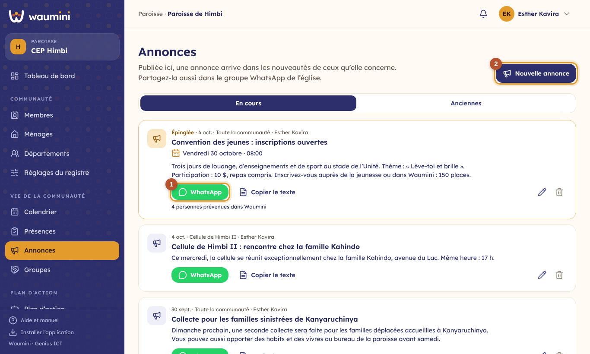
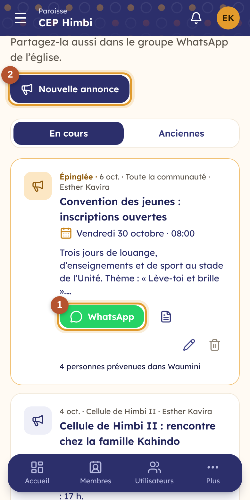

# 28. Les annonces

Une **annonce** informe la communauté, un département ou un groupe : un changement d'horaire, une collecte spéciale, une convention. Publiée dans Waumini, elle arrive dans les [nouveautés](25-nouveautes.md) de ceux qu'elle concerne, et sur leur téléphone s'ils l'ont activé. Comme beaucoup de fidèles n'ont pas de compte, chaque annonce se **partage aussi sur WhatsApp** en un geste.

| Qui | À qui il annonce |
|---|---|
| Secrétaire, pasteur, administrateur | À toute la communauté, à un département ou à un groupe ; peuvent **épingler** une annonce |
| Responsable de département | À son département et aux groupes de son département |
| Responsable ou adjoint d'un groupe | À son groupe |

## La page Annonces

**Vie de la communauté › Annonces**.

<table><tr>
<td width="68%"></td>
<td width="32%"></td>
</tr></table>

Les annonces **épinglées** restent en haut, puis les plus récentes. Chacune indique sa date, pour qui elle est et qui l'a publiée.

① **WhatsApp** ouvre WhatsApp avec le texte de l'annonce déjà écrit : le titre en gras, la date, l'heure et le lieu de l'activité s'il y en a une, le message et le nom de la communauté. Choisissez le groupe WhatsApp de l'église et envoyez. L'icône à côté **copie le texte**, pour le coller ailleurs (SMS, Facebook).

② **Nouvelle annonce** : un titre, le message, pour qui elle est, et la date jusqu'à laquelle elle reste **visible** (deux semaines par défaut). Après publication, Waumini indique combien de personnes ont été prévenues.

Chacun voit les annonces générales et celles de ses départements et de ses groupes. Une annonce passée sa date de fin va dans l'onglet **Anciennes**.

## Annoncer une activité du calendrier

Depuis une date du [calendrier](27-calendrier-presences.md), touchez **Annoncer** : l'annonce est préremplie avec le titre et la description de l'activité, pour le même public, visible jusqu'au lendemain de l'activité. Le texte partagé sur WhatsApp reprend la date, l'heure et le lieu.

## Le tableau de bord

Les trois dernières annonces en cours s'affichent sur le **tableau de bord**, à côté des activités de la semaine.
