# 29. Les documents : attestations, lettres, ordres de mission

Waumini rédige les documents de la communauté **en une minute** : attestation d'appartenance, de baptême, de présentation d'enfant, de service, certificat de mariage religieux, lettre de recommandation, ordre de mission, convocation, lettre. Chaque document délivré reçoit :

- un **numéro** qui suit (« ABA/HIM/2026/0012 ») ;
- un **texte figé**, tel qu'il a été imprimé ;
- un **QR code** : quiconque le scanne vérifie que le document est authentique, ou qu'il a été annulé.

Le document s'imprime sur l'en-tête de la communauté, puis se **signe à la main** et reçoit le cachet.

| Qui | Ce qu'il fait | Permission |
|---|---|---|
| Secrétaire, pasteur | Délivrent les documents, les annulent | Délivrer les attestations et lettres |
| Secrétaire, administrateur | Écrivent et adaptent les modèles | Gérer les modèles de documents |

## Les documents délivrés

**Documents › Documents délivrés**.

<table><tr>
<td width="68%">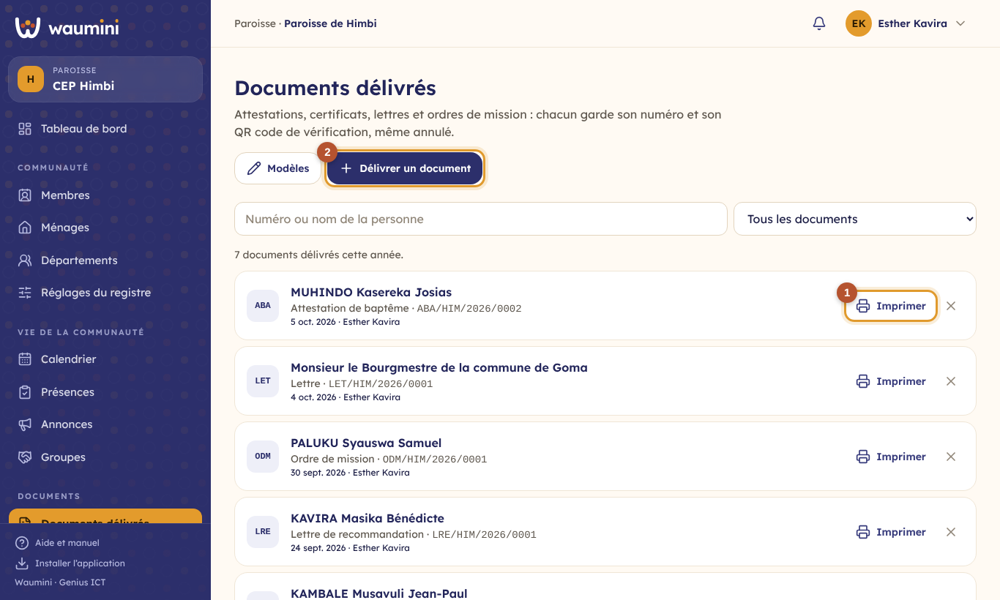</td>
<td width="32%">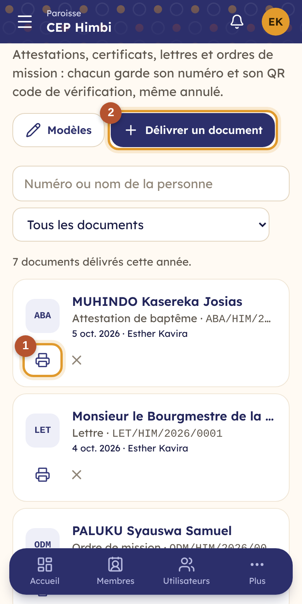</td>
</tr></table>

Le registre de tous les documents délivrés : la personne, le document, son numéro, sa date et qui l'a délivré. Cherchez par numéro ou par nom ; filtrez par sorte de document.

① **Imprimer** rouvre un document pour le réimprimer, à l'identique.

② **Délivrer un document**.

Un document **annulé** reste dans la liste, grisé, avec son motif.

## Délivrer un document

Touchez **Délivrer un document**, puis la sorte de document. Depuis la **fiche d'un membre**, le bouton **Document** ouvre le même écran avec la personne déjà choisie.

<table><tr>
<td width="68%">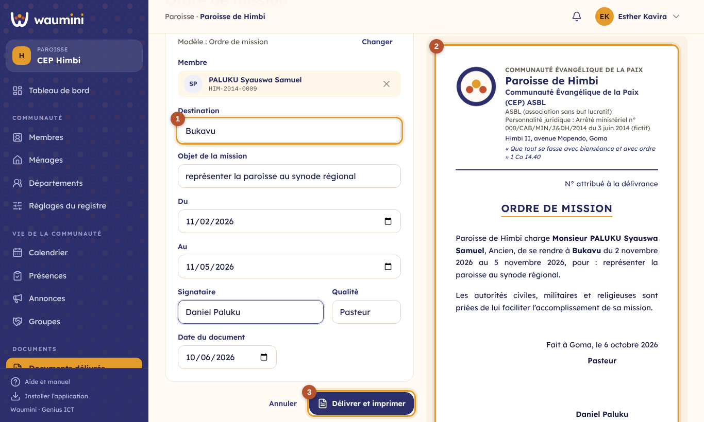</td>
<td width="32%">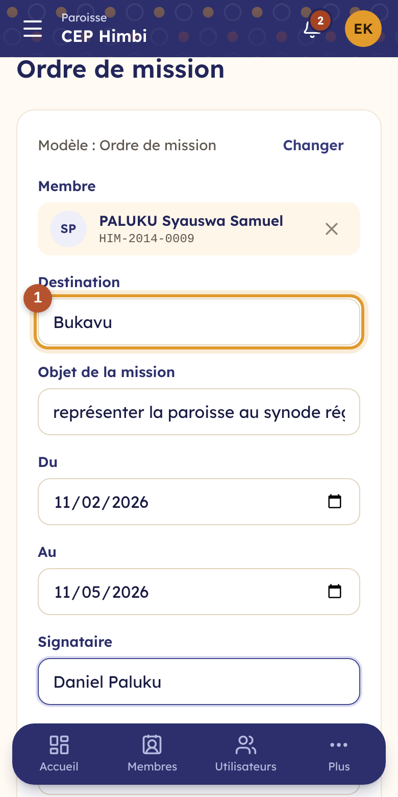</td>
</tr></table>

- Choisissez le **membre** (ou, pour une lettre, écrivez le **destinataire**). Pour une attestation de baptême, de mariage ou de présentation, vous pouvez aussi choisir un **acte d'un ancien registre** (voir [Les registres](30-registres.md)).
- ① Remplissez les **champs propres au document** : la destination et les dates d'une mission, la communauté d'accueil d'une recommandation…
- Indiquez le **signataire** (Waumini propose le dernier utilisé) et sa qualité.
- ② L'**aperçu** montre le document tel qu'il sera imprimé.
- ③ **Délivrer et imprimer** : le document reçoit son numéro et son QR code, puis s'ouvre pour l'impression.

Waumini prend les informations **sur la fiche** de la personne : nom, date et lieu de naissance, numéro de membre, date d'adhésion, fonction, et, pour un baptême ou un mariage, la date, le lieu, l'officiant et la référence du registre inscrits dans ses [étapes de vie](12-membres.md). Si une information manque, un cadre orange la signale : complétez la fiche puis revenez, ou laissez les **pointillés**, à compléter à la main sur le papier.

Le texte est **figé** dès la délivrance : corriger ensuite la fiche ne change pas un document déjà délivré. Pour corriger une erreur, **annulez** le document (la croix, dans la liste, avec un motif) et délivrez-en un nouveau.

## Imprimer et vérifier

<table><tr>
<td width="68%">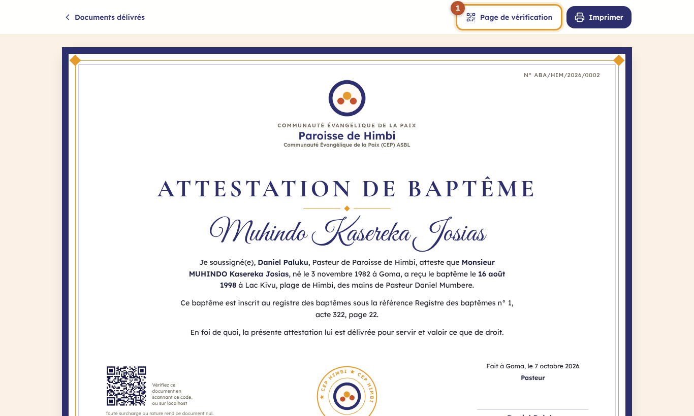</td>
<td width="32%">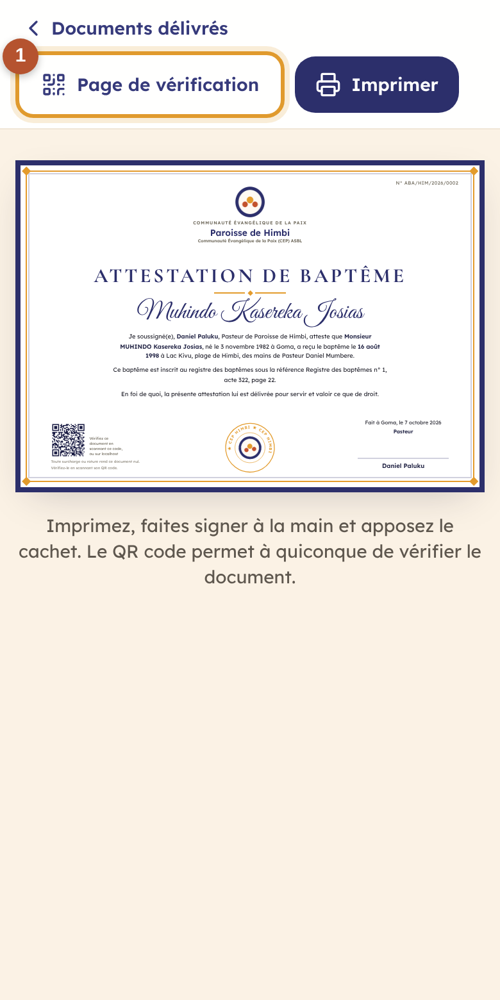</td>
</tr></table>

**La photo du membre.** Les modèles qui la demandent (d'office : attestation d'appartenance, lettre de recommandation, attestation de service, ordre de mission) impriment la **photo de la fiche**, au format identité, en haut à droite. Elle est **copiée au moment de la délivrance** : changer la photo de la fiche ensuite ne change pas un document déjà remis. Si la fiche n'a pas de photo, Waumini le signale avant la délivrance, avec un lien pour l'ajouter ; sinon, le document part sans photo.

Le document porte l'en-tête de la communauté (nom, identité juridique, adresse, devise, choisis dans [Paramètres › Identité et documents](08-parametres.md), avec le texte du bas propre aux documents), son numéro, son titre, le texte, le lieu et la date, la qualité et le nom du signataire, et, en bas, le **QR code**. Touchez **Imprimer**, en A4.

① **Page de vérification** montre ce que verra la personne qui scannera le QR code.

<table><tr>
<td width="68%">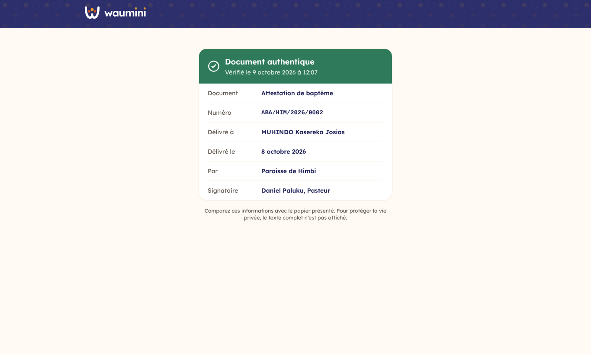</td>
<td width="32%">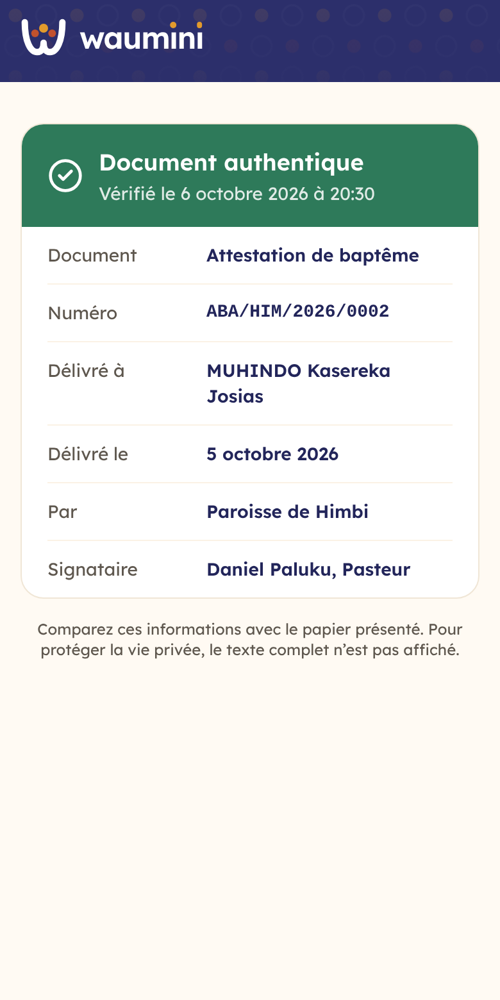</td>
</tr></table>

Une école, une ambassade, une autre église scanne le QR code avec n'importe quel téléphone, sans compte Waumini. La page indique **Document authentique** ou **Document annulé**, avec la sorte de document, le numéro, le nom, la date, la communauté et le signataire. Pour protéger la vie privée, le texte complet n'y figure pas : on compare avec le papier présenté. Si le document porte une photo, la page la montre aussi : la photo imprimée doit être la même, ce qui déjoue un faux fait avec la photo de quelqu'un d'autre. Un faux, dont le QR code ne correspond à rien, affiche **Document inconnu**.

## Les modèles

**Documents › Modèles de documents**.

<table><tr>
<td width="68%">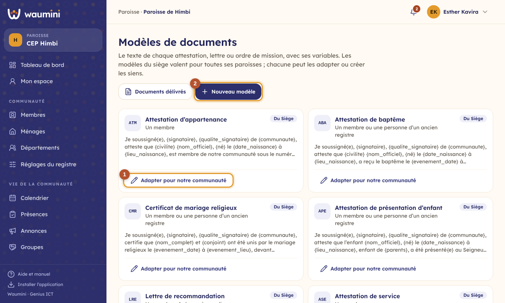</td>
<td width="32%">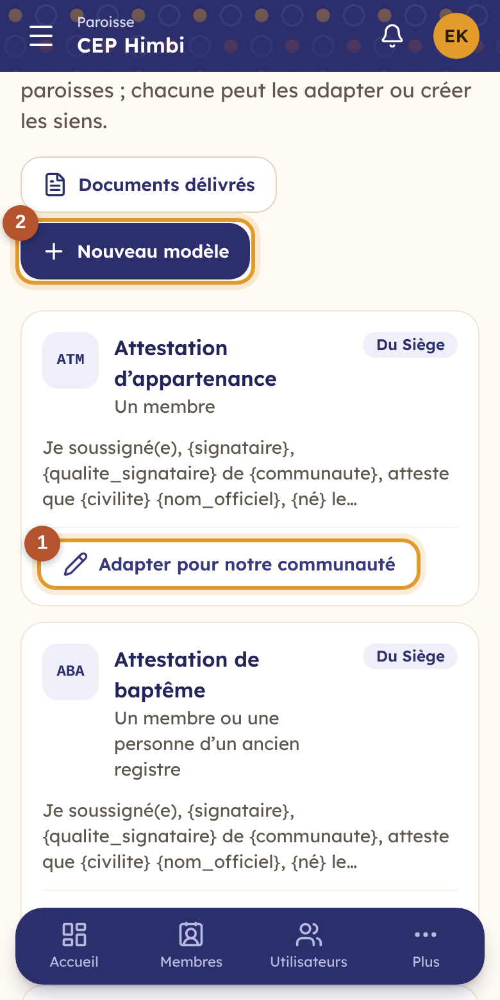</td>
</tr></table>

Neuf modèles sont fournis au **siège**, et valent pour toutes ses paroisses (badge **Du siège**).

① **Adapter pour notre communauté** : la paroisse en garde une copie, qu'elle modifie librement. Chez elle, la copie **remplace** le modèle du siège ; les autres paroisses gardent celui du siège.

② **Nouveau modèle** : une attestation de choriste, une carte de service, un certificat de fin de catéchèse…

Un modèle de la communauté peut être **mis de côté** : il n'est plus proposé, mais les documents déjà délivrés restent valables.

## Écrire un modèle

<table><tr>
<td width="68%">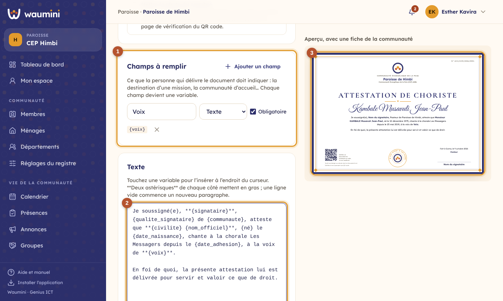</td>
<td width="32%">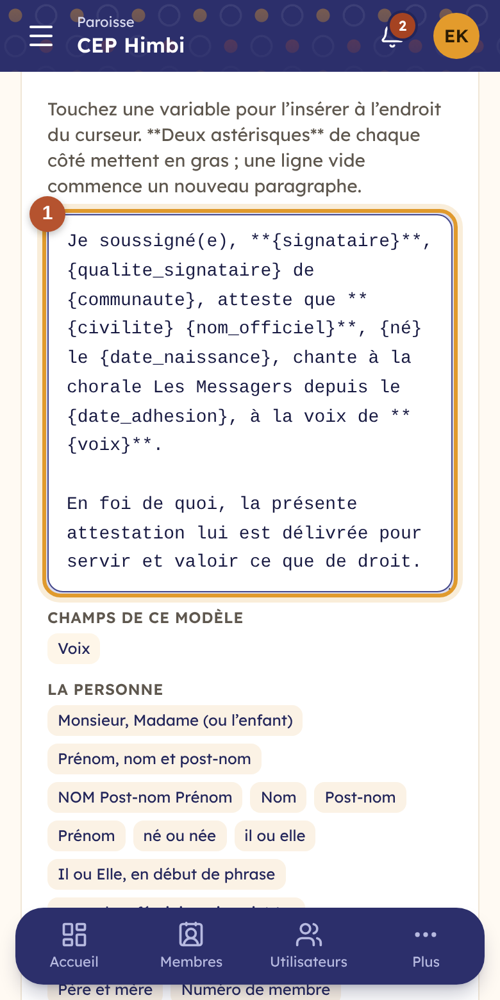</td>
</tr></table>

- Le **nom** du modèle, le **titre imprimé**, et un **code** court (ABA, ODM…) qui entre dans le numéro.
- **Délivré à** : un membre ; un membre ou une personne d'un ancien registre ; ou un destinataire libre (une lettre à la mairie).
- **Étape de vie reprise** : le baptême, le mariage… dont le document cite la date, le lieu et l'officiant.
- **Mettre la photo du membre** : la photo de sa fiche, au format identité (pas pour un destinataire libre).
- **Format du numéro** : par exemple `{CODE}/{SIGLE}/{ANNEE}/{NUMERO}`. `{SIGLE}` est le sigle de la paroisse, `{SIEGE}` celui du siège, `{AN}` l'année sur deux chiffres. La numérotation repart à 1 chaque année.

① **Les champs à remplir** : ce que la personne qui délivre doit indiquer. Chaque champ devient une variable : le champ « Voix » s'écrit `{voix}` dans le texte.

② **Le texte**. Touchez une variable pour l'insérer à l'endroit du curseur :

| Variable | Devient |
|---|---|
| `{civilite}` | Monsieur ou Madame |
| `{nom_officiel}` | KAHINDO Vagheni Esther |
| `{né}`, `{il}`, `{Il}` | né ou née, il ou elle, Il ou Elle |
| `inscrit{e}` | inscrit ou inscrite |
| `{date_naissance}`, `{lieu_naissance}` | 14 mars 1982, Butembo |
| `{evenement_date}`, `{evenement_registre}` | la date du baptême, sa référence dans le registre |
| `{signataire}`, `{qualite_signataire}`, `{communaute}` | Daniel Paluku, Pasteur, Paroisse de Himbi |

Deux astérisques de chaque côté mettent en **gras** : `**{nom_officiel}**`. Une ligne vide commence un nouveau paragraphe. Une variable mal écrite est signalée en rouge.

③ **L'aperçu** se met à jour pendant que vous écrivez, avec une vraie fiche de la communauté.
