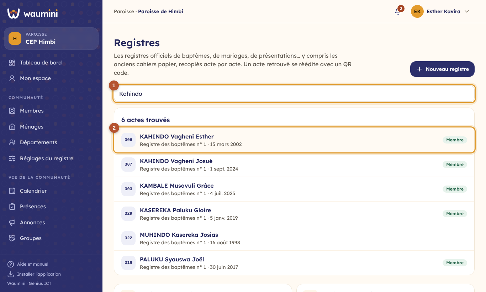
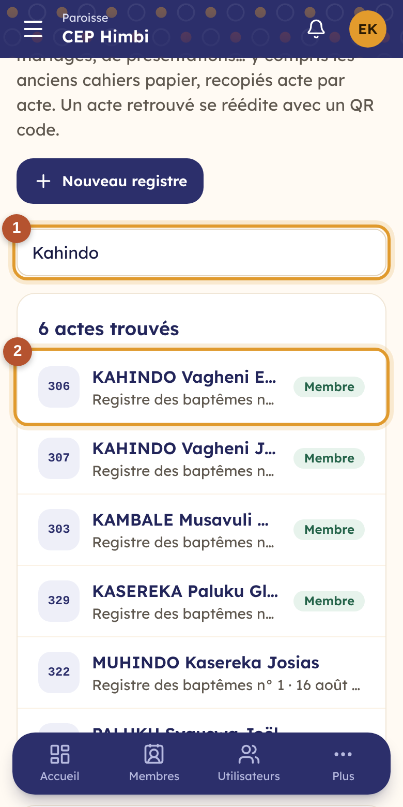
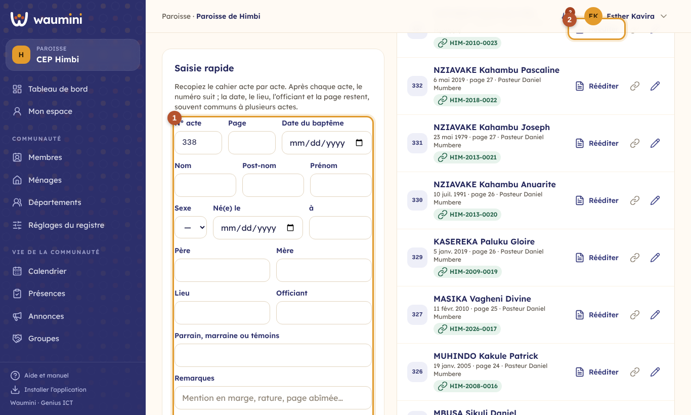
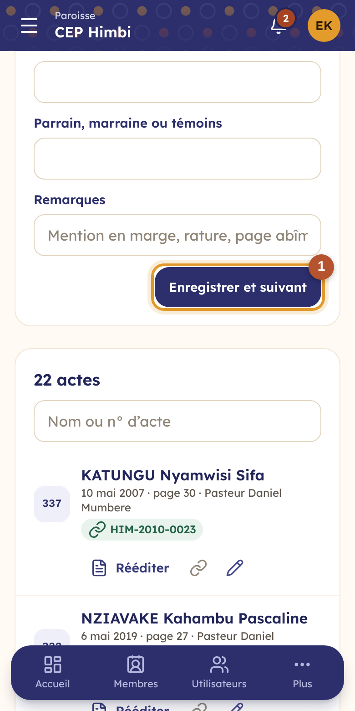

# 25. Les registres officiels et les anciens cahiers

Beaucoup de communautés gardent dans une armoire leurs **registres papier** : baptêmes, mariages, présentations d'enfants, parfois depuis cinquante ans. Ces cahiers s'abîment, se perdent, et retrouver un acte prend des heures. Waumini permet de les **recopier acte par acte**, de retrouver une personne en une seconde, et de **rééditer** une attestation moderne, avec son QR code, à partir d'un acte ancien.

| Qui | Ce qu'il fait | Permission |
|---|---|---|
| Secrétaire | Crée les registres, recopie et corrige les actes, les relie aux fiches | Tenir les registres officiels et les anciens registres |
| Pasteur, secrétaire | Cherchent dans les registres et rééditent les attestations | Délivrer les attestations et lettres |

## Les registres et la recherche

**Documents › Registres**.

<table><tr>
<td width="68%"></td>
<td width="32%"></td>
</tr></table>

① **La recherche** porte sur **tous les registres** à la fois : nom, post-nom, prénom, nom des parents, du conjoint, ou numéro de l'acte.

② **Les actes trouvés**, avec leur registre et leur date. Le badge **Membre** signale un acte relié à une fiche. Toucher un acte l'ouvre dans son registre.

Plus bas, **les registres** de la communauté, avec le nombre d'actes saisis et reliés.

**Nouveau registre** : créez-en un **par cahier**. Choisissez la sorte (baptêmes, mariages, présentations d'enfants, confirmations, consécrations, décès, autre), un nom (« Registre des baptêmes n° 2 »), les années couvertes et, si vous voulez, une remarque (l'état du cahier, où il est rangé).

## Recopier un cahier

Ouvrez le registre.

<table><tr>
<td width="68%"></td>
<td width="32%"></td>
</tr></table>

① **La saisie rapide**, pensée pour recopier un cahier entier sans perdre de temps :

- recopiez l'acte **tel qu'il est écrit** : numéro, page, date, nom, post-nom, prénom, sexe, naissance, père et mère (ou conjoint pour un mariage), lieu, officiant, parrain et marraine ou témoins ;
- **Enregistrer et suivant** : le **numéro suivant** se propose tout seul, et la **date, le lieu, l'officiant et la page** restent, puisqu'ils sont souvent communs à plusieurs actes (un baptême de vingt personnes le même dimanche) ; le curseur revient sur le nom ;
- une mention en marge, une rature, une page abîmée vont dans **Remarques**.

Un même numéro n'est pas accepté deux fois dans un registre. S'il est vraiment écrit deux fois dans le cahier, notez « 125 bis ».

Dans la liste, le crayon **corrige** un acte ; on peut aussi le supprimer.

## Relier un acte à la fiche d'un membre

Quand la personne de l'acte est membre, touchez **Relier**, cherchez sa fiche et choisissez-la. Sa fiche reçoit alors l'**étape de vie** (le baptême, le mariage…) avec la date, le lieu, l'officiant et la **référence du registre** (« Registre des baptêmes n° 1, acte 322, page 22 »). Si la fiche connaissait déjà cette étape, elle garde ce qu'elle savait ; l'acte complète seulement ce qui manquait.

Un acte relié porte, sous le nom, le numéro de membre : le toucher ouvre la fiche. L'icône de lien **délie** l'acte.

## Rééditer une attestation

② **Rééditer** délivre l'attestation qui correspond au registre (attestation de baptême, certificat de mariage, attestation de présentation d'enfant), **à partir de l'acte** : nom, naissance, parents, date, lieu, officiant et référence du registre. Cela vaut aussi pour une personne qui **n'est plus membre**, ou qui ne l'a jamais été dans Waumini : un ancien fidèle parti à Kinshasa qui demande l'attestation de son baptême de 1998.

Le document suit ensuite le chemin de tous les [documents](29-documents.md) : numéro, texte figé, impression, signature à la main et **QR code** de vérification.
