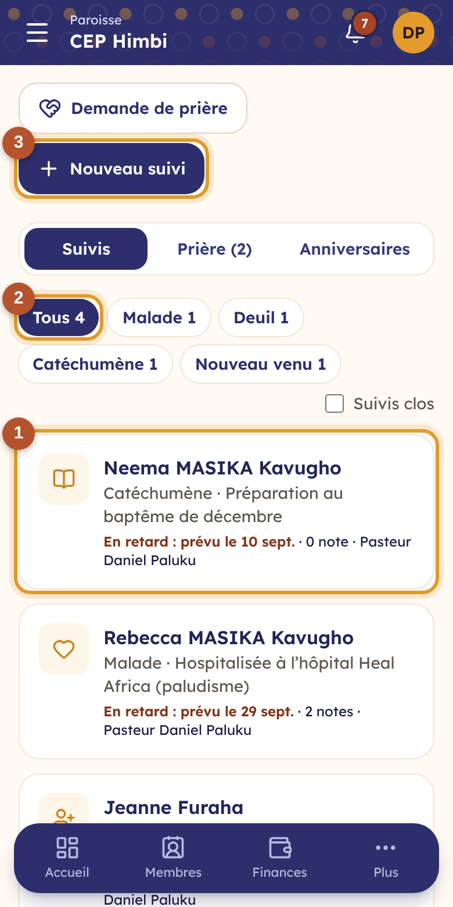
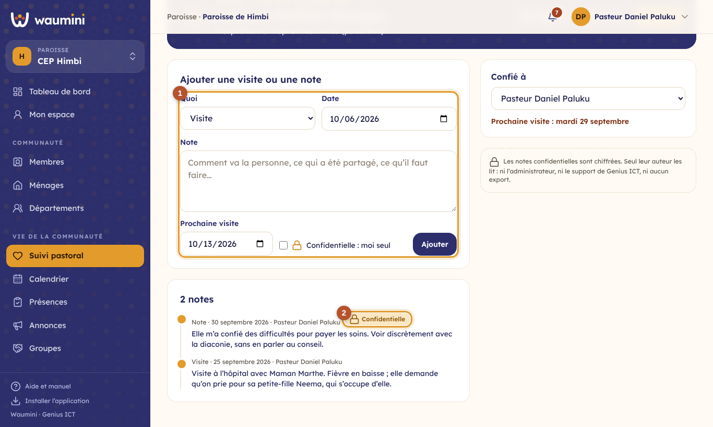
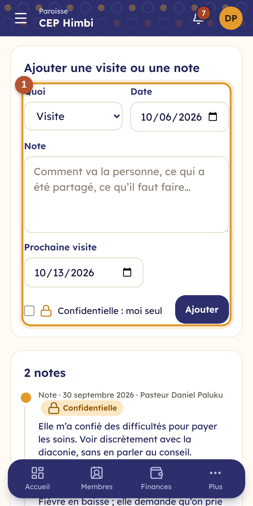
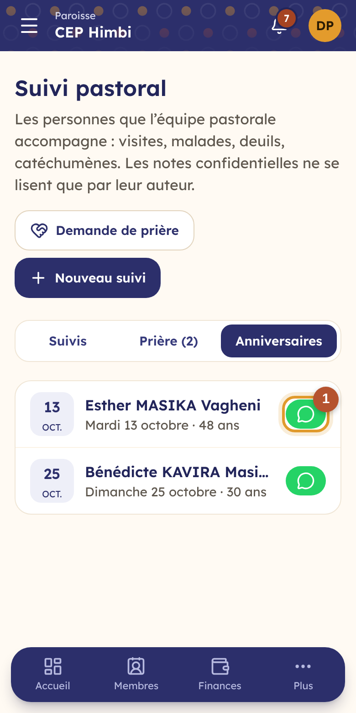

# 31. Le suivi pastoral

Le **suivi pastoral** aide l'équipe pastorale à ne perdre personne de vue : la maman hospitalisée, la famille en deuil, le catéchumène qui prépare son baptême, la nouvelle venue du dimanche. Chaque personne accompagnée a son **suivi**, avec la date de la prochaine visite et le fil des visites, appels et notes.

| Qui | Ce qu'il fait | Permission |
|---|---|---|
| Pasteur, équipe pastorale | Ouvre et tient les suivis, reçoit les demandes de prière | Voir et gérer le suivi pastoral |
| Pasteur | Écrit des notes confidentielles, que lui seul lit | Écrire et lire ses notes confidentielles |

## Les suivis

**Vie de la communauté › Suivi pastoral**.

<table><tr>
<td width="68%"></td>
<td width="32%"></td>
</tr></table>

① **Chaque personne suivie** : son nom, le type de suivi (visite, malade, deuil, catéchumène, accompagnement, nouveau venu), le motif, la **prochaine visite**, le nombre de notes et la personne à qui le suivi est confié. Une visite **en retard** s'affiche en rouge.

② **Les filtres** par type ; la case **Suivis clos** montre les suivis terminés.

③ **Nouveau suivi** : choisissez un membre (ou écrivez le nom et le téléphone d'une personne qui n'est pas membre), le type, le motif, la date de la prochaine visite et la personne de l'équipe à qui le confier. Elle est prévenue dans ses [nouveautés](25-nouveautes.md).

Depuis la **fiche d'un membre**, le bloc **Suivi pastoral** liste ses suivis et en ouvre un nouveau.

## Le fil d'un suivi

<table><tr>
<td width="68%"></td>
<td width="32%"></td>
</tr></table>

① **Ajouter une visite ou une note** : une visite, un appel ou une simple note, avec sa date, ce qui a été partagé, et la date de la **prochaine visite**.

② Une **note confidentielle** porte un cadenas. Elle est **chiffrée** : seul son auteur la lit. Ni l'administrateur, ni les autres membres de l'équipe, ni le support de Genius ICT, ni aucun export ne peuvent l'afficher ; les autres voient seulement qu'une note confidentielle existe.

En haut, **Appeler** et **Fiche** ; **Clore** termine le suivi quand la personne va mieux, sans rien effacer (**Rouvrir** le reprend). À droite, la personne à qui le suivi est **confié**, et les autres suivis de la même personne.

## Les demandes de prière

L'onglet **Prière** réunit les demandes confiées à l'équipe : enregistrées par le secrétariat (**Demande de prière**), ou envoyées par les membres depuis leur [espace](32-espace-membre.md). Elles restent **confidentielles** à l'équipe pastorale.

Après avoir prié, touchez **Porté dans la prière** et, si vous voulez, écrivez un mot : si la personne a son espace membre, elle le reçoit.

## Les anniversaires

<table><tr>
<td width="68%"></td>
<td width="32%"></td>
</tr></table>

L'onglet **Anniversaires** montre les anniversaires des 30 prochains jours, avec l'âge. ① **Souhaiter** ouvre WhatsApp avec un message de vœux déjà écrit.

Chaque matin, l'équipe pastorale reçoit aussi dans ses nouveautés **les anniversaires du jour**.
