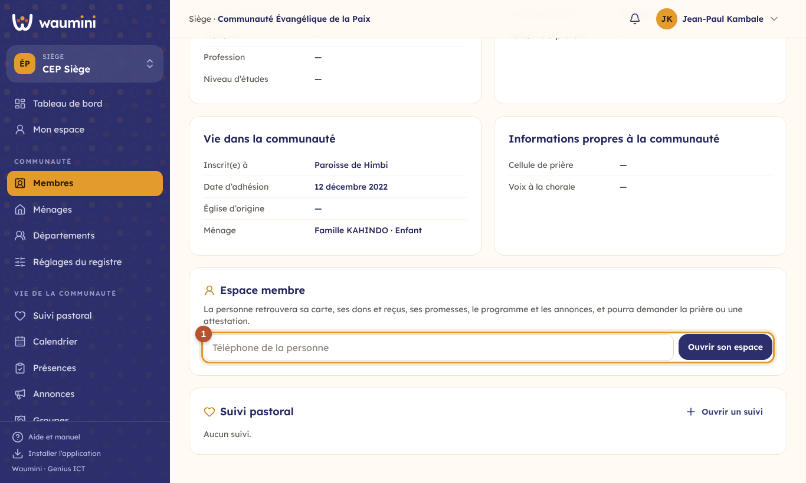
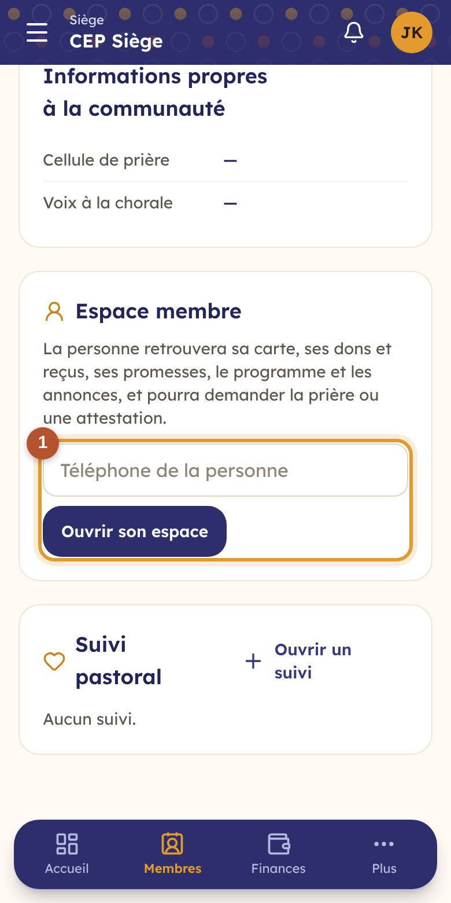
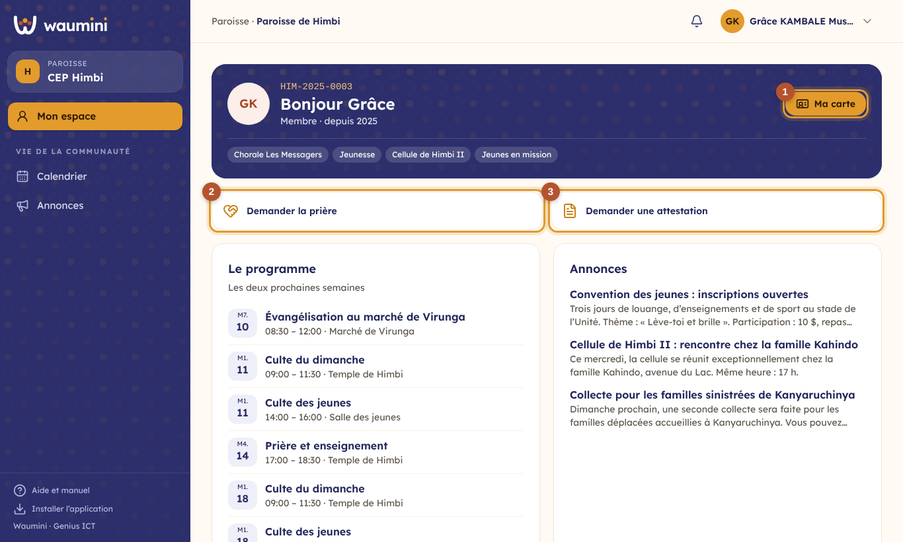
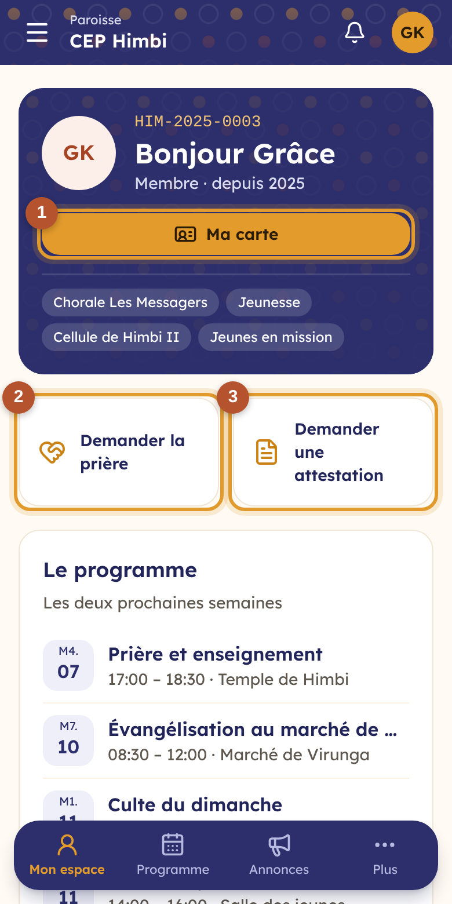

# 23. L'espace membre

Chaque membre peut avoir **son espace** dans Waumini, sur son téléphone : sa carte de membre, ses dons et ses reçus, ses promesses, le programme de la communauté, les annonces, et ses demandes de prière ou d'attestation. Il ne voit rien d'autre : ni le registre, ni les finances de la communauté.

## Ouvrir l'espace d'un membre

C'est l'administrateur, ou toute personne qui gère les utilisateurs, qui ouvre l'espace, depuis la **fiche du membre**.

<table><tr>
<td width="68%"></td>
<td width="32%"></td>
</tr></table>

① Dans le bloc **Espace membre**, vérifiez le **téléphone** de la personne et touchez **Ouvrir son espace**. Waumini crée son compte avec un **mot de passe provisoire**, affiché une seule fois. **Envoyer par WhatsApp** lui transmet l'adresse, son numéro et ce mot de passe. À la première connexion, elle choisit son propre mot de passe ; ensuite, elle peut se connecter avec son empreinte (voir [Mon profil](10-profil.md)).

Si un compte existe déjà à ce numéro (un responsable, par exemple), l'espace s'ouvre avec ce compte.

## Ce que le membre voit

En se connectant, le membre arrive directement dans **Mon espace**.

<table><tr>
<td width="68%"></td>
<td width="32%"></td>
</tr></table>

- En haut, son numéro, son statut, ses départements et ses groupes ; ① **Ma carte** ouvre sa [carte de membre](12-membres.md#la-carte-de-membre) avec son QR code.
- **Le programme** des deux prochaines semaines : les activités de toute la communauté, de ses départements et de ses groupes, avec ses inscriptions. Toucher une activité l'ouvre ; il peut s'y **inscrire** si elle est sur inscription.
- **Les annonces** en cours qui le concernent.
- **Mes dons et contributions** : ses dîmes et offrandes nominatives, le total de l'année, et le **reçu** de chacune à réimprimer. **Déclarer un don** : après avoir envoyé sa dîme ou son offrande par mobile money, le membre indique le montant, l'opérateur, la date et l'**ID de la transaction**, et ce pour quoi il donne (ou sa promesse). La trésorerie vérifie et valide ; en attendant, le don apparaît « en cours de vérification », et le reçu arrive à la validation.
- **Mes promesses** : ce qui est versé, ce qui reste, la prochaine échéance.
- **Mes demandes**, avec leur état.

En bas de l'écran du téléphone, les onglets **Mon espace**, **Programme** et **Annonces**.

## Les demandes

② **Demander la prière** : le sujet, et ce qu'il veut confier. La demande va à l'équipe pastorale seulement ([Le suivi pastoral](31-suivi-pastoral.md)) ; quand l'équipe a prié, un mot peut lui revenir.

③ **Demander une attestation** : il choisit le document (attestation d'appartenance, de baptême…) et dit pour quoi faire. Le secrétariat voit la demande en haut de **Documents délivrés** : **Délivrer** prépare le document avec la fiche de la personne ; **Refuser** demande un motif, que la personne verra. Dans les deux cas, elle est prévenue dans ses nouveautés. Le document se retire au secrétariat, signé et cacheté (voir [Les documents](29-documents.md)).

## La langue

Chaque membre utilise Waumini dans **sa langue** : celle choisie sur sa fiche (« Langue préférée ») lors de l'ouverture de l'espace, puis celle qu'il choisit lui-même dans **Mon profil**.
