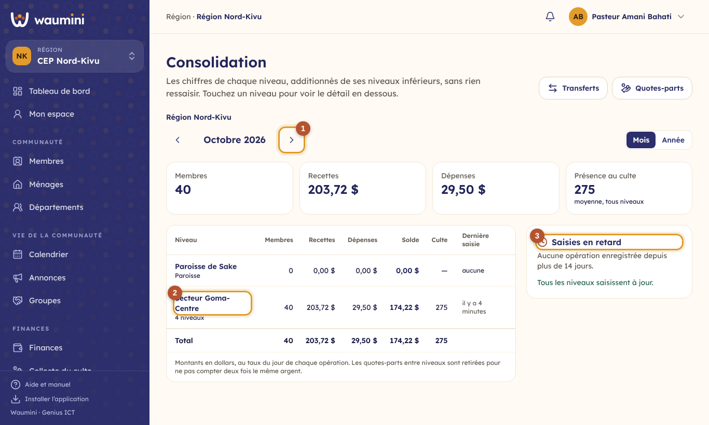
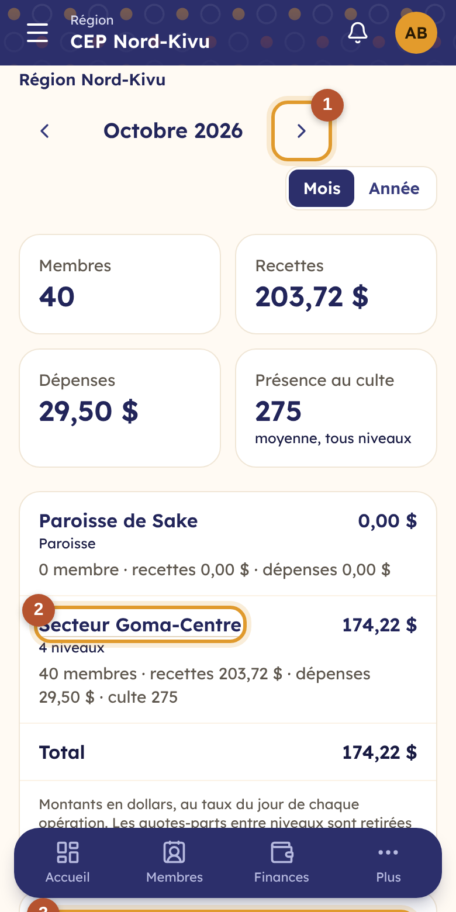
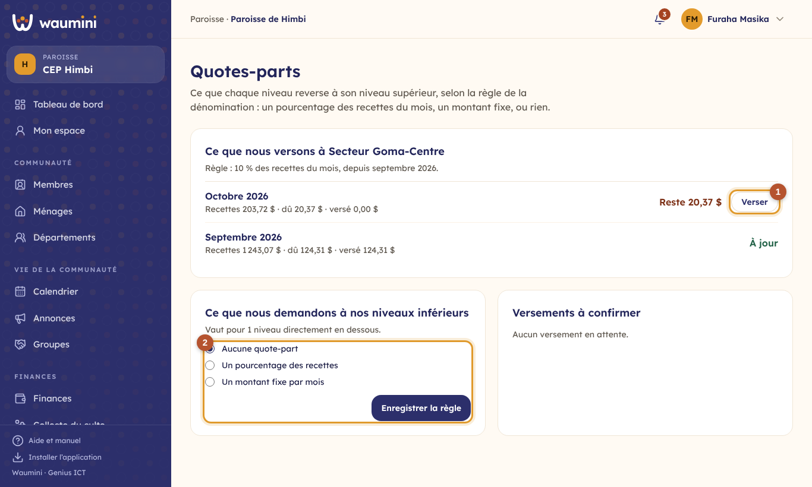
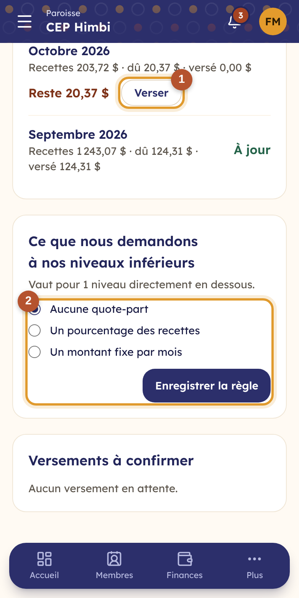
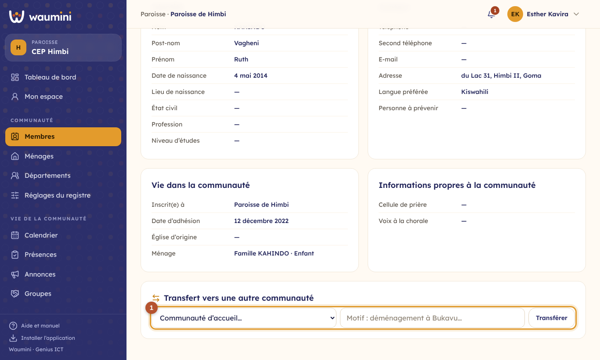
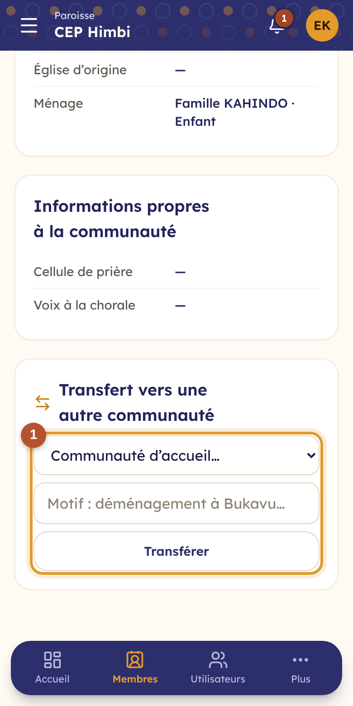
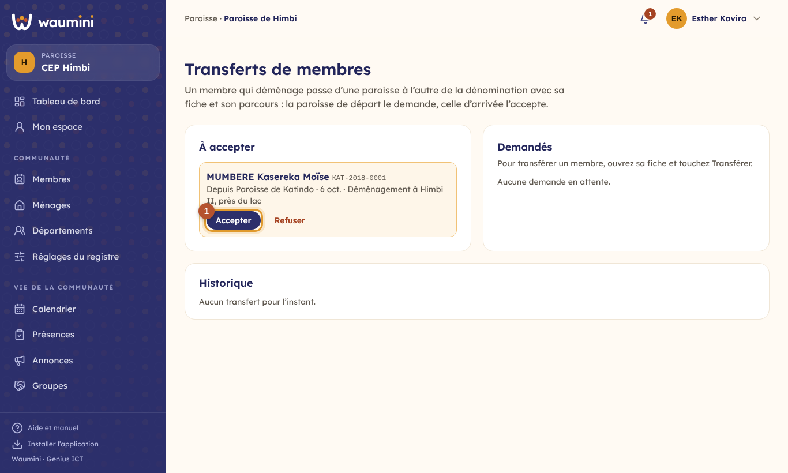
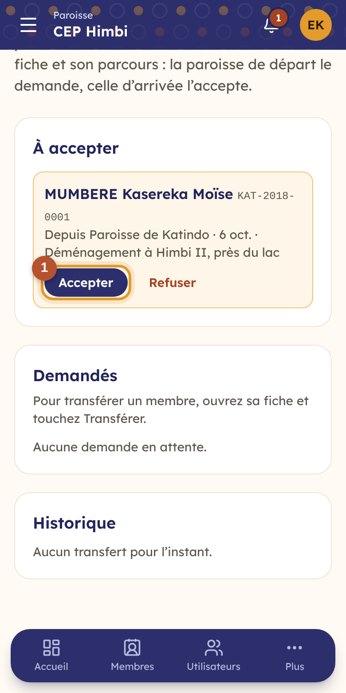

# 33. Le réseau : consolidation, quotes-parts et transferts

Une dénomination a un siège, des régions, des secteurs et des paroisses. Chaque paroisse tient son registre et sa caisse dans Waumini, et ses chiffres **remontent tout seuls** aux niveaux supérieurs. Personne ne recopie un rapport papier : le secteur voit ses paroisses, la région ses secteurs, le siège toute la dénomination.

Ce chapitre présente trois écrans, regroupés dans le menu **Réseau** :

- **Consolidation** : les chiffres de chaque niveau, additionnés de ses niveaux inférieurs ;
- **Quotes-parts** : ce que chaque niveau reverse au niveau supérieur ;
- **Transferts de membres** : un fidèle qui déménage passe d'une paroisse à l'autre avec sa fiche.

| Qui | Ce qu'il fait | Permission |
|---|---|---|
| Responsable de niveau, pasteur du siège, conseil | Voient la consolidation de leur niveau et de tout ce qui est en dessous | Voir les rapports consolidés des niveaux inférieurs |
| Trésorier | Verse la quote-part de son niveau ; confirme celles reçues des niveaux inférieurs | Décaisser et enregistrer les justificatifs ; Saisir les recettes et la collecte du culte |
| Administrateur, trésorier | Fixent la règle de quote-part demandée aux niveaux inférieurs | Gérer les caisses et les catégories |
| Secrétaire, responsable de niveau | Demandent, acceptent ou refusent les transferts | Gérer les transferts de membres, ou Ajouter et modifier les membres et les ménages |

## La consolidation

**Réseau › Consolidation**.

<table><tr>
<td width="68%"></td>
<td width="32%"></td>
</tr></table>

En haut, les quatre chiffres du niveau pour la période : **membres**, **recettes**, **dépenses** (en dollars) et **présence au culte**.

① **La période** : les flèches passent au mois précédent ou suivant ; **Mois** et **Année** changent l'échelle. Une année entière se compare d'un coup d'œil d'une région à l'autre.

② **Une ligne par niveau directement en dessous**, avec tout ce qui est sous lui : membres (et nouveaux membres de la période), recettes, dépenses, solde, présence au culte et **dernière saisie**. Touchez un niveau qui a des niveaux en dessous (« Secteur Goma-Centre, 4 niveaux ») pour **descendre** : on voit alors ses paroisses. Le fil en haut de l'écran (« Région Nord-Kivu › Secteur Goma-Centre ») permet de **remonter**.

Si le niveau a lui-même des membres ou une caisse (une région qui tient la caisse régionale), une ligne « (lui-même) » les montre à part.

③ **Saisies en retard** : les paroisses qui n'ont **rien enregistré depuis plus de deux semaines**. C'est souvent le signe d'un trésorier absent, d'une connexion difficile, ou d'une paroisse qui a besoin d'aide. Une paroisse toute nouvelle n'y apparaît qu'après deux semaines.

Comment les chiffres sont calculés :

- **Les montants sont en dollars**, au taux du jour de chaque opération (voir [Devises et taux du jour](07-devises.md)). Une recette en francs congolais compte pour sa valeur en dollars le jour où elle a été reçue.
- **Les quotes-parts sont retirées** des recettes et des dépenses : l'argent qu'une paroisse verse au secteur n'est pas une dépense de la dénomination, et ne doit pas être compté deux fois.
- **La présence au culte** additionne, pour chaque niveau, la présence moyenne de son culte principal sur la période (voir [Le calendrier et les présences](27-calendrier-presences.md)).
- **Les membres** sont ceux dont le statut compte comme membre (voir [Réglages du registre](15-reglages-registre.md)).

Le niveau supérieur **consulte** : il ne modifie rien dans les registres et les caisses des paroisses.

## Les quotes-parts

**Réseau › Quotes-parts**, ou **Quotes-parts** depuis la consolidation.

<table><tr>
<td width="68%"></td>
<td width="32%"></td>
</tr></table>

Chaque niveau choisit ce que ses niveaux **directement en dessous** lui reversent : le secteur pour ses paroisses, la région pour ses secteurs, le siège pour ses régions.

### Ce que nous versons au niveau supérieur

Pour chaque mois depuis l'entrée en vigueur de la règle : les **recettes** du mois (hors quotes-parts reçues), le montant **dû**, ce qui a été **versé**, et le **reste**. « À confirmer » signale un versement que le niveau supérieur n'a pas encore reçu.

① **Verser** : choisissez le compte d'où part l'argent (la caisse, le compte mobile money), la devise, le montant (Waumini propose le reste dû) et la référence du transfert. La dépense est enregistrée dans le journal de la paroisse, dans la catégorie « Quote-part versée au niveau supérieur ». Le trésorier du niveau supérieur est prévenu dans ses [nouveautés](25-nouveautes.md).

### Ce que nous demandons à nos niveaux inférieurs

② **La règle** :

- **Aucune quote-part** ;
- **Un pourcentage des recettes** : 10 % des recettes du mois, par exemple. Les quotes-parts que le niveau a lui-même reçues ne comptent pas dans ses recettes ;
- **Un montant fixe par mois**, en dollars ou en francs congolais.

La règle vaut **à partir du mois où elle est enregistrée** : les mois d'avant ne deviennent pas dus. La changer plus tard (passer de 10 % à 12 %) garde ce mois de départ.

**Versements à confirmer** : quand l'argent est arrivé, touchez **Confirmer la réception** et choisissez le compte où il est entré. La recette est enregistrée dans la catégorie « Quotes-parts reçues », avec la référence du versement.

**Suivi par niveau** : pour chaque niveau en dessous, sur les trois derniers mois, ce qu'il a versé sur ce qu'il doit, et ce qui reste.

## Les transferts de membres

Un fidèle déménage de Katindo à Himbi. Plutôt que de le radier d'un côté et de le réinscrire de l'autre, on le **transfère** : sa fiche part avec son parcours (identité, étapes de vie, historique des statuts), et il reçoit un numéro de la paroisse d'accueil. L'ancien numéro est gardé dans son historique.

### Demander un transfert

C'est la **paroisse de départ** qui demande. Ouvrez la fiche du membre, onglet **Profil**.

<table><tr>
<td width="68%"></td>
<td width="32%"></td>
</tr></table>

① Choisissez la **communauté d'accueil** (toute paroisse de la même dénomination), écrivez le motif (« Déménagement à Bukavu ») et touchez **Transférer**. Les secrétaires de la paroisse d'accueil sont prévenus.

Un transfert ne se fait qu'**au sein de la même dénomination**. Pour une personne qui part dans une autre église, changez plutôt son statut (voir [Le registre des membres](12-membres.md)) et délivrez-lui une [lettre de recommandation](29-documents.md).

### Accepter ou refuser

**Réseau › Transferts de membres**.

<table><tr>
<td width="68%"></td>
<td width="32%"></td>
</tr></table>

- **À accepter** : les personnes que d'autres paroisses vous envoient.
- ① **Accepter** : la fiche rejoint votre registre, avec un nouveau numéro. Ses départements, ses groupes et son ménage restaient propres à l'ancienne paroisse : ils sont retirés, à vous de l'inscrire dans les vôtres. Si la personne avait un [espace membre](32-espace-membre.md), son compte la suit.
- **Refuser** demande un motif (« Personne inconnue chez nous ») ; la paroisse de départ en est prévenue.
- **Demandés** : vos propres demandes en attente, que vous pouvez **annuler**.
- **Historique** : les transferts acceptés, refusés ou annulés, avec l'ancien et le nouveau numéro.

Le **responsable d'un groupe** ne peut pas partir tant que son groupe n'a pas de nouveau responsable : la paroisse de départ le remplace d'abord (voir [Les groupes](26-groupes.md)).
