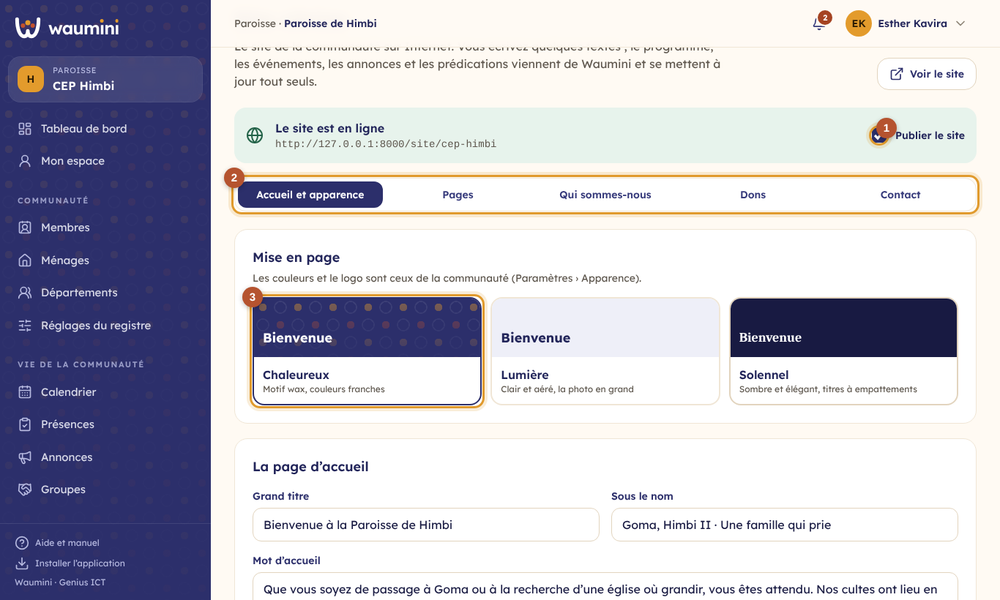
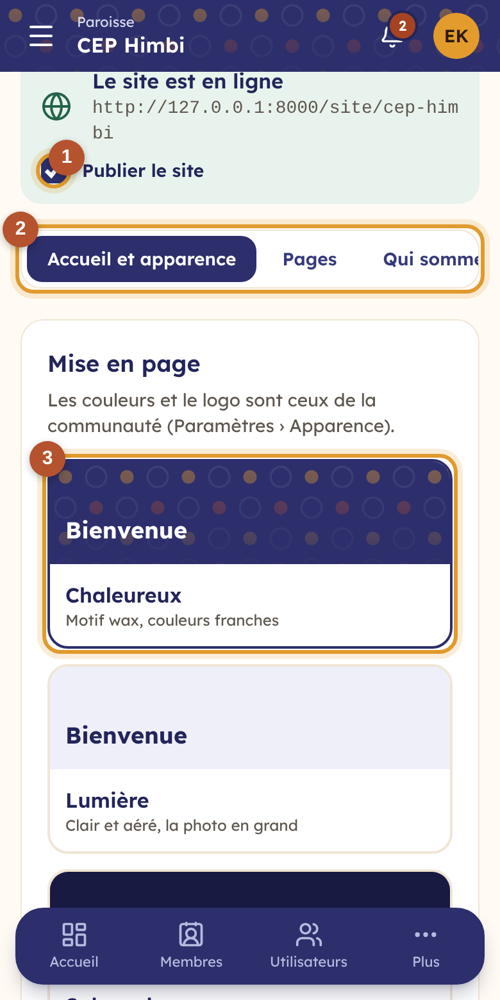
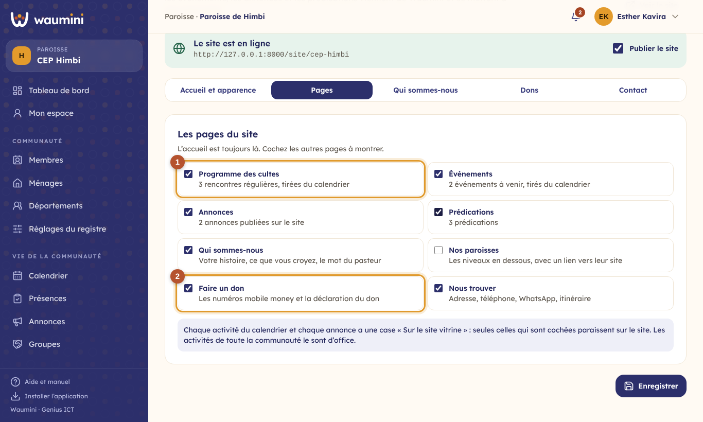
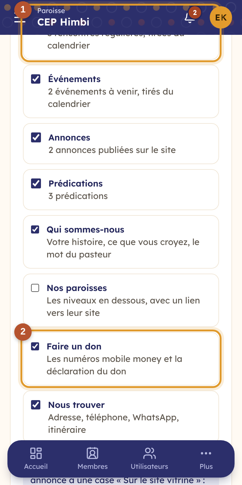
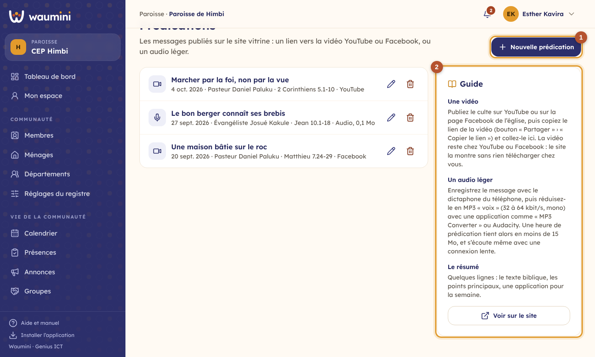
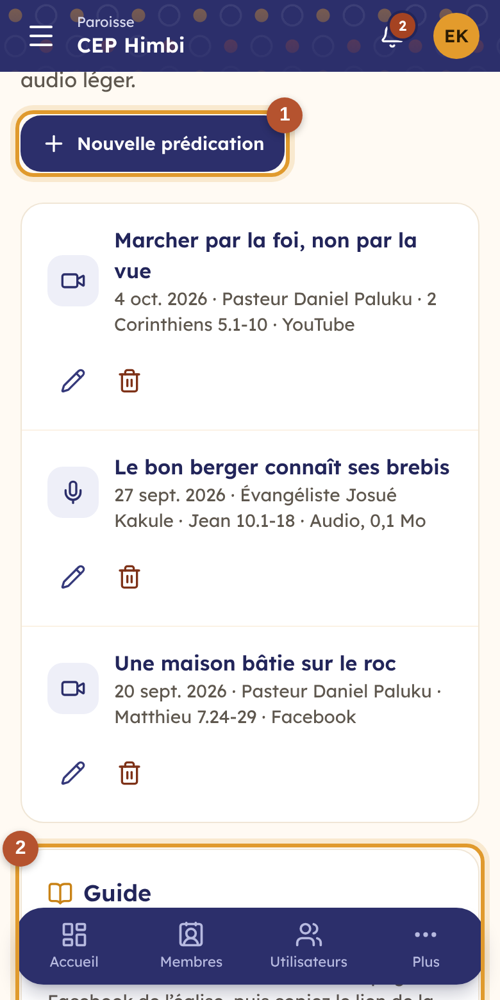
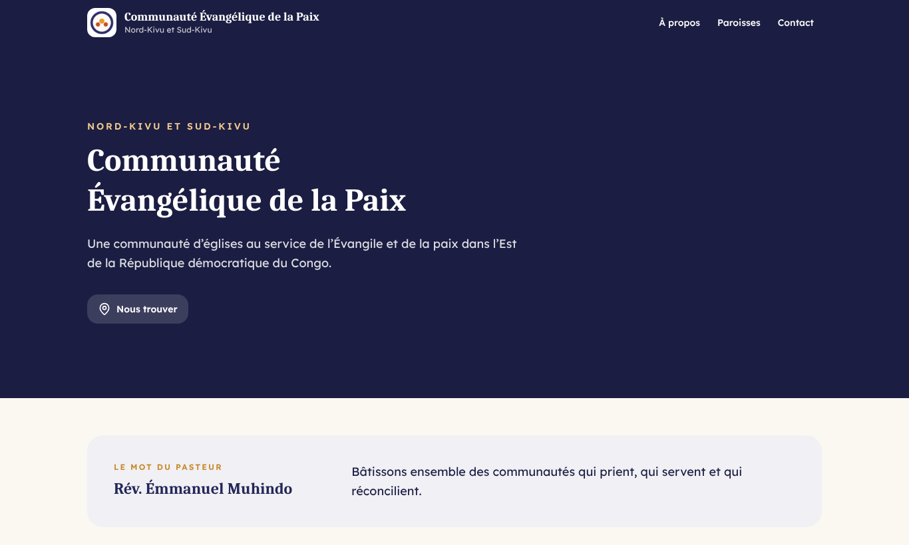
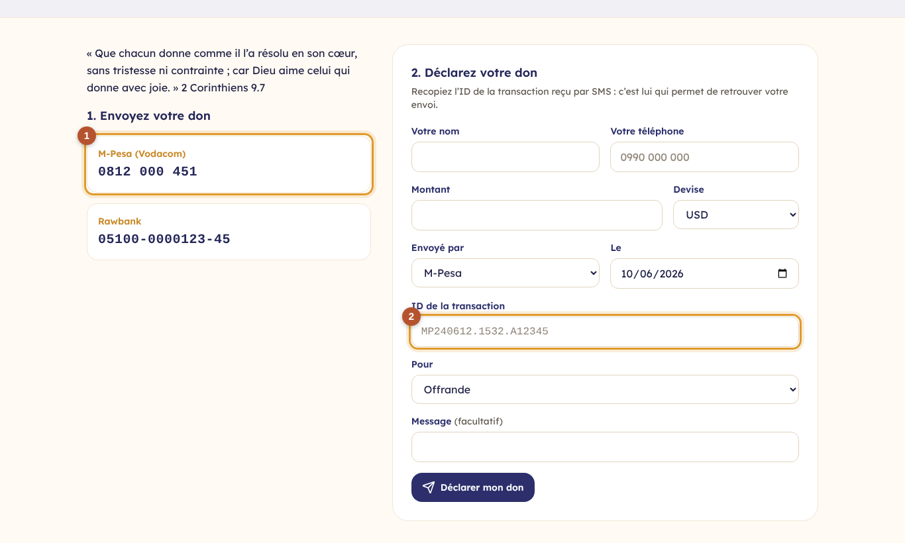
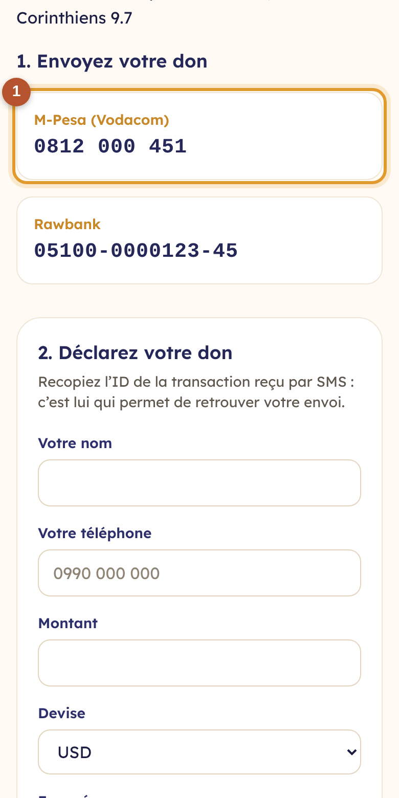

# 34. Le site vitrine

Chaque communauté peut avoir **son site sur Internet**, sans rien saisir deux fois. Vous écrivez quelques textes une fois pour toutes : le mot d'accueil, votre histoire, le mot du pasteur. Le reste vient de Waumini et se met à jour **tout seul** :

- le **programme des cultes** et les **événements** viennent du [calendrier](27-calendrier-presences.md) : changez l'heure du culte dans le calendrier, le site affiche la nouvelle heure ;
- les **annonces** choisies viennent des [annonces](28-annonces.md) ;
- les **prédications** sont publiées dans Waumini ;
- les **numéros mobile money** viennent de vos comptes, et les **dons déclarés** sur le site arrivent dans les [paiements déclarés](18-promesses.md).

L'adresse du site est celle de Waumini suivie du nom court de la communauté, par exemple `waumini.com/site/cep-himbi`. Partagez-la sur WhatsApp, imprimez-la sur vos affiches et vos documents.

| Qui | Ce qu'il fait | Permission |
|---|---|---|
| Secrétaire, administrateur | Règle et publie le site | Gérer le site vitrine |
| Pasteur, secrétaire | Publient les prédications | Publier les prédications sur le site |
| Trésorier | Vérifie les dons déclarés sur le site | Valider les paiements déclarés |

## Régler le site

**Site vitrine › Site vitrine**.

<table><tr>
<td width="68%"></td>
<td width="32%"></td>
</tr></table>

En haut, l'**adresse** du site et son état : en ligne, ou pas encore publié. **Voir le site** (ou **Aperçu**) l'ouvre dans un nouvel onglet.

① **Publier le site** : tant que la case n'est pas cochée, le site n'est visible que par ceux qui le gèrent, avec un bandeau « Aperçu ». Préparez tranquillement vos textes, regardez le résultat, puis publiez. Décocher la case retire le site d'Internet ; rien n'est perdu.

② **Les onglets** : *Accueil et apparence*, *Pages*, *Qui sommes-nous*, *Dons*, *Contact*. Touchez **Enregistrer** en bas après vos changements.

③ **La mise en page**, au choix :

- **Chaleureux** : le motif wax, des couleurs franches ;
- **Lumière** : clair et aéré, la photo d'accueil en grand ;
- **Solennel** : sombre et élégant, avec des titres à empattements.

Les **couleurs et le logo** sont ceux de la communauté, choisis dans [Paramètres › Apparence et Identité](08-parametres.md). Une paroisse sans logo propre prend celui du siège.

**La page d'accueil** : le grand titre, une ligne sous le nom (« Goma, Himbi II · Une famille qui prie »), un mot d'accueil de quelques lignes, et une **photo** facultative (l'église, l'assemblée, la chorale). Waumini réduit la photo pour qu'elle se charge vite, même avec une connexion lente.

## Les pages

<table><tr>
<td width="68%"></td>
<td width="32%"></td>
</tr></table>

L'accueil est toujours là. Cochez les autres pages à montrer :

| Page | Ce qu'elle montre | D'où cela vient |
|---|---|---|
| Programme des cultes | Les rencontres régulières, et les deux prochaines semaines | Le calendrier |
| Événements | Les conventions, concerts, retraites à venir, avec un bouton pour les partager sur WhatsApp | Le calendrier |
| Annonces | Les annonces choisies | Les annonces |
| Prédications | Les messages en vidéo ou en audio | Site vitrine › Prédications |
| Qui sommes-nous | Votre histoire, ce que vous croyez, le mot du pasteur | Onglet *Qui sommes-nous* |
| Nos paroisses | Les niveaux en dessous, avec un lien vers leur site | La hiérarchie |
| Faire un don | Les numéros et la déclaration du don | Onglet *Dons* |
| Nous trouver | Adresse, téléphone, WhatsApp, itinéraire | Paramètres et onglet *Contact* |

① Sous chaque page, Waumini indique ce qu'elle contient déjà (« 3 rencontres régulières, tirées du calendrier »).

**Ce qui paraît sur le site.** Chaque activité du calendrier et chaque annonce a une case **Sur le site vitrine** :

- les activités de **toute la communauté** sont cochées d'office ; décochez celles qui restent entre vous (la réunion des responsables) ;
- une activité d'un **département** ou d'un **groupe** n'est pas sur le site, sauf si vous cochez la case (la convention des jeunes, ouverte à tous) ;
- une **annonce** n'est sur le site que si vous cochez **Publier aussi sur le site vitrine**.

② **Faire un don** : voir plus bas.

## Les prédications

**Site vitrine › Prédications**.

<table><tr>
<td width="68%"></td>
<td width="32%"></td>
</tr></table>

① **Nouvelle prédication** : le titre, le prédicateur, la date, le texte biblique, un résumé de quelques lignes, puis **soit** le lien de la vidéo, **soit** un fichier audio.

② **Le guide**, toujours à portée de main :

- **Une vidéo** : publiez le culte sur YouTube ou sur la page Facebook de l'église, copiez le lien de la vidéo (« Partager » › « Copier le lien ») et collez-le. La vidéo reste chez YouTube ou Facebook. Sur le site, elle ne se charge que lorsque le visiteur touche **Lecture** : personne ne consomme ses données pour rien.
- **Un audio léger** : enregistrez le message avec le dictaphone du téléphone, puis réduisez-le en MP3 « voix » (32 à 64 kbit/s, mono) avec une application de conversion ou Audacity. Une heure de prédication tient alors en moins de **15 Mo**, la limite de Waumini, et s'écoute même avec une connexion lente.

Décocher **Visible sur le site** cache une prédication sans la supprimer. La corbeille la supprime, avec son fichier audio.

## Ce que voient les visiteurs

<table><tr>
<td width="68%"></td>
<td width="32%"></td>
</tr></table>

L'accueil présente le mot d'accueil, les boutons **Nos cultes**, **Faire un don** et **Nous trouver**, puis les rencontres de la semaine, le mot du pasteur, les prochains événements, les dernières annonces et la dernière prédication. Sur téléphone, le **Menu** en haut à droite ouvre les autres pages.

Les deux autres mises en page, sur la communauté de démonstration : **Lumière** pour la Paroisse de Katindo, avec sa photo, et **Solennel** pour le siège, qui présente ses paroisses.

<table><tr>
<td width="50%"></td>
<td width="50%"></td>
</tr></table>

## Les dons par mobile money

Dans l'onglet **Dons** : un texte (un verset, un mot sur les projets en cours), les **comptes montrés** (vos comptes mobile money et bancaires, avec leur numéro et leur titulaire, tels qu'ils sont réglés dans [Finances › Comptes](16-finances.md)), et ce que le donateur peut **choisir** (dîme, action de grâce, construction…) ; sans choix, c'est une offrande.

<table><tr>
<td width="68%"></td>
<td width="32%"></td>
</tr></table>

Le visiteur :

1. ① envoie son don sur l'un des numéros, depuis son téléphone ;
2. ② le **déclare** sur le site : son nom, son téléphone, le montant, l'opérateur, la date et l'**ID de la transaction** reçu par SMS.

La déclaration arrive dans **Finances › Paiements déclarés**, marquée « déclaré sur le site », et le trésorier est prévenu dans ses [nouveautés](25-nouveautes.md). Il vérifie sur le téléphone de l'église que l'argent est bien arrivé avec cet ID, puis **valide** (la recette entre dans le compte, avec un reçu) ou **rejette** avec un motif. Rien n'entre dans la caisse sans cette vérification.

## Le contact

L'adresse, le téléphone et l'e-mail viennent des [Paramètres](08-parametres.md). Dans l'onglet **Contact**, ajoutez le **numéro WhatsApp** (un bouton « Écrire sur WhatsApp »), le **lien Google Maps** (un bouton « Itinéraire » : dans Google Maps, touchez le lieu, puis « Partager » et copiez le lien), la **page Facebook** et la **chaîne YouTube**.
