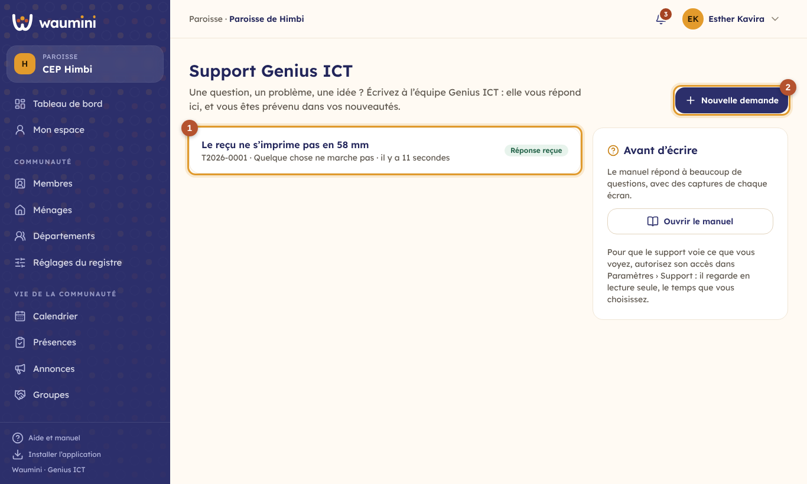
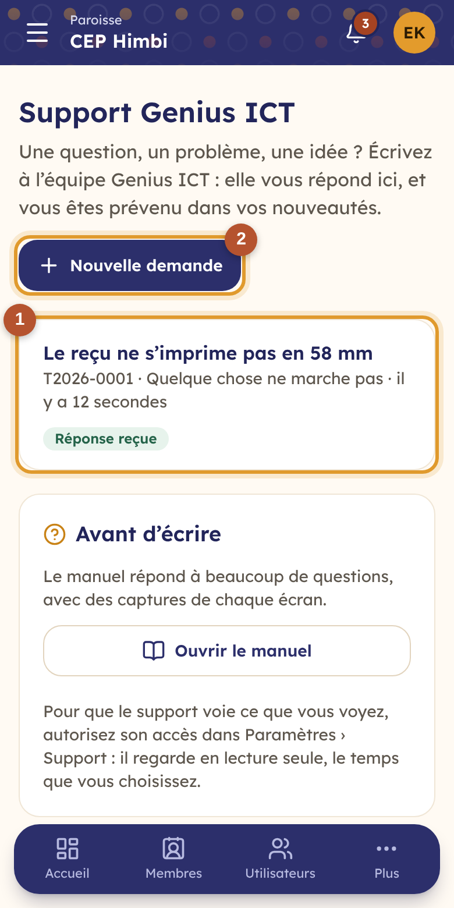
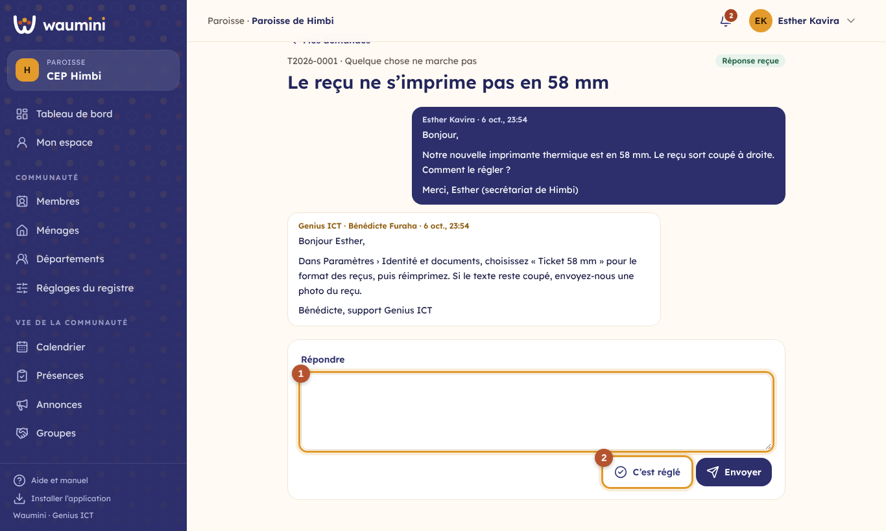

# 35. Demander de l'aide au support Genius ICT

Une question sur un écran, un reçu qui s'imprime mal, un fichier Excel à importer, une idée pour Waumini : écrivez à l'équipe **Genius ICT** depuis Waumini. Elle vous répond au même endroit, et vous êtes prévenu dans vos [nouveautés](25-nouveautes.md), même l'application fermée.

Tout utilisateur de la communauté peut écrire. Chacun voit **ses** demandes ; l'administrateur voit toutes celles de la communauté.

## Mes demandes

**Administration › Support Genius ICT**.

<table><tr>
<td width="68%"></td>
<td width="32%"></td>
</tr></table>

① **Vos demandes**, avec leur numéro et leur état :

| État | Ce qu'il veut dire |
|---|---|
| **En attente du support** | Genius ICT n'a pas encore répondu |
| **Réponse reçue** | Genius ICT a répondu : à vous de lire, de répondre ou de marquer la demande comme réglée |
| **Réglé** | La demande est close ; un nouveau message la rouvre |

② **Nouvelle demande** : choisissez le sujet (une question, quelque chose qui ne marche pas, des données à reprendre, l'abonnement, une idée), un titre court et votre message. Dites **ce que vous faisiez, ce qui s'est passé et ce que vous attendiez** : la réponse n'en sera que plus rapide.

À droite, avant d'écrire : le [manuel](README.md), qui répond déjà à beaucoup de questions, et le lien WhatsApp de Genius ICT pour une urgence.

## Une demande et ses échanges

<table><tr>
<td width="68%"></td>
<td width="32%"></td>
</tr></table>

Vos messages sont à droite, ceux de Genius ICT à gauche, avec le nom de l'agent et l'heure.

① **Répondre** : écrivez et touchez **Envoyer** ; l'agent est prévenu.

② **C'est réglé** clôt la demande quand le problème est résolu.

## Laisser le support regarder

Pour certains problèmes, l'agent a besoin de **voir ce que vous voyez**. L'administrateur peut l'autoriser pour 1, 3 ou 7 jours dans [Paramètres › Support](08-parametres.md#accès-du-support-genius-ict) : l'agent regarde en lecture seule, ne modifie rien, ne voit jamais le suivi pastoral, et chaque visite est inscrite au journal.
